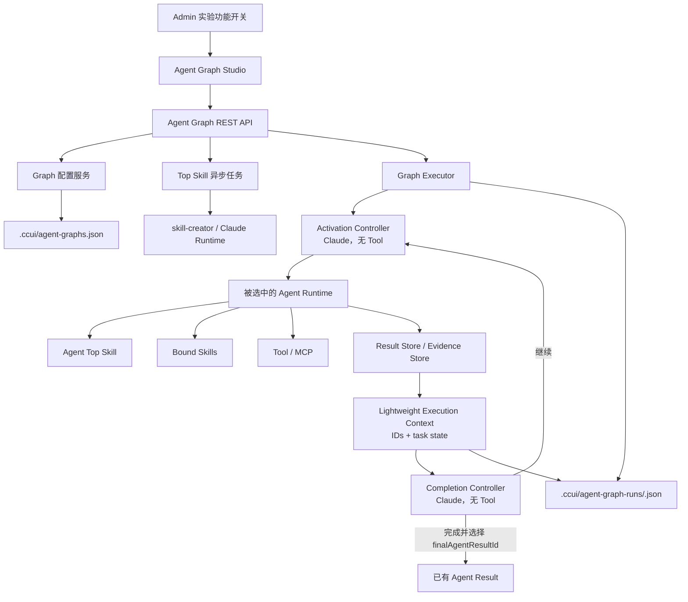
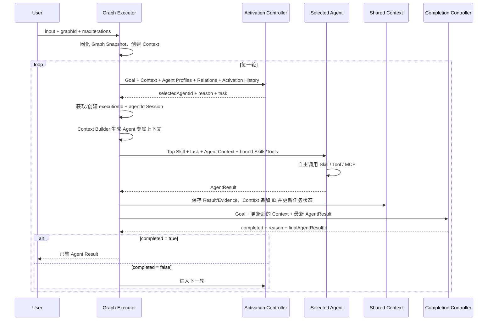

# Agent Graph System 实现方案

> 文档状态：基于当前已部署实现整理
> 更新时间：2026-08-11
> 运行环境：CCUI `3002`，Demo MCP `39999`

## 1. 目标与边界

本实现为 CCUI 增加一套实验性的 Agent Graph Studio 与 Graph Executor，用于配置多个独立 Agent，并在运行时根据共享上下文动态选择合适的 Agent 协作完成任务。

核心约束：

1. Graph 不是 Workflow，不表达固定的 `A → B → C` 执行链。
2. Relation 只表达协作关系、信息依赖和能力提示，不是执行 Edge。
3. 每个 Agent 是完整能力单元，包含角色、Top Skill、Skills 与 Tool/MCP。
4. Graph Executor 负责创建运行、管理 Context、选择 Agent 和判断完成。
5. Agent 自己依据 Top Skill 调用绑定的 Skill、Tool 与 MCP。
6. Agent 不直接互相调用，通过 Shared Execution Context 交换信息。
7. 当前每轮只激活一个 Agent，轮次之间串行协作；这不是 DAG 调度，也不是固定顺序。

当前不实现：

- 固定 Workflow、条件节点、DAG Edge 和显式 Loop 节点；
- Agent 自动创建、Graph 自动规划或 Relation 自动修改；
- Top Skill 自动演化；
- 多个 Agent 在同一轮并行执行；
- 完整的待解决问题生命周期管理。

## 2. 总体架构



主要代码组件：

| 层 | 实现 |
|---|---|
| Studio UI | `src/features/agent-graph/AgentGraphStudio.tsx` |
| Canvas | `src/features/agent-graph/AgentGraphCanvas.tsx` |
| Agent 配置 | `AgentBuilderDialog.tsx`、`AgentDetailsPanel.tsx` |
| Runtime UI | `GraphRuntimePanel.tsx` |
| 配置查看 | `GraphConfigurationPanel.tsx` |
| Graph API | `server/routes/agent-graphs.js` |
| Graph 配置服务 | `server/services/agent-graphs.js` |
| Executor | `server/services/agent-graph-executor.js` |
| Claude Runtime | `server/services/agent-graph-claude-runtime.js` |
| Run 持久化 | `server/services/agent-graph-run-store.js` |
| Top Skill 异步任务 | `server/services/top-skill-jobs.js` |
| Demo MCP | `server/services/agent-graph-demo-mcp-server.js` |

## 3. 核心数据模型

### 3.1 Agent Graph

```typescript
interface AgentGraph {
  id: string;
  name: string;
  goal: string;
  agents: AgentNode[];
  relations: AgentRelation[];
}
```

`goal` 是 Executor 判断下一步激活对象和任务是否完成的最高层目标。

### 3.2 Agent Node

```typescript
interface AgentNode {
  id: string;
  name: string;
  topSkill: string;
  skills: string[];
  tools: string[];
  position: { x: number; y: number };
  workingDescription: string;
  businessContext: string;
}
```

- `topSkill` 定义角色、职责、工作方法、Skill/Tool 使用方式和输出要求。
- `skills`、`tools` 是允许该 Agent 使用的能力边界。
- `workingDescription` 会参与 Agent Activation 判断。
- `position` 只服务于 Canvas 展示，不影响调度。

Top Skill 必须包含以下二级标题：

- `Role`
- `Responsibility`
- `Working Method`
- `Skill Usage Guidance`
- `Tool Usage Guidance`
- `Input Understanding`
- `Output Requirement`

### 3.3 Relation

```typescript
interface AgentRelation {
  id: string;
  sourceAgent: string;
  targetAgent: string;
  description: string;
}
```

Relation 会作为 Activation Controller 的判断材料，但不会被转换成拓扑顺序、依赖计数或强制调用路径。

### 3.4 Execution Context

```typescript
interface ExecutionContext {
  executionId: string;
  goal: string;
  status: RunStatus;
  iteration: number;
  currentNeed: string;
  evidenceIds: string[];
  resultIds: string[];
  pendingQuestions: string[];
}
```

Context 只保存一次 Graph 任务的轻量状态：

- `currentNeed`：当前最需要解决的问题；
- `evidenceIds`：引用 Evidence Store 中的事实；
- `resultIds`：引用 Result Store 中的 Agent 结果；
- `pendingQuestions`：当前建议下一轮关注的问题；
- `iteration`：当前协作轮次。

完整 Agent 输出、Claude 历史和 Tool 结果不进入 Execution Context。Agent 间仍通过 Context 通信，但由 Context Builder 根据这些引用从 Store 中选择相关摘要与 Evidence。

### 3.5 Agent Result

每次 Agent 执行后必须返回：

```typescript
interface AgentResult {
  resultId: string;
  executionId: string;
  agentId: string;
  summary: string;
  type: string;
  evidenceIds: string[];
  newQuestions: string[];
  confidence: number;
  content: string;
}
```

完整结果写入顶层 `resultStore`，Context 只追加 `resultId`。每条 Finding 会转换为独立 Evidence，写入 `evidenceStore`。Provider Session ID 不再属于 AgentResult，而是保存在 `execution.agentSessions[]`。

同一次 Graph Execution 内采用 `executionId + agentId` 唯一确定 Agent Claude Session。同一 Agent 再次激活时通过 Claude SDK `resume` 复用；不同 Execution 不复用。Activation Controller 和 Completion Controller 始终使用不持久化的无状态调用。

## 4. Graph Studio

Studio 支持：

- 创建、更新、删除 Graph；
- 编辑 Graph Name 与 Goal；
- 创建、编辑、删除、拖动 Agent；
- 配置 Agent 的 Top Skill、Skills、Tools/MCP、职责和业务背景；
- 创建和删除 Relation；
- Canvas 缩放和自动布局；
- 异步生成、重新生成和提示词优化 Top Skill；
- 启动、停止和查看历史运行；
- 查看完整 Graph 与 Executor 配置。

“查看配置”面板展示：

- Graph ID、Goal、Agent 和 Relation 数量；
- Executor 执行模型、激活策略、完成策略和安全限制；
- Claude Runtime 限制；
- Agent 完整配置与 Top Skill；
- Skill 状态、MCP 解析名称、健康状态和工具清单；
- Relation 描述；
- Graph 与 Executor 原始 JSON。

## 5. Top Skill 生成

Top Skill 生成与优化采用异步任务：

1. UI 提交生成或优化请求；
2. API 立即返回 `202` 和 Job ID；
3. 后台调用 skill-creator；
4. UI 轮询 Job 状态；
5. 成功后将生成内容回填 Agent；
6. 优化操作将当前 Top Skill 与用户优化提示一并提交。

Job 当前存放在服务进程内存中：默认保留 30 分钟，最多 200 个任务。服务重启后未完成和历史 Job 不会恢复。

## 6. Graph Executor 调度机制

### 6.1 执行模型

当前执行模型为：

```text
context-driven-collaboration-loop
```

每轮执行一个 Agent：



### 6.2 创建 Run

启动时 Executor：

1. 校验 Graph 至少包含一个 Agent；
2. 校验用户输入大小；
3. 将当前 Graph 深拷贝为 `graphSnapshot`，避免运行过程中配置变化影响本次执行；
4. 创建空的 Execution Context；
5. 初始化每个 Agent 的状态和激活次数；
6. 保存 queued Run 后异步开始执行。

同一 Graph 不允许在同一服务进程中同时存在两个活动 Run。

### 6.3 Activation Input

每轮开始时构造：

```typescript
{
  goal,
  context: {
    executionId,
    goal,
    currentNeed,
    evidenceIds,
    resultIds,
    pendingQuestions,
    iteration,
    status
  },
  availableAgents: [
    {
      id,
      name,
      workingDescription,
      skills,
      tools,
      activationCount
    }
  ],
  relations
}
```

Activation Controller 实际考虑：

- `graph-goal`：Graph 的总体目标；
- `shared-context`：已有 Findings、AgentResults 和 PendingQuestions；
- `agent-responsibility`：Agent 的职责与工作描述；
- `top-skill`：Agent 的角色和分析方法；
- `relations`：协作和信息依赖提示；
- `activation-history`：Agent 已激活次数和历史结果。

选择器由 Claude 做语义判断，不使用固定的数值评分函数。其结构化输出为：

```json
{
  "selectedAgentId": "agent-id",
  "reason": "为什么当前应选择该 Agent",
  "task": "交给该 Agent 的自然语言任务"
}
```

Executor 会验证 `selectedAgentId` 必须属于 Graph；因此模型不能选择不存在的 Agent。

### 6.4 Relation 的参与方式

Relation 与 Agent Profile 一起传给选择器。选择器可以据此理解“谁能消费谁的结果”或“谁具备后续能力”，但允许：

- 选择与上一 Agent 不相邻的节点；
- 跳过没有增量价值的节点；
- 再次激活之前执行过的 Agent；
- 在 Context 已充分时提前结束。

因此，Canvas 上的箭头不能理解为运行顺序。

### 6.5 重复激活保护

系统允许同一 Agent 多次执行，以支持“拿到第一步结果后再按新标签继续分析”。但如果选择器连续三次选择同一 Agent：

1. Executor 记录 `activation_reconsidered`；
2. 当 Graph 中还有其他 Agent 时，临时排除该 Agent；
3. 要求选择器重新选择最合适的协作者。

这是防止无价值循环的安全保护，不是禁止一个 Agent 多轮分析。

### 6.6 Agent 执行

被选中 Agent 收到：

- Agent Top Skill；
- 当前轮自然语言任务；
- Context Builder 生成的 Agent 专属 Context（Goal、CurrentNeed、相关 Evidence 与 Result 摘要增量）；
- 绑定 Skills 的完整说明；
- 解析后的 Tool/MCP 能力。

Agent Runtime 自主决定是否以及如何调用 Skill、Tool、MCP。Graph Executor 和 Activation/Completion Controller 都不直接调用业务工具。

Agent 第一次激活时创建可持久化 Claude Session；同一 Execution 再次激活时使用该 Agent 的 `providerSessionId` 恢复历史。Context Builder 记录已经注入该 Session 的 Evidence/Result ID，后续只发送新的相关增量，且不重复发送该 Agent 自己已经在 Session 历史中的结果。

当前单次 Agent 激活限制：

- Claude 最大 24 turns；
- 最多 8 次 Tool/MCP 调用；
- Agent 响应最大约 120,000 字符。

### 6.7 Context 更新

Agent 执行完成后：

1. 完整结构化结果写入 `resultStore`；
2. Findings 转换为 Evidence，按忽略大小写的 Claim 去重后写入 `evidenceStore`；
3. Context 只追加 `resultId` 与新增 `evidenceId`；
4. `pendingQuestions` 替换为本轮 `newQuestions`，并更新 `currentNeed`；
5. 有新增 Evidence 时将 `staleIterations` 清零，否则加一。

下一轮 Agent 不接收上一个 Agent 的直接消息，而是读取更新后的 Context。

### 6.8 Completion 判断

每次 Context 更新后，Completion Controller 判断：

- Goal 是否完成；
- 当前证据是否充分；
- 是否仍有关键待解决问题；
- 已知限制是否允许给出结论。

当前完成协议为：

```json
{
  "completed": true,
  "reason": "为什么可以结束",
  "finalAgentResultId": "已有 Agent Result ID"
}
```

当前配置为：

```text
finalResultSource = existing-agent-result
controllerMaySynthesizeBusinessAnswer = false
```

Completion Controller 是每轮新建的无状态判断调用，没有 Tool/MCP 权限，也禁止撰写、改写或补全业务答案。完成时必须选择已有 `finalAgentResultId`，最终返回内容直接来自该 Result Store 条目。

### 6.9 终止条件

Run 在以下任一条件下结束：

1. Completion Controller 返回 `completed = true`；
2. 达到最大迭代次数；
3. 连续三轮没有新增 Evidence；
4. 用户取消；
5. Agent、Controller、认证或 Runtime 发生不可恢复错误；
6. 服务重启后检测到失去进程内执行控制器的活动 Run，将其标记为中断失败。

默认最多 8 轮，可配置范围为 1–20 轮。

## 7. Context 裁剪与可观测性

持久化 Run 保存完整 Context；发送给 Claude 的控制平面 Context 会做裁剪：

- 最近 12 条 Findings；
- 最近 8 个 AgentResults；
- 每个结果内容最多约 8,000 字符；
- 最多 20 个 PendingQuestions；
- Agent Profile 中 Top Skill 最多约 4,000 字符。

运行详情按第 1 轮到最后一轮正序展示。独立的“Graph Executor 调度信息”按轮次展示：

- 调度前 Shared Context；
- 候选 Agent 与激活次数；
- Relations；
- 选中的 Agent、任务和选择理由；
- 重复激活重新判断；
- Context 更新；
- Completion 判断。

原始 Execution Trace 同时保留以下事件：

| Trace 类型 | 内容 |
|---|---|
| `run_created` / `run_started` | 创建 Context、启动 Executor |
| `iteration_started` | 本轮完整 Activation Input |
| `activation_decision` | 选择结果、原因、任务 |
| `activation_reconsidered` | 重复激活保护及重新选择 |
| `agent_started` | Agent 实际入参 |
| `agent_completed` | Agent 结构化出参 |
| `context_updated` | 新增 Findings、PendingQuestions、Stale 状态 |
| `completion_decision` | 完成判断入参和出参 |
| `run_completed` / `run_failed` | 最终结果或错误 |

Trace 最多保存 500 个事件；单字符串最多约 32,000 字符；数组最多展示 100 项；密码、Token、API Key、Cookie、Authorization 等敏感字段会被隐藏。

## 8. API 与持久化

API 基础路径：

```text
/api/workspaces/:workspaceId/agent-graphs
```

主要接口：

| 方法 | 路径 | 功能 |
|---|---|---|
| GET | `/agent-graphs` | Graph 列表与 Executor 配置 |
| POST | `/agent-graphs` | 创建 Graph |
| PUT | `/agent-graphs/:graphId` | 更新 Graph |
| DELETE | `/agent-graphs/:graphId` | 删除 Graph |
| POST | `/agent-graphs/top-skill-jobs` | 启动 Top Skill 生成/优化 |
| GET | `/agent-graphs/top-skill-jobs/:jobId` | 查询异步任务 |
| POST | `/agent-graphs/:graphId/runs` | 启动运行 |
| GET | `/agent-graphs/:graphId/runs` | 查询运行历史 |
| GET | `/agent-graphs/:graphId/runs/:runId` | 查询单次运行 |
| POST | `/agent-graphs/:graphId/runs/:runId/cancel` | 取消运行 |

Workspace 内持久化：

```text
.ccui/agent-graphs.json
.ccui/agent-graph-runs/<runId>.json
```

写入采用临时文件加 rename，避免部分写入；每个 Run 保存 Graph Snapshot、Executor Config Snapshot、Context、Agent 状态、Trace 和最终结果。

## 9. 权限、开关与安全

- Agent Graph 是全局实验功能，只有 Admin 可以看到并切换开关；
- 开关关闭时 UI 不展示功能，后端 Agent Graph API 返回 404；
- API 经过登录认证、Tenant Context 和 Workspace Access 校验；
- Owner/Edit 可以修改 Graph 和启动/取消运行；只读用户可以查看 Graph 与 Run；
- 返回前移除内部 `workspacePath`、Tenant/User/Workspace 运行字段；
- Trace 自动脱敏；
- Claude 认证缺失时 Run 返回明确的认证错误；
- Agent 只能看到并使用绑定的 Skills 与 Tool/MCP。

## 10. Demo Skills、MCP 与数据

当前 Demo MCP 微服务运行在 `39999`，提供三个逻辑 MCP Server：

### 10.1 Hive MCP

- `describe_hive_tables`
- `query_hive_metrics`
- `execute_hive_sql`

### 10.2 BI 查询 MCP

- `get_metric_catalog`
- `query_metric_report`
- `compare_metric_periods`

### 10.3 标签查询 MCP

- `list_profile_tags`
- `analyze_audience`
- `sample_audience`

显示名映射：

```text
Hive MCP   -> hive-mcp
BI查询MCP -> bi-query-mcp
标签查询MCP -> tag-query-mcp
```

配套 Skills：

- `query-music-app-reports`
- `analyze-music-audiences`

Demo 数据是确定性生成的模拟音乐 App 数据，用于验证 Graph 与 Executor，不代表真实生产数据。当前覆盖多个音乐 App、2025-01 至 2026-07 报表范围以及约 10 万画像样本，并刻意避免为某个结论手工植入特殊异常。

## 11. 当前局限与后续建议

### 11.1 当前局限

1. Activation 是 Claude 语义判断，可解释但不是完全确定性的评分算法。
2. 每轮串行执行一个 Agent，不支持并行专家分析。
3. PendingQuestions 只是最新一轮问题列表，不是任务队列。
4. Completion Controller 只能选择已有 Agent Result，最终可交付内容依赖专业 Agent 的输出质量。
5. Top Skill Job 存储在内存中，服务重启不恢复。
6. 活动 Run 依赖进程内 AbortController，服务重启后会标记为中断失败。
7. Context Builder 只选择有限数量的相关 Evidence 和 Result 摘要，未入选的 Store 内容不会进入当前 Prompt。
8. Demo MCP 数据用于验证能力，不能用于真实业务决策。

### 11.2 可选演进方向

在不改变“Graph 不是 Workflow”的前提下，可以进一步增加：

- PendingQuestion 独立 ID、来源、负责人、状态和解决证据；
- Activation 决策的规则约束与语义评分混合模式；
- 多候选 Agent 并行分析后写入同一 Context；
- 可恢复的持久化任务队列；
- 跨 Execution 的 Agent Memory（当前明确不实现）；
- 更精细的 Evidence 相关性排序与 Context 预算；
- Run 成本、Token、Tool 调用次数和时延指标。

这些演进项应继续遵守 Relation 不是执行 Edge、Agent 自主使用 Skill/Tool、Executor 只负责协调的架构原则。

## 12. 调度伪代码

```typescript
run = createRun(graphSnapshot, userInput)

for iteration in 1..maxIterations:
  activationInput = {
    goal,
    sharedContext,
    availableAgents,
    relations,
    activationHistory
  }

  decision = activationController.select(activationInput)

  if selectedAgent has run 3 consecutive times:
    decision = activationController.selectAgain(exclude = selectedAgent)

  agentSession = getOrCreateSession(executionId, selectedAgent.id)
  agentContext = contextBuilder.build(selectedAgent, sharedContext, resultStore, evidenceStore)

  agentInput = {
    topSkill,
    boundSkills,
    boundTools,
    decision.task,
    agentContext
  }

  agentResult = selectedAgent.execute(agentInput, resume = agentSession.providerSessionId)
  resultStore.append(agentResult)
  evidenceStore.appendUnique(agentResult.findings)
  sharedContext.resultIds.append(agentResult.resultId)
  sharedContext.evidenceIds.appendNew(agentResult.evidenceIds)
  sharedContext.pendingQuestions = agentResult.newQuestions

  completion = completionController.evaluate(goal, sharedContext)

  if completion.completed:
    return resultStore.get(completion.finalAgentResultId)

  if noNewFindingFor3Iterations:
    return latestAgentResult

return latestAgentResult
```

该伪代码中的 `select` 是基于 Goal、Context、Agent Profile、Top Skill、Relation 和历史激活情况的语义选择，而不是沿 Relation 顺序遍历节点。
