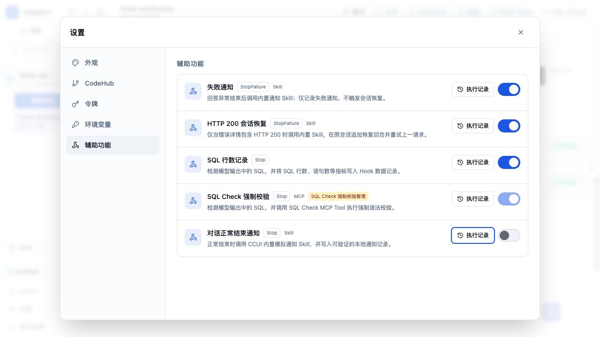
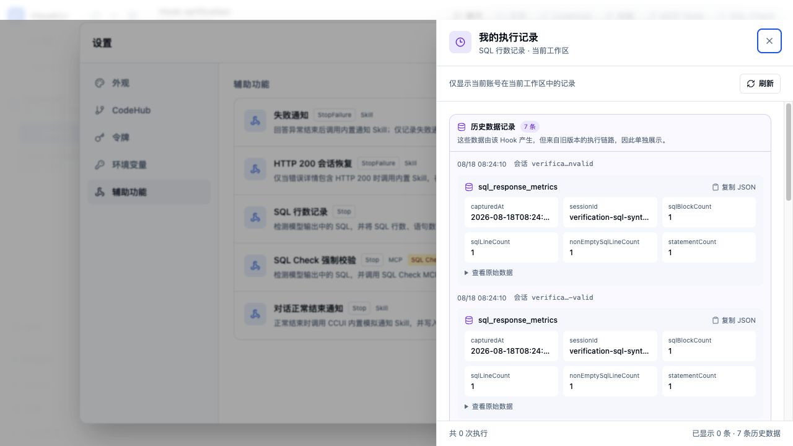
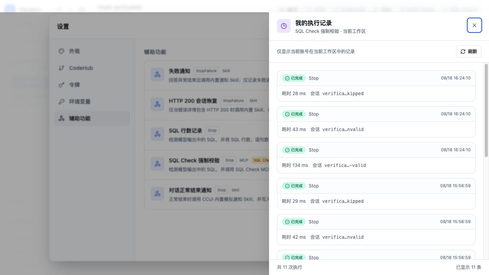

# Hook UI 实际测试问题与修复记录

日期：2026-08-23

## 1. 测试范围与隔离方式

本轮先对当前 5 条 Hook 配置做真实页面检查，再针对发现的问题完成修复和回归：

| Hook | 事件 | 主要能力 | 修复前实际检查结果 |
| --- | --- | --- | --- |
| 失败通知 | `StopFailure` | 调用内置通知 Skill | 受控失败事件可正常排入 Skill；执行审计成功 |
| HTTP 200 会话恢复 | `StopFailure` | JavaScript 条件判断 + Skill 恢复 | `shouldRecover=true`，恢复回合成功排队 |
| SQL 行数记录 | `Stop` | JavaScript + `write_record` | 成功写入 SQL 行数、语句数等业务数据 |
| SQL Check 强制校验 | `Stop` | JavaScript + MCP | Hook 被触发，但实际 MCP 调用报 `TypeError: fetch failed` |
| 对话正常结束通知 | `Stop` | 独立 Hook Agent 调用 Skill | Hook Agent 约 10.7 秒完成；会话卡片长期停留“执行中”，刷新后才显示完成 |

同时检查了 Hook 列表、编辑器、发布与绑定、业务数据、执行诊断、详情弹窗、复制/创建/删除等页面路径。临时 CRUD 只发生在数据库副本中。

修复后 UI 回归使用以下隔离方式：

- 从当前数据库做 SQLite 一致性备份，放入 `/private/tmp`；只修改副本中的管理员密码。
- 当前前端代码运行在 5174 端口；后端使用项目生产镜像中的 Node 22 和临时数据库，映射到 3101 端口。
- 不保存真实 Hook 配置，不改真实绑定，不删除真实数据。
- 页面验证结束后关闭一次性容器、开发服务器并删除临时数据库及复制的 `.env`。

## 2. 问题一：Hook Agent 已结束，卡片仍显示“执行中”

### 现象与证据

“对话正常结束通知”产生的 Hook Agent 实际在约 10.7 秒后成功结束，执行诊断中状态也已经是 `succeeded`，但会话内紫色 Hook 卡片持续显示“执行中”。只有刷新页面或重新载入历史后才变成“已完成”。

### 原因

同一个 Hook Agent 生命周期使用固定消息 ID。实时通道已经把该 ID 从 `running` 更新为 `succeeded`，但消息合并逻辑始终让服务端历史中的同 ID 消息优先。服务端持久化是异步的，因此短时间内仍可能返回旧的 `running` 记录。

此外，服务端历史刷新时会直接删除所有同 ID 实时消息，导致实时终态在持久化追上之前被提前清掉。

### 修复方案

在 `src/stores/sessionMerge.ts` 中对 `hook_activity` 增加生命周期优先级：

- `queued < running < succeeded/failed`。
- 服务端为 `running`、实时为终态时，合并结果使用实时终态。
- 服务端已经是终态、实时仍是旧状态时，继续使用服务端终态。
- 历史刷新只有在服务端状态追平实时状态后才清理该实时消息。
- 规则仅作用于 `hook_activity`，普通聊天、流式消息和乐观消息仍维持原有服务端优先逻辑。

### 回归证据

新增并通过以下确定性测试：

1. 同 ID 的实时 `succeeded` 覆盖持久化 `running`。
2. 实时旧 `running` 不覆盖持久化 `succeeded`。
3. 历史刷新期间保留领先的实时终态，持久化追平后再清理。
4. 实时缓冲区仍然只保留一个 Hook Agent 卡片并原位更新。

前端 Hook/会话逻辑扩展套件共 50 条，全部通过。

## 3. 问题二：SQL Check 实际 MCP 调用 `fetch failed`

### 现象与证据

SQL Check Hook 的 JavaScript 检测和条件判断正常执行，但后置 MCP 动作在实际会话中失败，错误为 `TypeError: fetch failed`。相同事件中的 SQL 行数记录仍然成功，说明失败点在 MCP 连接而不是 Hook 事件或脚本本身。

### 原因

SQL Check 预置地址为：

```text
http://host.docker.internal:<SERVER_PORT>/mcp/sql-syntax-check
```

这个地址是给 Docker 内的 Claude 会话使用的。Hook 后置动作却由 CCUI Node.js 进程直接执行；在本机开发模式下，`host.docker.internal` 不保证能从宿主进程解析，因此连接在 MCP 初始化前失败。

### 修复方案

在 `server/services/hook-mcp-client.js` 中增加直连地址解析：

- 仅当 MCP Server 名称是内置 `sql-syntax-checker`，且地址主机是 `host.docker.internal` 时，改为 `127.0.0.1`。
- 普通远端 MCP 地址保持不变。
- 用户自定义的 `host.docker.internal` MCP 地址也保持不变，避免误把真实宿主机服务改到 CCUI 容器内部。

### 回归证据

- 聚焦测试启动真实临时 HTTP MCP Server，配置仍使用 `host.docker.internal`，完成 `initialize`、`tools/call` 和结构化结果解析，5/5 通过。
- Node 22 一次性生产容器内，用相同 Docker 地址实际调用 CCUI SQL MCP 端点，返回：`valid=true`、`statementCount=1`、`checker=ccui-simulated-sql-syntax-checker`，规则 ID 也完整透传。
- 额外断言普通远端地址和自定义宿主地址不被改写。

## 4. 问题三：返回列表会直接丢弃未保存修改

### 现象与证据

编辑 Hook 名称、说明、事件、脚本、后置行为或返回字段后，点击“返回列表”会立刻关闭编辑器，没有任何提醒。

### 原因

编辑器的返回按钮直接调用 `onBack`，父组件只执行 `setEditor(null)`；系统没有保存基线，也没有判断可编辑字段是否变化。

### 修复方案

- 为 Hook 的可编辑字段生成稳定签名，只包含名称、说明、事件、 Matcher、脚本、后置行为和 Claude 返回配置。
- 打开编辑器时记录基线；保存或发布成功后更新基线。
- 版本、状态、绑定数量、更新时间等服务端元数据不参与脏数据判断。
- 有未保存修改时，使用应用内 Dialog 提示“继续编辑”或“放弃修改”，不使用浏览器原生 `confirm`。
- 保存绑定时保留编辑器内尚未保存的字段，避免绑定响应顺带覆盖本地编辑内容。

### 实际 UI 回归

1. 打开“SQL 行数记录”并修改“功能说明”。
2. 点击“返回列表”，页面显示“放弃未保存的修改？”对话框。
3. 点击“继续编辑”，修改内容仍在。
4. 再次返回并点击“放弃修改”，回到 Hook 列表。
5. 重新打开该 Hook，临时文字不存在，数据库副本中的原配置未变化。
6. 未做修改时点击返回，直接回到列表，不弹确认框。

## 5. 问题四：执行记录和执行详情缺少明确关闭入口

### 现象与证据

Hook 卡片的“执行记录”会打开外层诊断弹窗；点击某条记录又会打开执行详情弹窗。两层弹窗原来都没有可见关闭按钮，只能依赖遮罩、Esc 或不明显的默认行为。

### 修复方案

- 在外层“执行记录”弹窗右上角增加可见 `X` 按钮，`aria-label=关闭`。
- 在内层“Hook 执行详情”弹窗右上角增加独立 `X` 按钮。
- 调整顶部留白，避免关闭按钮遮挡刷新按钮或标题。

### 实际 UI 回归

- “SQL 行数记录”的执行记录弹窗显示 1 个可见关闭按钮，点击后弹窗消失。
- “SQL Check 强制校验”的执行记录可正常列出历史记录。
- 打开一条执行详情时页面有 2 个关闭按钮；关闭详情后，详情消失、外层记录列表保留且只剩 1 个关闭按钮；再关闭外层后所有诊断弹窗消失。

## 6. 自动化验证结果

| 验证项 | 结果 |
| --- | --- |
| 本次涉及文件 Lint | 通过 |
| 客户端 TypeScript | 通过 |
| 服务端 TypeScript | 通过 |
| Vite 生产构建 | 通过，3569 个模块完成转换 |
| 前端 Hook/会话逻辑 | 50/50 通过 |
| SQL MCP 聚焦测试 | 5/5 通过 |
| 扩展 Hook 服务端套件 | 87 条断言通过；全事件矩阵文件出现运行环境级原生崩溃，见下节 |

## 7. 已知验证环境限制

### Node 24 与 `better-sqlite3` 原生清理崩溃

Codex 自带 Node 24 在运行 `hook-scenarios.test.js` 的 JavaScript/Python 全矩阵以及本地源码后端处理数据库请求时，会在原生模块清理阶段触发：

```text
Assertion failed: (env) != nullptr
Statement::~Statement()
RemoveEnvironmentCleanupHook
```

串行重跑仍可复现。该文件崩溃前，“28 类 SDK Hook 事件”和“真实 SDK 控制通道”两项已经通过，但不能把整个文件记为成功。真实页面回归因此改用项目生产镜像的 Node 22；页面和 SQL MCP 直连验证均正常。

### 全仓 Lint 的既有依赖缺口

全仓 Lint 仍会因 `zod` 和 `shell-quote` 无法解析而失败，并伴随既有 warning。本次涉及文件单独 Lint 为零错误；未把这两个无关依赖问题混入 Hook UI 修复。

### 修复后的实时终态验证边界

修复前的卡片停滞来自真实模型会话。修复后的隔离 UI 环境没有挂载真实运行时和工作区，因此没有再发起一个真实 Claude 回合；终态覆盖、反向保护和刷新竞态由精确复现同一消息序列的 store 测试验证。页面层对 Hook 专属卡片的独立展示与历史恢复已在修复前实际测试中确认。

## 8. 相关文件

- `src/stores/sessionMerge.ts`
- `src/stores/useSessionStore.test.ts`
- `server/services/hook-mcp-client.js`
- `server/services/sql-syntax-mcp-server.test.js`
- `src/components/admin/HookConfigsTab.tsx`
- `src/components/admin/hook-config/HookConfigEditor.tsx`
- `src/components/admin/hook-config/HookDiagnosticsPanel.tsx`
- `src/components/admin/hook-config/editorUtils.ts`
- `src/components/admin/hook-config/editorUtils.test.ts`
- `src/i18n/locales/zh-CN/admin.json`
- `src/i18n/locales/en/admin.json`

## 9. 2026-08-24 补充：启用的 Hook 与会话展示不完整

### 现象与实际证据

同时启用全部预置 Hook 和 SQL Check 强制校验后，执行诊断中能看到多个 Hook 已执行，但会话中只显示了“发送通知”产生的后置消息；设置页的“辅助功能”列表也没有显示已经启用并执行的 SQL Check Hook。

修复前在真实页面复现时，“辅助功能”只列出 4 条普通 Hook，SQL Check 页面则明确显示强制校验已启用。执行记录和设置列表因此出现了不一致。

### 原因

问题由三条数据链路不一致共同导致：

1. 设置页的可用 Hook 查询只返回 `binding_controller=admin` 的配置，而运行时会同时加载 `binding_controller=sql_check` 的配置。因此 SQL Check 能执行，却被设置页过滤掉。
2. 会话事件只在 Hook 后置动作是 `invoke_skill` 或 `send_agent_message` 时生成 `hook_activity`。脚本、`write_record`、`call_mcp_tool` 以及 SQL Check 自身的执行只写入审计表，没有发送会话卡片。
3. 单纯修复实时事件只能覆盖新执行；既有会话加载历史时没有把 `hook_executions` 审计记录还原为 Hook 卡片，所以刷新旧会话仍然缺失。

### 修复方案

- Hook 运行时现在为每一次执行统一报告 `running -> succeeded/failed` 生命周期，不再依赖是否产生后置消息。
- 会话中把“Hook 执行”和“后置消息”作为两类卡片：
  - “Hook 执行”展示 Hook 名称、事件、状态、脚本以及 MCP 调用、写入记录、调用技能、发送 Agent 消息等动作类型。
  - “后置消息”继续表示 Hook 生成并送入下一轮对话的内容，避免把执行记录和模型消息混为一谈。
- 会话历史加载时从 `hook_executions` 恢复通用 Hook 执行卡片，并按稳定 ID 去重。这样修复前已经产生的执行记录也能在旧会话中补显。
- 设置页的可用列表纳入已发布的 SQL Check Hook。SQL Check 行显示“SQL Check 强制校验管理”标记，并保持开关只读，防止绕过专用 SQL Check 页面中的校验与配置流程。
- 所有活动上报和历史恢复均采用 fail-open：UI 辅助展示失败不会中断 Hook 本身或会话执行。

### 实际 UI 回归

使用最终生产镜像和现有测试会话完成真实页面验证：

1. “辅助功能”由原来的 4 条恢复为 5 条：失败通知、HTTP 200 会话恢复、SQL 行数记录、SQL Check 强制校验、对话正常结束通知。
2. SQL Check 行显示已启用、开关只读，并带有“SQL Check 强制校验管理”标记。
3. 重新加载修复前已有执行记录的旧会话后，页面恢复出 4 张 Hook 执行卡片，不需要重新运行 Hook。
4. 两次 SQL Check 记录均显示“Stop / 脚本 / MCP 调用 / 已完成”；两次正常结束通知记录均显示“Stop / 调用技能 / 已完成”。
5. Hook 执行卡片和后置消息使用不同标题，用户可以明确判断一条会话内容来自执行审计还是 Hook 生成的后续对话。

### 补充自动化验证

| 验证项 | 结果 |
| --- | --- |
| Hook 配置、运行时、历史恢复聚焦测试 | 52/52 通过 |
| 前端消息归一化与会话 Store 测试 | 39/39 通过 |
| Hook 服务端主套件 | 72/72 通过 |
| 28 类 SDK Hook 事件与行为矩阵 | 3/3 通过 |
| Workspace 路由聚焦测试 | 1/1 通过 |
| 客户端与服务端 TypeScript | 全部通过 |
| 本次涉及文件 Lint、JSON 解析、`git diff --check` | 全部通过 |
| Vite 生产构建、Docker 生产镜像构建与健康检查 | 全部通过 |

### 本次补充涉及文件

- `server/claude-sdk.js`
- `server/services/hook-configs.js`
- `server/services/hook-runtime.js`
- `server/services/session-message-history.js`
- `server/shared/types.ts`
- `src/components/chat/hooks/useChatMessages.ts`
- `src/components/chat/types/types.ts`
- `src/components/chat/view/subcomponents/MessageComponent.tsx`
- `src/components/settings/view/tabs/HookSettingsTab.tsx`
- `src/stores/useSessionStore.ts`
- `src/i18n/locales/zh-CN/chat.json`
- `src/i18n/locales/en/chat.json`

## 10. 2026-08-24 UI 评审补充：执行卡片隐藏 Hook 说明

### 现象与原因

“Hook 执行”卡片原来会在状态和动作信息下方再次展示 Hook 配置说明，例如“正常结束时调用 CCUI 内置模拟通知 Skill，并写入可验证的本地通知记录。”。这段文字不是本次执行的动态结果，并且设置页已经展示相同说明，因此在对话中造成重复信息和过高的卡片占用。

### 调整方案

- “Hook 执行”卡片不再展示配置说明，只保留 Hook 名称、执行状态、事件、脚本/动作类型和时间。
- “后置消息”卡片仍保留消息摘要；本次调整不影响 Hook 生成的后续对话内容。
- 后端历史记录和实时事件仍保留 `summary` 字段，只调整执行卡片的展示，避免改变审计数据或兼容性。

### 实际 UI 回归

- 生产容器重新构建并健康启动后，旧会话中的 4 张 Hook 执行卡片仍完整存在。
- 通知 Hook 说明文本和 SQL Check 说明文本在会话 DOM 中的匹配数量均为 0。
- 卡片分别保留“Stop / 调用技能”和“Stop / 脚本 / MCP 调用”等执行关键信息。
- 涉及文件 Lint、客户端 TypeScript、Vite 生产构建和 Docker 生产镜像构建均通过。

## 11. 2026-08-24 设置页补充：每个 Hook 查看自己的执行记录

### 用户需求与设计

Hook 的后置行为可能只写审计或业务数据，不一定生成一条对话消息。为避免用户必须进入管理员诊断页或在会话中寻找卡片，“设置 → 辅助功能”的每个 Hook 行现在都有独立的“执行记录”入口。

点击后从右侧打开“我的执行记录”抽屉，展示：

- 当前 Hook 名称、事件、成功/失败/执行中状态、时间、耗时和会话标识。
- 该次执行写入的业务数据；常用字段直接平铺，原始 JSON 可展开或复制。
- 刷新、分页、空状态、错误状态和明确的关闭入口。
- 顶部固定说明“仅显示当前账号在当前工作区中的记录”。



### 数据隔离方案

新增 Workspace 用户接口时，不接受客户端提供的用户或租户作为可信条件。服务端使用登录态和工作区访问校验结果强制限定：

```text
hook_id + current_user_id + workspace.tenant_id + workspace.id
```

接口还会确认请求的 Hook 确实在当前用户可用列表中。即使请求自行附加 `userId=999` 或 `tenantId=999`，也不会改变查询范围。

为了避免不同 Hook 的业务记录串线，数据记录不仅按 `execution_id` 关联，还必须同时匹配当前 `hook_id`、用户、租户和工作区。

### 实际测试发现的历史数据兼容问题

首次 UI 测试时发现：旧版本把 SQL 检测和 SQL 行记录放在同一个 Hook 执行中。拆分配置的数据库迁移已把 `sql_response_metrics` 的归属改为“SQL 行数记录”，但保留了拆分前的执行 ID；因此出现两个风险：

1. 如果只按执行 ID 关联，这些业务记录会错误显示在“SQL Check 强制校验”下。
2. 如果再按 Hook ID 严格过滤，旧业务记录虽然不再串线，但在“SQL 行数记录”下也没有可匹配的执行卡片，会变得不可见。

修复后采用两段式展示：

- 执行与记录 Hook 一致时，业务数据继续附在对应执行卡片中。
- 记录属于当前 Hook、但引用旧 Hook 的执行 ID 时，放在抽屉顶部的“历史数据记录”区，并说明来自旧版本执行链路。
- 不伪造新的执行次数，也不修改既有审计记录。



### 最终生产页面实际回归

使用最终 Docker 生产镜像和现有 Hook 验证工作区，逐一点击全部 5 个入口：

| Hook | 页面结果 |
| --- | --- |
| 失败通知 | 1 次执行，正常展示 |
| HTTP 200 会话恢复 | 0 次执行，显示空状态 |
| SQL 行数记录 | 0 次新 Hook 执行，7 条历史数据记录正常展示 |
| SQL Check 强制校验 | 11 次执行，正常展示；`sql_response_metrics` 匹配数为 0 |
| 对话正常结束通知 | 2 次执行，正常展示 |

5 个抽屉均成功打开，没有加载错误；SQL Check 抽屉中没有“历史数据记录”区，也没有混入 SQL 行数业务数据。



### 自动化验证

| 验证项 | 结果 |
| --- | --- |
| 用户 Hook 记录服务测试 | 21/21 通过，覆盖账号/租户/工作区隔离、跨 Hook 防串线和旧记录兼容 |
| Workspace 路由测试 | 21/21 通过，覆盖客户端查询参数无法越权 |
| Hook 服务端主套件 | 73/73 通过 |
| 28 类 SDK Hook 事件与行为矩阵 | 3/3 通过 |
| Hook 配置前端工具测试 | 8/8 通过 |
| 客户端与服务端 TypeScript | 全部通过 |
| 本次涉及文件 Lint | 通过 |
| Docker 生产镜像构建与健康检查 | 通过；Vite 完成 3571 个模块转换 |

## 12. 2026-08-25 内部 Hook 后置回合重复触发 Stop Hook

### 现象与原因

启用“对话正常结束通知”后，原始回答的 `Stop` 会调用通知 Skill，并在原会话中排入一个内部 `hook_recovery` 回合。该内部回合结束时也会产生 `Stop` 事件。此前运行时仍会为这个内部回合注册全部用户 Hook，因此 SQL 行数记录、SQL Check 强制校验、对话正常结束通知等 `Stop` Hook 会产生第二次真实执行和审计记录。

原有的 `suppressSkillRecovery` 只阻止 `invoke_skill` 和 `send_agent_message` 再次排入后置回合，用于避免无限递归；它不会阻止 Hook 脚本、MCP 调用、写记录以及执行审计再次运行。

### 修复方案

- 在 Claude 运行时注册用户 Hook 之前识别 `runtimeOptions.hookRecovery`。
- 内部 Hook 后置回合不再注册任何用户配置 Hook，因此其 `Stop` 或 `StopFailure` 不会进入用户 Hook 运行时。
- Claude 内置运行时 Hook 保持不变；原始用户回合的 Hook 执行和后置 Skill 调用保持不变。
- 前端 Hook 卡片展示逻辑不做调整，本次修复只消除内部回合造成的第二次真实执行。

### 回归要求

- 普通用户回合仍能解析当前用户并注册 Hook。
- 内部 `hook_recovery` 回合即使携带有效用户 ID，也必须返回“无用户 Hook 可注册”。
- 实际页面验证时，同一次正常结束通知只新增一次该 Hook 的执行记录；内部 Skill 回合结束后不得新增第二次执行。

### 实际验证结果

- 使用重建后的 Docker 生产页面发送“只回复 `RUNTIME_HOOK_FIX_OK`”。原始回答在 10:33:21 执行 SQL 行数记录、SQL Check 强制校验和对话正常结束通知，并正常排入通知 Skill 后置回合。
- 通知 Skill 在 10:33:32 完成后，没有再次出现上述三项 Hook 的执行卡片，也没有再次运行其脚本、MCP 或写记录动作。
- “对话正常结束通知”的执行记录总数由测试前 4 次增加为 5 次，而不是旧逻辑下的 6 次，确认本轮只产生一次真实执行。
- Claude SDK 回归 19/19、Hook 主套件 74/74、28 类事件矩阵 3/3、前端 Hook 配置工具 8/8 通过；服务端 TypeScript 与涉及文件 Lint 通过。

## 13. 2026-08-25 同一次 Hook 执行与后置动作合并展示

### 现象与原因

运行时重复执行修复后，一次“对话正常结束通知”只会产生一条真实执行记录，但会话中仍有两张相邻卡片：`activityKind=execution` 显示“Hook 执行”，`activityKind=followup` 显示“后置消息”。两条活动共享同一个执行 ID，分别代表执行审计和该执行排入的 Skill 后置动作，并不是两次 Hook 执行；分开展示仍容易被理解为重复触发。

### 调整方案

- 后端 Hook 活动事件显式携带 `executionId`，历史审计恢复的执行活动也提供同一字段。
- 前端按 `executionId` 将后置动作归入执行卡片；旧持久化消息没有该字段时，使用 `hook_activity_<executionId>_...` 共享前缀兼容归组。
- 主卡片只展示一次 Hook 名称、事件、动作类型和执行状态；后置动作作为卡片内子区展示 Skill、参数、队列/完成状态和错误信息。
- 如果分页数据中只有后置动作而缺少对应执行活动，继续保留独立卡片，避免信息丢失。
- 本次只调整展示聚合，不改变 Skill 调用、Hook 执行次数或设置页审计记录。

### 实际验证结果

- 刷新生产页面后，10:33:21 的旧记录由两张同名卡片合并为一个 Hook 容器，容器内有一条后置动作。
- 新发送“只回复 `GROUPED_HOOK_OK`”后，10:58:21 的实时链路同样只有一个 Hook 容器，内部后置动作从实时状态更新到“已完成”。
- DOM 校验结果为一个 `data-hook-activity`，内部一个 `data-hook-followup`；页面不再出现第二个同名 Hook 卡片。

## 14. 2026-08-25 执行卡片移除通用类别标签

“Hook 执行”是所有执行卡片都相同的通用类别，卡片本身的样式、图标以及 Hook 名称已经足以表达其含义。为减少重复视觉信息，执行卡片顶部不再显示“Hook 执行”，直接以 Hook 名称作为标题；状态、事件、脚本/动作类型、时间以及卡片内的后置消息保持不变。独立后置消息仍保留自己的类别标签，避免分页缺少主执行活动时失去语义。

### 实际验证结果

- Docker 生产镜像重新构建成功，容器健康检查通过。
- 实际会话页面中精确文本“HOOK 执行”的 DOM 数量为 0。
- SQL 行数记录、SQL Check 强制校验、对话正常结束通知三类执行卡片的名称、状态、事件、动作和时间均保留。
- 对话正常结束通知卡片内的“后置消息”仍正常展示，确认只移除了执行卡的通用类别文案，没有隐藏执行记录或后置动作。

## 15. 2026-08-27 Hook 会话展示开关与后置行为折叠

### 需求与原有问题

部分 Hook 只承担通知、审计或自动处理职责，用户不一定希望在对话主流程中看到其执行过程。此前所有已启用 Hook 都会生成紫色执行卡片，调用 Skill 或发送 Agent 消息时，后置行为详情还会直接展开，占用较多会话空间。

原实现没有“是否在会话展示”的配置字段；运行时活动上报和历史审计恢复也都会无条件生成卡片。前端虽然已经把同一次执行的后置消息归入主卡片，但子区仍固定展开。

### 修复方案

- Hook 配置新增 `show_in_chat` 字段和“在对话中展示 Hook”开关。已有 Hook 和新建 Hook 默认开启，保证升级后现有展示行为不突变。
- 开关关闭时抑制实时 `hook_activity` 和后置 Skill 过程消息的 WebSocket 展示；Hook 脚本、MCP、数据记录、Skill/Agent 后置行为和执行审计继续运行。内部活动仍持久化，用于历史关联和审计，不会渲染为紫色卡片。
- 后置 Skill 回合的思考、工具调用、工具结果和最终文本统一携带对应的 Hook 活动 ID；历史加载时也会根据 Claude 内部回合标记恢复这个关联，直到下一个真实用户回合为止。
- 历史会话按当前 Hook 配置同时过滤执行审计卡片、已持久化的后置活动以及关联的 Skill 过程消息，刷新页面后不会重新出现被隐藏的紫色卡片或独立过程消息。
- 对旧版“有内部活动标记、但没有持久化后置活动”的记录，前端按共享执行 ID 前缀自动补回卡内后置行为；对更早、尚未写入活动标记的 `invoke_skill` 记录，则只在对应 Stop 执行之后、下一个真实用户回合之前的严格边界内收纳过程消息，兼顾旧数据展示与普通对话隔离。
- 兼容缺少 Hook 配置表的旧数据库：查询配置失败时保留既有活动，不让旧会话历史整体加载失败。
- 展示开启时，同一次执行的后置行为及其完整 Skill 过程都收纳在主 Hook 卡片内；默认只显示“后置行为 N”，用户点击后才渲染 Skill、参数、状态、思考、工具调用和最终结果。
- 设置页明确提示：关闭展示不会影响 Hook 执行、后置行为或执行记录。

### 真实 UI 与运行时验证

在生产 Docker 页面使用“对话正常结束通知”完成了关闭与开启两轮验证：

1. 管理员关闭“在对话中展示 Hook”，当前用户开启该 Hook 后发送真实消息。
2. 最终隐藏验证中，Hook 执行记录由 7 次增加到 8 次，最新状态为 `succeeded`；动作结果同时包含 `scheduled=true` 和 `queued=true`，通知 Skill 也实际写入了本地验证记录。
3. 同一回合的会话只新增“SQL 行数记录”和“SQL Check 强制校验”两张紫色卡片；页面中的通知完成标记数量保持 2 不变，证明“对话正常结束通知”的卡片、思考、命令和结果都没有作为独立消息泄漏。
4. 重新开启展示后再运行一次，Hook 执行记录增加到 9 次。可折叠入口由 4 个增加到 5 个，但收起状态下通知完成标记仍保持 2 个，且 `data-hook-recovery-list` 数量为 0。
5. 点击最新的“后置行为 1”后，展开列表数量变为 1，卡内过程消息数量为 4；页面通知完成标记增加到 3，确认思考、Bash 写入、工具结果和最终通知文本只在展开后显示，且都位于同一紫色 Hook 卡片内。
6. 加入共享执行前缀和严格 Stop 回合边界两级兼容后再次刷新，页面共有 8 个可折叠入口；收起状态下 `HOOK_NOTIFICATION_SKILL_EXECUTED` 标记和 `data-hook-recovery-list` 均为 0，旧版后置 Skill 过程已全部归入对应卡片。展开最新入口后，列表为 1、过程消息为 4、通知标记为 1。
7. 测试完成后已恢复管理员展示开关为开启，并恢复 root 用户未启用该 Hook 的原始绑定状态。

### 自动化回归

| 验证项 | 结果 |
| --- | --- |
| Node 22 Hook 配置与会话历史服务测试 | 38/38 通过 |
| 前端 Hook 配置与消息归一化测试 | 38/38 通过 |
| Claude 历史回合关联测试 | 23/23 通过 |
| 客户端与服务端 TypeScript | 全部通过 |
| 涉及文件 Lint、`git diff --check` | 全部通过 |
| Vite 与 Docker 生产构建、容器健康检查 | 全部通过 |

## 16. 2026-08-27 SQL 记录与强制校验结果收纳到 Hook 卡片

### 需求与原因

“SQL 行数记录”和“SQL Check 强制校验”的执行卡片原先只显示“写入记录”或“MCP 调用”动作类型。实际业务记录保存在 `hook_data_records`，MCP 返回保存在 `hook_executions.actions_json`，但运行时活动事件和历史恢复消息没有携带这些动作结果，因此用户必须离开会话前往设置页才能查看详情。

### 修复方案

- Hook 运行完成时，将经过审计脱敏和大小限制的 `call_mcp_tool`、`write_record` 动作结果写入同一条执行活动；运行中活动仍保持精简。
- `write_record` 的运行结果补充记录数据；历史加载则按执行 ID 从 `hook_data_records` 查询记录，并优先按记录 ID、其次按记录类型关联到对应动作。
- 历史执行恢复改为读取完整动作审计；如果同 ID 的实时持久化活动已经带有动作结果，历史合并不会用缺少结果的旧结构覆盖它。
- 紫色 Hook 卡片增加默认收起的“执行结果 N”。“写入记录”展开后展示记录类型、记录 ID、时间和记录 JSON；“MCP 调用”展开后展示返回 JSON。失败仍直接在主卡片中用红色错误区显示。
- SQLite 的 `CURRENT_TIMESTAMP` 为 UTC 且不带时区后缀，前端按 UTC 解析后再转换为用户本地时间，避免记录时间比 Hook 卡片时间少 8 小时。

### 实际 UI 验证

1. 生产页面刷新后，已有历史记录中出现 16 个“执行结果 1”入口，默认收起时 `data-hook-result-list` 为 0；说明历史执行审计已恢复到原 Hook 卡片，并且没有增加独立消息。
2. 展开无 SQL 的旧记录，“SQL 行数记录”显示 `recorded=false / condition_false`，“SQL Check 强制校验”显示 `called=false / condition_false`，条件跳过原因可直接查看。
3. 实际发送 `SELECT id, name FROM users WHERE id = 1;` 后，SQL 行数记录成功新增业务记录；卡片内显示 `sqlBlockCount=1`、`sqlLineCount=1`、`statementCount=1`、`statementTypes=["SELECT"]` 和 `characterCount=40`，并显示真实记录 ID。
4. 当前测试环境中的 `mcp__sql-syntax-checker__check_sql_syntax` 未处于可用状态，强制校验卡片按预期显示失败和 `Hook MCP tool ... is unavailable`，没有把错误拆成卡外消息。成功返回的 `{ valid: true, issueCount: 0 }` 卡内恢复路径由服务端历史用例和前端归一化用例覆盖。

### 自动化回归

| 验证项 | 结果 |
| --- | --- |
| Hook 运行时与会话历史测试 | 33/33 通过 |
| Hook 配置服务测试 | 21/21 通过 |
| 前端 Hook 消息归一化测试 | 27/27 通过 |
| 客户端与服务端 TypeScript、涉及文件 Lint | 全部通过 |
| Docker 生产构建与容器健康检查 | 全部通过 |
