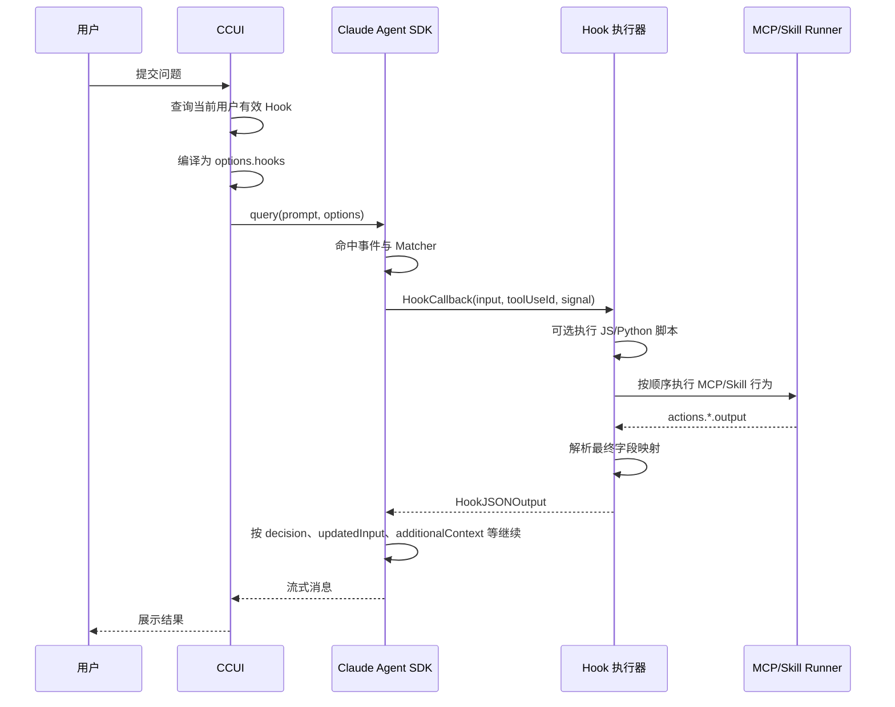

# CCUI Admin Hook 需求设计方案

## 1. 目标与边界

管理员在一个页面内完成 Hook 配置。正式运行时，CCUI 把已发布且对当前用户生效的 Hook 编译进 Claude Agent SDK 的 `options.hooks`。

一个 Hook 按以下顺序处理：

1. 选择 Claude Code Hook 事件；
2. 配置 Claude Code 原生 Matcher；
3. 可选执行 JavaScript 或 Python 扩展脚本；
4. 可选按顺序执行 MCP 工具或 Skill 恢复行为；
5. 显式配置最终返回给 Claude 的 `HookJSONOutput` 字段。

脚本输出和行为输出均为 CCUI 内部变量，不会自动返回 Claude。只有第 5 步开启的字段会进入 Claude Hook 回调返回值。

当前已包含配置、发布、用户生效范围、SDK 注册、脚本执行、MCP 后置调用、回答结束后 Skill 新回合、Claude 返回值组装和执行审计的完整后端链路。

历史 Hook 配置不做转换。

## 2. 配置页面

配置页纵向平铺，不使用多页向导。

### 2.1 Hook 事件与基本信息

管理员填写名称、说明并选择事件。事件决定：

- Claude Code 在哪个时点回调；
- Matcher 匹配哪个 SDK 原生字段；
- 脚本能够读取哪些 `event` 字段；
- 最终能够返回哪些 Claude 字段；
- 是否允许配置 Skill 恢复行为。

默认展示“回答结束、用户提交问题、工具执行前、工具成功后”等管理员开放的事件；“更多事件”用于维护创建页可见事件，不改变 SDK 的事件能力。

### 2.2 Matcher

Matcher 使用一个文本框，内容编译到 Agent SDK 的 `HookCallbackMatcher.matcher`。

- 留空或 `*`：匹配该事件的每次回调；
- 普通名称或 `|` 分隔值：按 SDK 原生名称匹配；
- 包含正则字符：按正则匹配，保存时检查正则语法；
- `FileChanged`：按 `|` 分隔的文件名处理；
- SDK 不支持 Matcher 的事件：输入框禁用。

示例：

| 事件 | Matcher 匹配字段 | 示例 |
| --- | --- | --- |
| `PreToolUse`、`PostToolUse`、`PostToolUseFailure` | `tool_name` | `Bash\|Read`、`^mcp__database__.*$` |
| `PermissionRequest`、`PermissionDenied` | `tool_name` | `Write` |
| `SessionStart` | `source` | `startup\|resume` |
| `StopFailure` | `error` | `rate_limit\|server_error` |
| `SubagentStart`、`SubagentStop` | `agent_type` | `Explore` |
| `Elicitation`、`ElicitationResult` | `mcp_server_name` | `database` |
| `FileChanged` | 文件名 | `.envrc\|.env` |

### 2.3 高级脚本（可选）

高级脚本支持 JavaScript 和 Python。启用脚本时，根据当前事件生成可编辑模板，模板列出该事件真实的 SDK 回调字段。

JavaScript 入口：

```js
export async function run(event, ccui) {
  // 在这里编写处理逻辑
  return {
    output: {
      // riskLevel: 'high'
    },
  };
}
```

Python 入口：

```python
async def run(event, ccui):
    # 在这里编写处理逻辑
    return {
        "output": {
            # "riskLevel": "high"
        }
    }
```

管理员先声明输出变量的名称、类型和说明，再在脚本的 `output` 中返回同名字段。声明后，以下位置可以选择 `script.output.<变量名>`：

- 后续 MCP 工具参数；
- 后续 Skill 参数模板；
- “返回给 Claude”的字段映射。

脚本输出变量名称必须是合法且不重复的 JavaScript/Python 标识符，最多 50 个。脚本最大 128 KB。

### 2.4 CCUI 脚本 API

脚本不能直接获得 Node.js `fs`、`process`、任意网络或数据库连接。CCUI 注入以下受控 API：

JavaScript：

```js
await ccui.workspace.readText(path)
await ccui.workspace.writeText(path, content)
await ccui.workspace.readJson(path)
await ccui.workspace.writeJson(path, value)
await ccui.workspace.list(path)
await ccui.workspace.exists(path)

ccui.env.userId
ccui.env.username
ccui.env.tenantId
ccui.env.workspaceId
ccui.env.sessionId

await ccui.records.write(type, data)
await ccui.log.info(message, data)
```

Python 提供等价的 snake_case 方法，例如 `read_text`、`write_text`、`read_json`、`write_json`。

文件 API 只接受当前会话工作空间内的相对路径。运行时必须防止绝对路径、`..`、符号链接等方式越过工作空间边界。`ccui.env` 在每次真实回调时注入，不在管理员保存配置时固化。

### 2.5 Hook 后置行为

脚本完成后，CCUI 按列表顺序执行行为。当前只保留两类正式行为。

#### 调用 MCP 工具

管理员只能从 `/api/admin/hooks/resources` 返回的真实、已发布且健康的 MCP 工具中选择。编辑器根据工具 `inputSchema` 展开参数，每个参数可选择：

- 固定值；
- 当前 `event` 字段；
- `ccui.env.*`；
- `script.output.*`；
- 已执行的前序行为输出。

运行时由 CCUI 的 MCP Tool Runner 直接调用目标 MCP Server，而不是要求 Claude 再发起一次工具调用。结果保存为：

```text
actions.<actionId>.output
```

因此，CCUI 直接发起的 MCP 调用默认不会再次触发 Claude Code 的 `PreToolUse`、`PostToolUse` Hook，避免递归。

#### 调用 Skill

Skill 不是可被 Hook 直接 RPC 调用的 Claude Code 工具。当前配置把它定义为“回答结束后的新模型回合”，允许用于正常结束 `Stop` 和异常结束 `StopFailure`：

```text
/<skillName> <渲染后的参数>
```

运行时由 CCUI 创建新的、受限回合，将上面的文本作为恢复问题交给 Claude。参数模板可以使用 `{{ccui.env.userId}}`、`{{event.error}}`、`{{script.output.xxx}}`、`{{actions.<id>.output}}` 等变量，并配置最多 1～5 个回合。

这项行为不依赖原 Hook 的返回值。`Stop` 命中时，CCUI 在正常回答结束后追加新回合；`StopFailure` 命中时，即使 Claude Code 忽略该事件的返回值，CCUI 仍可在回调内部完成恢复调度。

### 2.6 返回给 Claude

最后一步平铺展示当前事件被 Agent SDK 接纳的全部返回字段，不再通过下拉框添加字段。每个字段占一行：左侧为字段名称和说明，中间为“返回”开关，右侧为唯一的值输入框。字段默认关闭；管理员开启后直接填写值，在同一个输入框中输入 `/` 可以选择当前可用变量。字符串字段允许把固定文本和变量组合为模板，例如 `执行结果：{{script.output.summary}}`；其他类型可以填写固定值，或用变量整体提供值。关闭的字段不会进入最终 `HookJSONOutput`。

例如 `PreToolUse` 可以配置：

```text
hookSpecificOutput.permissionDecision
hookSpecificOutput.permissionDecisionReason
hookSpecificOutput.updatedInput
hookSpecificOutput.additionalContext
```

`PostToolUse` 可以配置 `hookSpecificOutput.updatedMCPToolOutput`，但 `Stop` 不能配置该字段。后端会在发布时再次按事件白名单校验。

管理员不配置 `hookSpecificOutput.hookEventName`。编译器发现存在任意 `hookSpecificOutput.*` 字段时，会自动写入当前事件名称。

`StopFailure` 的 Hook 返回值会被 Claude Code 忽略，因此页面不提供返回字段，只允许脚本、MCP 工具和 Skill 恢复行为。

## 3. 数据模型

### 3.1 hooks

```sql
CREATE TABLE hooks (
  id TEXT PRIMARY KEY,
  name TEXT NOT NULL,
  description TEXT NOT NULL DEFAULT '',
  status TEXT NOT NULL CHECK (status IN ('draft', 'published', 'disabled')),
  event_name TEXT NOT NULL,
  matcher_json TEXT NOT NULL DEFAULT '{}',
  extension_logic_json TEXT NOT NULL DEFAULT 'null',
  post_actions_json TEXT NOT NULL DEFAULT '[]',
  claude_response_json TEXT NOT NULL DEFAULT '{"bindings":{}}',
  version INTEGER NOT NULL DEFAULT 0,
  activation_scope TEXT NOT NULL CHECK (activation_scope IN ('manual', 'all_users')),
  created_by INTEGER NOT NULL,
  updated_by INTEGER NOT NULL,
  created_at DATETIME DEFAULT CURRENT_TIMESTAMP,
  updated_at DATETIME DEFAULT CURRENT_TIMESTAMP,
  published_at DATETIME
);
```

配置示例：

```json
{
  "eventName": "StopFailure",
  "matcher": { "mode": "exact", "value": "server_error" },
  "extensionLogic": {
    "language": "javascript",
    "code": "export async function run(event, ccui) { return { output: { message: event.error } }; }",
    "outputs": [
      { "name": "message", "type": "string", "description": "失败说明" }
    ]
  },
  "postActions": [
    {
      "id": "send-sms",
      "type": "call_mcp_tool",
      "position": 0,
      "config": {
        "toolName": "mcp__notify__send_sms",
        "inputs": {
          "userId": { "source": "reference", "path": "ccui.env.userId" },
          "content": { "source": "reference", "path": "script.output.message" }
        }
      }
    },
    {
      "id": "recover",
      "type": "invoke_skill",
      "position": 1,
      "config": {
        "skillName": "notify-user",
        "argumentsTemplate": "用户 {{ccui.env.userId}}，失败信息 {{script.output.message}}",
        "maxTurns": 3
      }
    }
  ],
  "claudeResponse": { "bindings": {} }
}
```

### 3.2 用户启用关系

```sql
CREATE TABLE user_hook_bindings (
  user_id INTEGER NOT NULL,
  hook_id TEXT NOT NULL,
  bound_by INTEGER,
  bound_at DATETIME DEFAULT CURRENT_TIMESTAMP,
  updated_at DATETIME DEFAULT CURRENT_TIMESTAMP,
  PRIMARY KEY (user_id, hook_id)
);
```

用户需要运行 Hook 的判断：

```text
Hook.status = published
AND (
  Hook.activation_scope = all_users
  OR user_hook_bindings 中存在 (user_id, hook_id)
)
```

- 管理员启动：`activation_scope = all_users`，当前及未来用户均生效；
- 管理员停止：`activation_scope = manual`，不删除用户自己的绑定；
- 用户自行启用：向 `user_hook_bindings` 插入记录；
- 不使用数据库触发器批量物化全局绑定。

### 3.3 执行审计与脚本数据

`hook_executions` 每命中一次配置 Hook 就创建一条记录，状态为 `running`、`succeeded` 或 `failed`。记录内容包括 Hook 版本、用户/租户/工作空间/会话、SDK 事件输入、脚本输出、各行为输出、最终 Claude 返回值、日志、错误和耗时。

`hook_data_records` 只保存脚本通过 `ccui.records.write(type, data)` 主动写入的业务数据，并通过 `execution_id` 关联本次执行。它不代替系统审计，也不会由基础行为自动产生。

## 4. 管理 API 与发布校验

| 方法 | 路径 | 作用 |
| --- | --- | --- |
| `GET` | `/api/admin/hooks` | Hook 列表 |
| `POST` | `/api/admin/hooks` | 保存新草稿 |
| `GET` | `/api/admin/hooks/:hookId` | Hook 详情 |
| `PUT` | `/api/admin/hooks/:hookId` | 更新草稿 |
| `POST` | `/api/admin/hooks/:hookId/publish` | 发布新版本 |
| `POST` | `/api/admin/hooks/:hookId/start` | 对所有用户启动 |
| `POST` | `/api/admin/hooks/:hookId/stop` | 停止全局启用 |
| `DELETE` | `/api/admin/hooks/:hookId` | 删除 Hook |
| `GET` | `/api/admin/hooks/:hookId/executions` | 查询最近的 Hook 执行审计，`limit` 最大 200 |
| `GET` | `/api/admin/hooks/:hookId/data-records` | 查询脚本主动写入的结构化数据，`limit` 最大 200 |
| `GET/PUT` | `/api/admin/hooks/settings` | 读取或更新创建页可见事件 |
| `GET` | `/api/admin/hooks/resources` | 获取真实 MCP 工具、Skill、环境字段目录 |

发布时校验：

- 事件、Matcher 和正则合法；
- 至少配置脚本、后置行为或 Claude 返回字段之一；
- 脚本语言、大小、输出变量名称、类型和唯一性合法；
- 行为 ID 唯一，最多 20 个，只能引用当前步骤之前已产生的变量；
- MCP 工具必须来自当前资源目录，必填参数已配置；
- Skill 必须来自当前资源目录，且只用于 `Stop` 或 `StopFailure`；
- Claude 返回字段必须属于当前事件的 SDK 白名单；
- 所有引用路径必须指向当前事件、真实环境变量、已声明脚本输出或可用行为输出。

## 5. 编译与 Claude Agent SDK 交互

这里的“编译”不是生成 `.claude/settings.json`，而是在每次创建用户 Claude 会话前，把数据库配置转换为内存中的 `options.hooks`。

```ts
const hooks = {
  PreToolUse: [
    {
      matcher: '^mcp__database__.*$',
      hooks: [createCcuiHookCallback(compiledHook, runtimeContext)],
    },
  ],
};

query({
  prompt,
  options: {
    ...sdkOptions,
    hooks,
  },
});
```

`createCcuiHookCallback` 是 CCUI 固定的桥接函数，管理员不能替换。当前执行器内部逻辑如下：

```ts
async function callback(input, toolUseId, { signal }) {
  const runtime = createHookRuntime(input, toolUseId, signal);

  const scriptResult = compiledHook.script
    ? await scriptRunner.run(compiledHook.script, input, runtime.ccui)
    : { output: {} };

  const actionResults = await postActionRunner.runSequentially(
    compiledHook.postActions,
    { event: input, ccui: runtime.ccui, script: scriptResult },
  );

  if (input.hook_event_name === 'StopFailure') return {};

  return compileClaudeResponse(compiledHook.claudeResponse, {
    event: input,
    ccui: runtime.ccui,
    script: scriptResult,
    actions: actionResults,
  });
}
```

最终返回示例：

```json
{
  "hookSpecificOutput": {
    "hookEventName": "PreToolUse",
    "permissionDecision": "deny",
    "permissionDecisionReason": "命令不符合安全规则"
  }
}
```

单次链路：



## 6. 执行器安全要求

当前运行时安全措施：

1. JavaScript 在独立 Worker/Isolate 中执行，禁用 `process`、`require` 和任意网络/文件模块；
2. Python 在独立受限进程中执行，通过 JSON-RPC 使用 CCUI API；
3. 脚本监听 SDK `AbortSignal` 并默认限制为 10 秒；MCP 调用监听同一信号并默认限制为 30 秒；
4. 文件 API 做路径规范化、真实路径与工作空间边界检查；
5. MCP 行为只连接当前用户工作空间运行时可见的 MCP Server，使用独立 MCP Client 直接调用，不经过模型且不会递归触发 Claude Hook；
6. Skill 恢复把工作空间中已安装 Skill 的真实内容追加到同一 SDK 输入流，并以 Hook + 行为为单位去重，防止失败循环；
7. 最终 `HookJSONOutput` 再按事件白名单校验，未解析变量不返回，并限制为 2 MB；
8. `hook_executions` 记录 Hook 版本、用户、租户、工作空间、会话、事件、耗时、脚本输出、行为结果、Claude 返回值和错误；常见密钥字段写入前脱敏；
9. `ccui.records.write(type, data)` 单独写入 `hook_data_records`，与不可编辑的执行审计分开。

## 7. 当前实现状态

已实现：

- 单页五阶段配置体验；
- 28 个 Agent SDK Hook 事件目录与真实回调字段；
- Matcher 精确值、列表、正则识别与后端校验；
- 可选 JavaScript/Python 模板与脚本输出变量；
- 工作空间、环境、结构化记录和日志 API 契约；
- 真实 MCP 工具和 Skill 资源选择；
- MCP/Skill 后置行为的保存与发布校验；
- 事件级 Claude 返回字段映射；
- 草稿、发布、全局启动/停止和用户绑定模型。
- 用户会话创建时查询全局 Hook 与用户绑定 Hook，并合并进现有 `sdkOptions.hooks`；
- JavaScript Worker + VM 执行器、受限 Python 子进程和 CCUI API 代理；
- 工作空间相对路径、真实路径和符号链接越界防护；
- 独立 MCP Tool Runner；
- `Stop` / `StopFailure` Skill 新回合及同一行为去重；
- 变量解析、模板渲染、`HookJSONOutput` 组装和运行时事件白名单复核；
- `hook_executions` 执行审计与 `hook_data_records` 结构化业务记录；
- 配置、运行时、脚本沙箱、MCP 参数和 Skill 恢复链路自动化测试。
- 由真实 Hook 配置服务创建、发布并全局启动 28 种事件，逐个验证用户解析、SDK Matcher 编译、回调脚本、Claude 返回值、执行审计和结构化记录。
- 全量行为矩阵共创建并执行 235 个已发布 Hook：56 个事件×脚本语言组合、30 个事件×后置行为组合、149 个事件×Claude 返回字段组合；每个脚本组合都会实际调用全部受控 CCUI API，每个 MCP 组合都会启动真实 stdio Server。
- Agent SDK 控制通道测试会接收真实 `initialize` 注册数据，并为 28 个事件发送 `hook_callback` 控制请求，核对 SDK 回写的 `control_response`、CCUI 执行审计及结构化记录；测试不请求模型，因此不会产生 Claude 调用费用。
- `npm run seed:hook-test-configs` 可把全量矩阵保存到显式指定的正式数据库中。生成项统一使用 `[Hook全量测试]` 前缀，发布后保持 `activation_scope = manual`，便于管理员查看且不会对任何用户生效；再次执行会替换旧的同前缀测试配置，不修改用户已有 Hook。

暂未提供独立的正式“模拟测试”页面；测试配置时需要在真实用户会话中触发对应事件，执行结果已经写入审计表。
