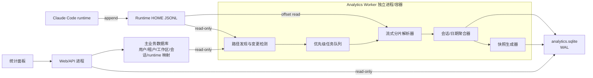

# JSONL 聊天统计索引与历史回填方案

Last updated: 2026-07-27

Status: Proposed

## 1. 背景

Claude 会话的规范聊天历史已经保存在各自 runtime HOME 下的 JSONL 中。改造前的统计面板直接查询 `agent_session_messages`，并且在用户打开统计 Tab 时同步计算统计结果。

当前已经完成不依赖聊天历史的第一阶段：统计面板只读取 `users`、`tenants`、`tenant_users` 和 `session_index`，不访问 `agent_session_messages` 或 JSONL。本方案用于后续需要恢复消息数、Token、工具调用等聊天历史指标时实施。

现有实现存在以下问题：

- Claude 新消息不再写入 `agent_session_messages`，统计面板中的消息数、Token、MCP 工具调用等指标会不完整。
- 如果把当前同步 SQL 直接替换成同步读取 JSONL，打开统计 Tab、切换日期范围、用户分页和刷新都会触发文件扫描。
- 现有 JSONL 总量约 150 GB，文件数量多，并且存在超大文件和超大单行。
- JSONL 解析、`JSON.parse` 和 SQLite 写入即使使用异步文件读取，也可能阻塞 Web/API Node 进程。
- 当前会话历史读取实现会把匹配消息收集到内存后排序，不适合作为统计回填读取器。

因此需要建立独立的 JSONL 统计索引体系。

## 2. 目标

### 2.1 功能目标

- JSONL 是 Claude 聊天历史和聊天统计的唯一事实来源。
- 数据库只保存可以从 JSONL 重建的统计索引、聚合值和处理进度，不保存第二份完整消息历史。
- 首次全量处理约 150 GB JSONL 后，后续只处理新增内容。
- 支持消息数、角色分布、Token、回复率、SQL 检测、MCP 工具使用、用户/租户排行、首次提问和留存等现有指标。
- 支持文件追加、截断、重写、移动、删除、解析失败和解析规则升级。

### 2.2 性能目标

- 打开统计面板时不读取、不扫描、不解析 JSONL。
- 统计接口只查询统计数据库或已完成快照。
- 历史回填期间，统计接口 P95 响应时间小于 300 ms。
- 历史回填期间，不明显增加聊天流式响应停顿。
- Worker 默认内存上限不超过 512 MB。
- 增量统计延迟目标为 60 秒以内。
- 150 GB 首次回填目标在 24 小时以内完成；无业务负载时争取在一个夜间窗口内完成。

### 2.3 非目标

- 不在统计数据库中复制完整 JSONL 消息正文。
- 不要求首次启用后立即得到完整的全部历史统计。
- 不允许统计接口为了追求即时完整性而回退到同步扫描 JSONL。
- 本方案第一阶段不改变 Claude Code 自身写入 JSONL 的行为。

## 3. 核心原则

1. **JSONL 是事实来源**：统计库丢失后必须能够从 JSONL 重建。
2. **请求路径与扫描路径隔离**：页面请求永远不能启动或等待 JSONL 扫描。
3. **进程隔离**：解析运行在独立 OS 进程或独立容器中，不使用 Web/API 进程内的普通异步任务。
4. **数据库隔离**：统计 Worker 写独立的 `analytics.sqlite`，避免与主业务库争抢写锁。
5. **流式和分片**：不整体读取文件，不构造完整消息数组，不对全量消息排序。
6. **先提交后展示**：页面只读取已经原子提交的统计结果或快照。
7. **可见的不完整性**：历史未回填完成时显示覆盖率、进度和更新时间，不把部分统计伪装成完整统计。
8. **幂等和可恢复**：每批统计更新和 checkpoint 在同一事务中提交。

## 4. 总体架构



## 5. 进程与部署模型

### 5.1 推荐模型

- Web/API 进程继续负责页面、WebSocket、聊天和普通接口。
- 新增 Analytics Worker 独立进程。
- 开发环境可以由主服务通过 `child_process.spawn` 启动 Worker。
- 生产环境优先使用独立容器或独立服务。
- 不推荐使用 `worker_threads` 作为最终隔离边界。

独立容器需要：

- 只读挂载 runtime HOME 或包含 JSONL 的宿主机目录。
- 只读访问主数据库，或通过受控接口获取会话到 JSONL 的映射。
- 可写挂载 `analytics.sqlite` 所在目录。
- 独立 CPU、内存限制。

### 5.2 单实例约束

Analytics Worker 使用租约表保证同一统计库同一时刻只有一个主写入器：

```text
analytics_worker_lease
  lease_name
  owner_id
  acquired_at
  expires_at
  heartbeat_at
```

租约需要定期续期；Worker 异常退出后，其他实例可在租约过期后接管。

## 6. 统计数据库

建议使用独立的 `analytics.sqlite`：

```sql
PRAGMA journal_mode = WAL;
PRAGMA synchronous = NORMAL;
PRAGMA busy_timeout = 5000;
PRAGMA foreign_keys = ON;
```

不要让首次回填的大量写事务进入主业务数据库。

### 6.1 文件与 checkpoint

建议表：`analytics_jsonl_files`

```text
id
provider
tenant_id
user_id
workspace_id
runtime_id
provider_session_id
file_path
file_identity
discovered_size
discovered_mtime_ms
processed_offset
verified_boundary_hash
parser_state_json
parser_version
status
retry_count
last_indexed_at
last_error
created_at
updated_at
```

约束和说明：

- `file_path` 不能单独作为文件身份，因为文件可能移动。
- `file_identity` 可以结合规范路径、创建时间、首段摘要等生成。
- `processed_offset` 只前进到最后一个完整换行符之后。
- `verified_boundary_hash` 保存 offset 前固定窗口的摘要，用于判断文件前缀是否被修改。
- `parser_state_json` 保存跨批次所需的少量状态，例如尚未配对的用户提问、Token 累计状态。
- `parser_version` 用于判断统计规则升级后是否需要重建。
- `status` 建议包含 `pending`、`backfilling`、`live`、`complete`、`retry`、`invalid`、`removed`。

### 6.2 最小可重建事实层

建议表：`analytics_session_day`

粒度为：

```text
source_file_id + provider_session_id + day
```

主要字段：

```text
tenant_id
user_id
workspace_id
runtime_id
provider
provider_session_id
day
message_count
user_message_count
assistant_message_count
system_message_count
question_count
assistant_reply_count
sql_like_count
high_risk_sql_count
input_tokens
output_tokens
cache_tokens
total_tokens
token_event_count
mcp_call_count
mcp_error_count
first_message_at
last_message_at
first_question_at
last_question_at
```

保留 `source_file_id` 的原因：

- 文件被重写或删除时，可以删除该文件的全部贡献后局部重建。
- 避免为了修复单个文件重新扫描全部历史。
- 同一个 session 如果存在多个历史来源，也可以安全求和。

### 6.3 MCP 工具聚合

建议表：`analytics_session_tool_day`

```text
source_file_id
provider_session_id
day
server_name
tool_name
call_count
success_count
error_count
last_called_at
```

### 6.4 高频问题与失败问题

建议表：`analytics_session_query_day`

```text
source_file_id
provider_session_id
user_id
day
query_hash
query_sample
question_count
failure_count
last_asked_at
last_failed_at
```

隐私约束：

- `query_hash` 使用规范化文本的 HMAC 或稳定摘要。
- `query_sample` 最多保留有限长度的展示样本，例如 256 个字符。
- 如果安全要求禁止保存任何问题正文，应关闭 `query_sample`，同时取消统计面板中的原文展示。
- 不能把完整用户问题作为“统计索引”重新复制到数据库。

### 6.5 生命周期和留存索引

建议表：`analytics_session_lifetime`

```text
provider_session_id
tenant_id
user_id
workspace_id
provider
first_message_at
last_message_at
first_question_at
last_question_at
active_day_count
total_message_count
total_user_message_count
total_assistant_message_count
total_system_message_count
total_tokens
completed_at
```

用户首次提问和留存可以通过 session lifetime 与 session day 汇总得到，不再需要每次扫描历史。

### 6.6 用户、租户和全局日汇总

为了让面板查询稳定，建议从 session day 异步生成：

- `analytics_user_day`
- `analytics_tenant_day`
- `analytics_global_day`

当某个 session day 改变时，将对应的 `user + day`、`tenant + day` 和 `global + day` 标记为 dirty，再重新聚合这些受影响的键。

不要直接在多个累计表上盲目做 delta 加减，否则文件重建、批次重试和规则升级容易造成统计漂移。

### 6.7 索引状态和快照

建议表：

- `analytics_index_state`
- `analytics_summary_snapshots`

状态字段至少包含：

```text
phase
total_files
completed_files
failed_files
skipped_files
total_bytes
processed_bytes
effective_bytes_per_second
estimated_completion_at
history_coverage_start
history_coverage_end
last_live_update_at
last_backfill_update_at
parser_version
```

快照建议预生成常用范围：

- 7 天
- 30 天
- 90 天
- 全部历史

## 7. JSONL 文件发现

### 7.1 正常会话

优先使用已有数据映射定位文件：

- `agent_session_runtime.runtime_home_path`
- `session_index.provider`
- `session_index.provider_session_id`
- workspace 路径与 Claude project storage name

Claude 标准路径中的 transcript 通常命名为：

```text
<runtime_home>/.claude/projects/<project-storage>/<sessionId>.jsonl
```

正常路径应直接定位，不应为了寻找一个 session 而扫描所有 JSONL。

### 7.2 旧版和异常布局

旧版文件布局使用低优先级 discovery 任务处理：

- 流式遍历目录。
- 每次只处理有限数量目录和文件。
- 保存目录扫描游标。
- discovery 不在服务启动关键路径执行。
- discovery 不在统计接口请求路径执行。

### 7.3 新会话注册

在 provider session 与 runtime 成功绑定时，向 Analytics Worker 注册：

```text
provider
providerSessionId
runtimeHomePath
workspacePath
tenantId
userId
workspaceId
runtimeId
```

这可以避免依赖大范围目录轮询来发现新文件。

### 7.4 变更检测

不能只依赖 `fs.watch`。建议组合使用：

- 会话创建时主动注册。
- 活跃会话按短周期检查 `size/mtime`。
- 非活跃会话按长周期检查。
- 每日进行一次低优先级完整 reconciliation。

## 8. 流式解析与分片

### 8.1 禁止的处理方式

- 禁止 `readFile` 整个 JSONL。
- 禁止把整个会话消息放入数组。
- 禁止解析完整会话后再分页。
- 禁止对完整历史消息排序。
- 禁止逐条消息写 SQLite。

### 8.2 单次执行片

Worker 每个执行片达到任一条件后让出执行权：

- 读取 8 MB。
- 解析 5,000 条完整 JSONL 行。
- 连续运行 250 ms。

这些值应通过基准测试调整。

每批次流程：

1. 从 `processed_offset` 开始读取。
2. 只处理完整 JSONL 行。
3. 在内存中按 session/day/tool/query 聚合。
4. 开启 `analytics.sqlite` 短事务。
5. UPSERT 聚合值。
6. 更新 checkpoint 和 parser state。
7. 提交事务。
8. 将文件重新放回任务队列，稍后继续。

聚合和 checkpoint 必须在同一事务中提交。这样：

- 事务失败时 offset 不前进。
- 事务成功后重启不会重复统计。

### 8.3 未完成的最后一行

Claude 可能正在追加 JSONL。读取到没有换行结尾的最后一段时：

- 不解析该段。
- 不将 offset 移过该段起点。
- 下次从该段起点重新读取。

不应把可能非常大的半行长期保存在内存。

### 8.4 超大单行

单行可能包含巨大的工具结果。建议两级解析：

- 普通行：使用 `JSON.parse`。
- 超过阈值的行：使用选择性流式 JSON 解析，只提取统计需要的字段。

统计字段包括：

- timestamp
- session id
- type/kind/role
- usage/token budget
- tool name/server/status
- error flag
- 用户问题的有限长度样本

巨大工具结果正文不进入聚合对象。

对不能安全解析的超大行：

- 标记文件为 `partial` 或增加 `skipped_lines`。
- 记录错误原因和字节位置。
- 在 coverage 中暴露。
- 不允许静默当作完整统计。

## 9. 消息口径

统计解析器必须复用或对齐现有 Claude 消息可见性规则：

- 排除 `stream_delta` 和 `stream_end`。
- 排除 meta 消息。
- 排除 sidechain 消息。
- 排除 Claude 内部 skill body、local command caveat 等内部内容。
- 排除前端聊天历史中本来不可见的系统噪声。
- 用户消息、助手消息、工具调用和 Token 的去重规则必须稳定。

`agent-*.jsonl` 默认不进入普通消息数，避免子代理内容重复计数。如果产品需要单独统计子代理工具调用，应使用独立维度，不得混入主聊天消息统计。

每次修改统计口径时：

- 增加 `parser_version`。
- 明确哪些指标需要局部重建。
- 不应因为新增一个非核心指标就默认强制重扫全部历史。

## 10. 首次全量回填

### 10.1 阶段

1. **Inventory**
   - 只发现文件并读取 metadata。
   - 计算总文件数和总字节数。
   - 不读取文件正文。

2. **Benchmark**
   - 选择具有代表性的 1–5 GB JSONL。
   - 使用正式解析器测量端到端 MB/s、CPU、内存和 SQLite 写入速度。

3. **Recent priority**
   - 优先处理最近活跃 session。
   - 优先形成最近 7/30/90 天的可用覆盖。

4. **Historical backfill**
   - 从最近 session 向旧 session 推进。
   - 按处理字节数计算进度和 ETA。

5. **Reconciliation**
   - 校验文件总数、总字节数、失败文件和规则版本。
   - 生成全部历史完整快照。

### 10.2 150 GB 时间预估

以端到端有效吞吐计算：

| 有效吞吐 | 150 GB 预计时间 |
|---:|---:|
| 3 MB/s | 约 14 小时 |
| 5 MB/s | 约 8.5 小时 |
| 10 MB/s | 约 4.3 小时 |
| 20 MB/s | 约 2.1 小时 |

实际时间还受小文件数量、超大单行、文件系统和解析失败重试影响。

推荐初始策略：

- 白天回填上限 3–5 MB/s。
- 无活跃聊天时提升到 10–15 MB/s。
- 预计一个夜间窗口完成，保守接受 24 小时以内完成。

### 10.3 优先级

任务队列优先级从高到低：

1. 活跃 session 的新增内容。
2. 最近 7 天未完成 session。
3. 最近 30 天未完成 session。
4. 最近 90 天未完成 session。
5. 更早历史。
6. reconciliation 和低优先级重试。

## 11. 增量更新

首次回填完成后：

- `size == processed_offset`：无需读取。
- `size > processed_offset` 且边界 hash 一致：从 offset 增量读取。
- 新文件：从 0 开始。
- `size < processed_offset`：文件被截断，局部重建。
- 边界 hash 不一致：文件被原地修改，局部重建。
- 文件消失：标记 removed，删除该 source file 的聚合贡献。
- 文件移动且 identity 一致：更新路径，不重复统计。

正常情况下，后续成本只与新增 JSONL 字节数有关。

## 12. 资源控制

建议环境变量：

```text
ANALYTICS_INDEXER_ENABLED=true
ANALYTICS_DB_PATH=<data>/analytics.sqlite
ANALYTICS_WORKER_CONCURRENCY=1
ANALYTICS_BATCH_BYTES=8388608
ANALYTICS_BATCH_LINES=5000
ANALYTICS_SLICE_MS=250
ANALYTICS_DAY_READ_MBPS=5
ANALYTICS_IDLE_READ_MBPS=12
ANALYTICS_ACTIVE_CHAT_READ_MBPS=1
ANALYTICS_PAUSE_ON_HIGH_LOAD=true
ANALYTICS_MAX_NORMAL_JSON_LINE_BYTES=2097152
ANALYTICS_SNAPSHOT_INTERVAL_MS=30000
```

### 12.1 动态节流

建议状态：

```text
无活跃聊天：10–15 MB/s
存在活跃聊天：0–1 MB/s
API P95 超过阈值：暂停历史回填
聊天流式延迟异常：暂停历史回填
夜间窗口：允许提升吞吐
```

活跃 session 增量任务的数据量通常较小，可保留高优先级；暂停的主要是历史回填。

### 12.2 SQLite 写入

- 每批次使用短事务。
- 不为每条消息执行一次提交。
- 写入聚合行，不写入完整消息。
- 定期 checkpoint WAL，但避免高峰期执行重型维护。
- Snapshot 生成和 JSONL 解析不要持有同一个长事务。

## 13. 统计 API 改造

以下接口改为只读统计库：

- `GET /api/admin/analytics/summary`
- `GET /api/admin/analytics/users`
- `GET /api/admin/analytics`
- `GET /api/admin/mcp/tool-usage`

新增：

- `GET /api/admin/analytics/index-status`
- `POST /api/admin/analytics/indexer/reconcile`
- `POST /api/admin/analytics/indexer/rebuild-file`
- `POST /api/admin/analytics/indexer/rebuild-session`

管理写操作必须保留管理员权限和审计记录。

### 13.1 响应覆盖信息

统计响应统一包含：

```json
{
  "coverage": {
    "status": "backfilling",
    "isComplete": false,
    "processedBytes": 53687091200,
    "totalBytes": 161061273600,
    "progress": 0.3333,
    "effectiveBytesPerSecond": 7340032,
    "estimatedCompletionAt": "2026-07-28T03:40:00.000Z",
    "lastIndexedAt": "2026-07-27T15:30:00.000Z",
    "failedFiles": 2,
    "skippedLines": 0,
    "parserVersion": 1
  }
}
```

### 13.2 强制规则

- 统计 API 不允许调用 provider `fetchHistory`。
- 统计 API 不允许访问 JSONL 文件系统。
- 统计库不可用时快速返回 `initializing` 或最后缓存快照。
- 统计库数据过期时返回 stale 数据并标明更新时间。
- 统计 API 不允许回退查询 Claude 的 `agent_session_messages`。

## 14. 前端改造

当前 `AnalyticsDashboardTab` 在挂载时请求 summary 和 users，切换 Tab 后会卸载，回来时重新请求。

建议：

- 将统计查询结果放入具有 `staleTime` 的前端查询缓存。
- 再次打开 Tab 时立即展示上一次数据。
- 后台静默请求最新快照。
- 默认 `staleTime` 30–60 秒。
- 日期范围切换显示已有缓存，再刷新对应范围。
- “刷新”只刷新统计快照，不启动 JSONL 扫描。
- 独立提供“安排重新索引”管理入口。

### 14.1 状态展示

面板显示：

```text
数据更新至：2026-07-27 15:30
最近 30 天：完整
全部历史：回填 68%
当前速度：7.4 MB/s
预计完成：约 2 小时
异常文件：2
```

没有任何可用快照时，接口应快速返回 `initializing`，页面展示初始化状态，而不是等待扫描完成。

## 15. 指标迁移顺序

### P0：基础指标

- 消息总数。
- 用户、助手、系统消息数。
- 每日消息趋势。
- Token 数。
- 用户和租户汇总。

### P1：交互和风险指标

- 助手回复数。
- 回答返回率。
- SQL-like 回答。
- 高风险 SQL。
- 失败原因。

### P2：扩展指标

- MCP server/tool 调用统计。
- 高频问题。
- 失败问题。
- 首次提问用户。
- D1/D7/D30 留存。

每组指标应有独立 readiness。P2 尚未完成时，不应阻塞 P0 面板上线。

## 16. 异常与恢复

### 16.1 Worker 崩溃

- 已提交批次保留。
- 未提交批次全部回滚。
- 重启后从最后 checkpoint 继续。
- 页面继续读取最后快照。

### 16.2 文件截断或重写

1. 标记文件 `rebuild_required`。
2. 原子删除该 `source_file_id` 的贡献。
3. checkpoint 重置到 0。
4. 重新处理该文件。
5. 重新生成受影响的 user/tenant/day 聚合。

### 16.3 文件删除

- 标记 removed。
- 删除对应 source file 贡献。
- 保留审计状态。
- 不删除主业务 session 数据。

### 16.4 统计规则升级

- 提升 parser version。
- 明确受影响指标。
- 优先支持“只重建受影响指标”。
- 必须全量重建时，旧快照继续服务，直到新版本快照完成后原子切换。

### 16.5 统计库损坏

- 页面显示 stale/initializing。
- 聊天和其他页面不受影响。
- 删除或隔离损坏统计库后，从 JSONL 重建。

## 17. 测试方案

### 17.1 单元测试

- 普通用户和助手消息。
- Token usage 的不同字段命名。
- MCP tool name/server/status。
- partial last line。
- malformed line。
- 超大工具结果行。
- meta、sidechain、internal content 过滤。
- reply pairing 跨批次。
- checkpoint 重放幂等性。
- 文件截断、重写和删除。

### 17.2 集成测试

- Worker 处理临时 runtime HOME。
- Worker 中途终止后恢复。
- 同一批次统计和 checkpoint 原子性。
- 两个 Worker 争抢租约。
- API 只读统计库且不触发文件访问。
- parser version 升级后局部重建。

### 17.3 性能测试

- 使用 1–5 GB 代表性 JSONL。
- 包含大量小文件、单个大文件和超大单行。
- 记录端到端 MB/s、CPU、峰值内存、SQLite 写入量。
- 回填同时持续请求统计接口和运行聊天。
- 验证统计 API P95 和聊天流式延迟目标。

## 18. 验收标准

- 打开统计 Tab 不产生 JSONL 文件读取。
- 切换日期、分页、搜索和刷新不产生 JSONL 文件读取。
- Worker 停止时统计面板仍可展示最后快照。
- Worker 崩溃不导致 Web/API 进程退出或卡顿。
- 回填期间 Web/API 统计接口 P95 小于 300 ms。
- Worker 峰值内存不超过配置上限。
- 150 GB 回填在目标资源配置下 24 小时内完成。
- 回填完成后的新增统计延迟小于 60 秒。
- Worker 重启后消息统计不重复。
- 单文件重建不要求重新扫描其他 JSONL。
- 页面明确显示统计覆盖率、更新时间和异常文件数。

## 19. 分阶段实施

### 阶段 0：盘点和基准

- 统计文件数和总字节数。
- 构建代表性样本。
- 测试正式解析器吞吐。
- 确定 CPU、内存和 MB/s 限制。

### 阶段 1：Worker 基础设施

- 创建独立 Worker。
- 创建 `analytics.sqlite` 和 checkpoint 表。
- 实现租约、任务队列、状态和资源限速。
- 实现文件发现和直接路径注册。

### 阶段 2：P0 解析与回填

- 实现流式分片解析。
- 实现消息和 Token 基础统计。
- 实现 session/day 与 user/tenant/global rollup。
- 执行 150 GB 首次回填。

### 阶段 3：接口与前端切换

- 统计接口改为只读统计库。
- 增加 coverage/status。
- 前端增加缓存、静默刷新和回填进度展示。
- 禁止统计接口访问 JSONL。

### 阶段 4：P1/P2 指标

- 回复率、SQL、高风险 SQL。
- MCP 使用统计。
- 高频/失败问题。
- 首次提问和留存。

### 阶段 5：收尾

- 校验 JSONL 统计与历史数据库统计差异。
- 完成全部历史快照。
- 移除 Claude 统计对 `agent_session_messages` 的依赖。
- 建立日常 reconciliation 和告警。

## 20. 最终决策

本方案选择：

- 一次全量流式回填约 150 GB JSONL。
- 回填完成后永久增量更新。
- 独立 Analytics Worker。
- 独立 `analytics.sqlite`。
- 统计接口只查询已提交汇总或快照。
- 页面永不等待 JSONL 扫描。
- 历史不完整时展示覆盖率和 ETA。

这使 JSONL 数量和大小只影响“历史统计多久完成”，不会影响“统计面板和其他页面是否可用”。
