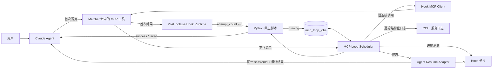
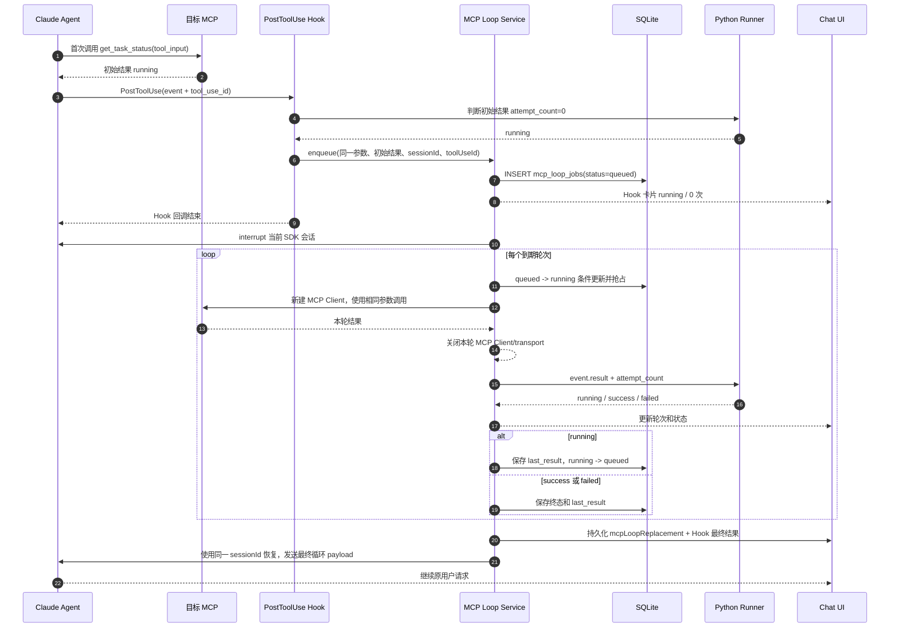
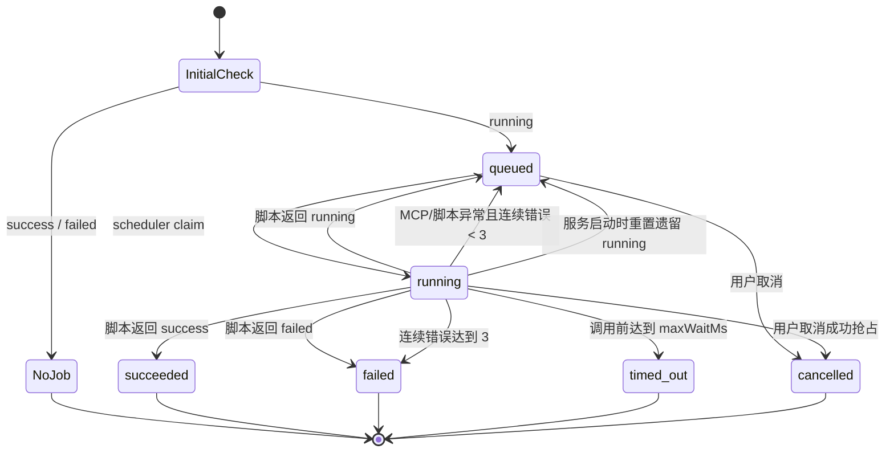
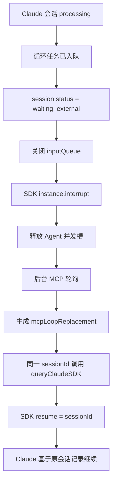
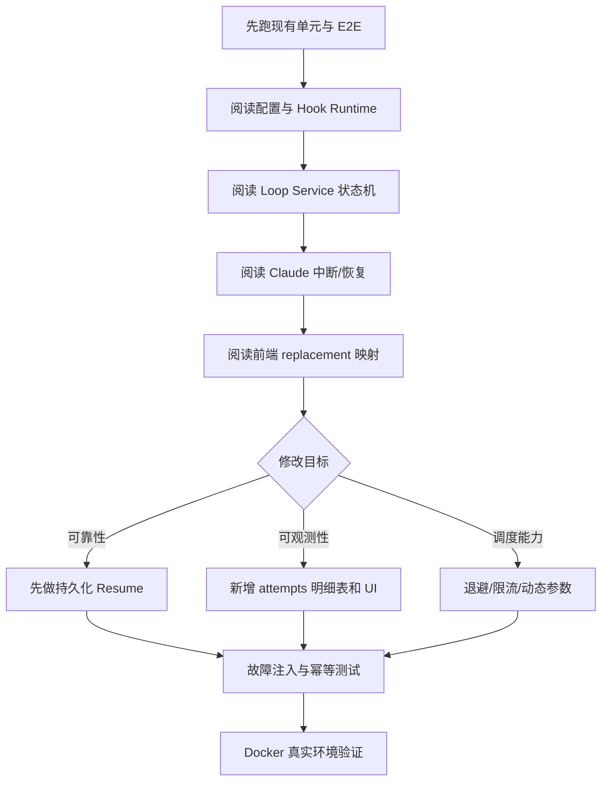

# Hook MCP 后置循环（`mcp_loop_run`）实现与维护手册

> 文档状态：当前实现说明 + 接手改造指南<br>
> 最后核对：2026-08-29<br>
> 适用范围：CCUI Claude Agent、Hook `PostToolUse`、Hook MCP 目录

本文中“当前实现”描述已经存在的代码；第 15 节带有“建议、推荐、未来”措辞的内容是改造方案，尚未实现。

## 目录

- [1. 一页结论](#1-一页结论)
- [2. 为什么使用 PostToolUse](#2-为什么使用-posttooluse)
- [3. 总体架构](#3-总体架构)
- [4. 配置模型](#4-配置模型)
- [5. Python 终止脚本](#5-python-终止脚本)
- [6. 完整运行时序](#6-完整运行时序)
- [7. 状态机与错误策略](#7-状态机与错误策略)
- [8. 持久化模型](#8-持久化模型)
- [9. MCP 调用、连接与鉴权](#9-mcp-调用连接与鉴权)
- [10. Agent 暂停、上下文和恢复](#10-agent-暂停上下文和恢复)
- [11. 页面行为](#11-页面行为)
- [12. 逐轮执行日志](#12-逐轮执行日志)
- [13. 运维查询与排障](#13-运维查询与排障)
- [14. 测试与模拟环境](#14-测试与模拟环境)
- [15. 接手后的常见改造方案](#15-接手后的常见改造方案)
- [16. 修改时必须守住的系统不变量](#16-修改时必须守住的系统不变量)
- [17. 建议接手顺序](#17-建议接手顺序)

## 1. 一页结论

`mcp_loop_run` 是 CCUI 内部的 Hook 后置行为，不是一个对 Agent 暴露的 MCP 工具。它解决的是以下问题：

1. Agent 调用一个“查询状态”类 MCP 工具；
2. 首次结果仍为 `running`；
3. CCUI 暂停当前 Agent 回合；
4. CCUI 在后台使用**同一个 MCP 工具、同一组参数**进行短连接轮询；
5. 每次成功取得结果后运行 Python 终止脚本；
6. 脚本返回 `success` 或 `failed` 后，CCUI 把最后结果注入原 Claude 会话并恢复 Agent。

当前实现的核心特征：

- 只支持 `PostToolUse`；
- 循环目标就是 Matcher 命中的 MCP 工具，不单独配置目标；
- 每轮复用首次调用的完整 `event.tool_input`；
- 首次 MCP 结果也会执行终止脚本，此时 `attempt_count = 0`；
- 每轮轮询都是一次独立 MCP 连接，调用完成立即关闭；
- 等待期间不占用模型连接，也不持续占用 MCP 连接；
- 同一 Claude 会话最多有一个活动循环；
- 原 MCP 卡片保留首次结果，最终结果显示在 Hook 卡片；
- 每轮脚本输入、输出、判断结果与错误都会保存到 `mcp_loop_attempts`，管理员可在 Hook 执行记录详情中查看；
- 循环任务记录保存在 SQLite，但 Agent 自动恢复所需上下文仍有一部分只存在内存中，因此 **CCUI 进程重启后的自动恢复尚不可靠**。

## 2. 为什么使用 `PostToolUse`

循环行为必须发生在原 MCP 工具已经返回以后，因为此时 CCUI 才同时拥有：

- 原工具名称 `event.tool_name`；
- 原工具参数 `event.tool_input`；
- 原工具调用 ID `event.tool_use_id`；
- 原工具返回 `event.tool_response`。

如果放在 `PreToolUse`：

- 还没有首次查询结果；
- 无法判断任务是否已经终止；
- 会把“允许原工具先执行”和“后续轮询”混成一个阶段；
- 无法自然保留页面上的首次 MCP 调用记录。

因此当前实现只允许 `PostToolUse + mcp_loop_run`，并要求循环行为是 Hook 的最后一个后置行为。

## 3. 总体架构



### 3.1 组件职责

| 组件 | 主要职责 | 源码入口 |
|---|---|---|
| Hook 配置 UI | 限制事件、选择 Matcher、编辑轮询参数和 Python 脚本 | [`src/components/admin/hook-config/HookConfigEditor.tsx`](../src/components/admin/hook-config/HookConfigEditor.tsx) |
| Hook 配置服务 | 校验并标准化 `mcp_loop_run`；发布时验证 Matcher 资源 | [`server/services/hook-configs.js`](../server/services/hook-configs.js) |
| Hook Runtime | 读取首次 `tool_input/tool_response`，调用 `enqueueMcpLoop` | [`server/services/hook-runtime.js`](../server/services/hook-runtime.js) |
| MCP Loop Service | 持久化任务、调度、调用 MCP、执行终止脚本、推进状态 | [`server/services/mcp-loop-service.js`](../server/services/mcp-loop-service.js) |
| MCP Client | 为每一轮创建连接、调用工具、规范化结果并关闭连接 | [`server/services/hook-mcp-client.js`](../server/services/hook-mcp-client.js) |
| Python Runner | 隔离执行终止脚本，限制内置函数和模块导入 | [`server/services/hook-script-executor.js`](../server/services/hook-script-executor.js)、[`hook-python-runner.py`](../server/services/hook-python-runner.py) |
| Claude Adapter | 保存循环上下文、中断会话、发送 Hook 活动、恢复同一会话 | [`server/claude-sdk.js`](../server/claude-sdk.js) |
| Chat 映射与卡片 | 保留原 MCP 结果，把循环最终结果挂到 Hook 卡片 | [`src/components/chat/hooks/useChatMessages.ts`](../src/components/chat/hooks/useChatMessages.ts)、[`MessageComponent.tsx`](../src/components/chat/view/subcomponents/MessageComponent.tsx) |
| SQLite Schema | 保存循环任务当前状态 | [`server/database/hook-config-schema.js`](../server/database/hook-config-schema.js) |

## 4. 配置模型

### 4.1 完整示例

```json
{
  "name": "等待任务结束",
  "eventName": "PostToolUse",
  "matcher": {
    "mode": "exact",
    "value": "mcp__mcp-loop-demo__get_task_status"
  },
  "extensionLogic": null,
  "postActions": [
    {
      "id": "wait-until-terminal",
      "type": "mcp_loop_run",
      "position": 0,
      "config": {
        "pollIntervalMs": 10000,
        "perCallTimeoutMs": 15000,
        "maxWaitMs": 2700000,
        "waitingLabel": "等待任务完成",
        "terminationScript": "async def run(event, ccui):\n    result = event.get(\"result\") or {}\n    status = result.get(\"status\")\n    if status == \"success\":\n        return {\"output\": {\"status\": \"success\"}}\n    if status == \"failed\":\n        return {\"output\": {\"status\": \"failed\"}}\n    return {\"output\": {\"status\": \"running\"}}\n"
      }
    }
  ],
  "claudeResponse": {
    "bindings": {}
  }
}
```

### 4.2 字段与约束

| 字段 | 默认值 | 后端约束 | 说明 |
|---|---:|---:|---|
| `pollIntervalMs` | `10000` | 10 ms ～ 300000 ms | 上一次调用处理完以后，再等待该间隔 |
| `perCallTimeoutMs` | `15000` | 10 ms ～ 300000 ms | 单轮 MCP 连接和调用总超时 |
| `maxWaitMs` | `2700000` | 不小于轮询间隔，最大 604800000 ms | 默认 45 分钟，最大 7 天 |
| `waitingLabel` | `等待任务完成` | 最长 200 字符 | Hook 卡片提示文字 |
| `terminationScript` | 页面内置示例 | 必填，最大 128 KiB | 当前只执行 Python |

额外约束：

- 只能配置在 `PostToolUse`；
- 一个 Hook 最多一个 `mcp_loop_run`；
- 它必须是最后一个后置行为；
- Matcher 必须完整匹配 Hook MCP 目录中已发现的 MCP 工具；
- 配置循环后，页面会清空并隐藏“返回给 Claude”的普通 Hook bindings；循环最终结果走独立恢复链路；
- 同一 Agent 会话如果已有活动循环，第二个循环会被拒绝。

### 4.3 MCP 工具如何匹配

管理端和 Hook 配置使用稳定的公开名称：

```text
mcp__<Hook MCP server name>__<tool name>
```

例如：

```text
mcp__mcp-loop-demo__get_task_status
```

发布 Hook 时，后端用 `hook.matcher.value` 在 Hook MCP 工具目录中做精确查找。循环动作不再保存另一份 MCP 选择，避免 Matcher 与循环目标不一致。

真正执行时，后端会根据保存的 `mcpServerId` 生成内部 runtime alias：

```text
mcp__ccui-hook-mcp-<server-id-suffix>__get_task_status
```

公开名称用于配置稳定性，runtime alias 用于避免与用户工作区其他 MCP server name 冲突。

### 4.4 参数从哪里来

循环参数不做二次映射，直接复制首次触发 Hook 的完整参数：

```js
const input = event.tool_input;
```

因此如果首次调用为：

```json
{
  "task_id": "task-123",
  "region": "cn-north-4"
}
```

后续所有轮次都会使用完全相同的对象。`task_id` 不需要在循环动作里再次配置。

## 5. Python 终止脚本

### 5.1 输入契约

首次结果和每次成功轮询的结果都会经过同一个脚本：

```python
async def run(event, ccui):
    event["result"]          # 当前结果；首次判断时是原 MCP 返回
    event["initial_result"]  # 首次 MCP 返回，后续轮次保持不变
    event["inputs"]          # 首次完整 tool_input
    event["attempt_count"]   # 首次判断为 0；轮询从 1 开始
    event["elapsed_ms"]      # 从循环判断开始计算的耗时
```

### 5.2 输出契约

推荐返回：

```python
return {"output": {"status": "running"}}
return {"output": {"status": "success"}}
return {"output": {"status": "failed"}}
```

运行时还兼容以下别名：

| 脚本返回 | 内部状态 |
|---|---|
| `running`、`continue` | 继续轮询 |
| `success`、`succeeded` | `succeeded` |
| `failure`、`failed` | `failed` |

其他返回值会被视为脚本错误，进入轮询错误重试策略。

### 5.3 处理多层结果示例

```python
async def run(event, ccui):
    result = event.get("result") or {}
    task = result.get("data") or {}
    state = task.get("state")

    await ccui.log.info(
        "termination decision",
        {
            "attempt": event.get("attempt_count"),
            "state": state,
        },
    )

    if state == 3:
        return {"output": {"status": "success"}}
    if state == -1:
        return {"output": {"status": "failed"}}
    return {"output": {"status": "running"}}
```

### 5.4 隔离与模块导入

Python 脚本通过独立进程运行，使用 `python -I -S`，默认超时 10 秒。运行器限制危险内置函数、dunder 属性、相对导入和通配符导入。

允许导入的顶层模块由服务端环境变量精确控制：

```bash
CCUI_HOOK_PYTHON_IMPORT_ALLOWLIST=json,re,math,datetime
```

注意：

- 白名单控制的是 Hook Python 脚本，不是 MCP `headersHelper`；
- 终止脚本不能通过 `os.getenv("USER_KEY")` 读取 Agent 私密环境；
- 终止脚本可使用受限的 `ccui.workspace` 和 `ccui.log` API；
- 循环运行时没有为 `ccui.records.write` 注入持久化处理器，不应依赖它保存轮询记录；
- 旧版本 `successWhen/failureWhen` 等值条件会在配置读取或保存时转换成等价 Python 脚本；已经在运行且脚本为空的旧任务仍保留等值判断兼容逻辑。

## 6. 完整运行时序



### 6.1 首次结果已经终止

如果 `attempt_count = 0` 时脚本就返回 `success` 或 `failed`：

- 不创建 `mcp_loop_jobs`；
- 不暂停 Agent；
- 不产生后台循环；
- 原工具结果直接按正常 Claude Hook 流程继续。

如果首次判断脚本本身报错，`enqueue` 会直接失败，Hook Runtime 按现有 fail-open 行为记录 Hook 失败并返回空响应；此时同样不会创建后台 job，也不会进入“连续三次错误”策略。

### 6.2 调度节奏

调度器默认每 1 秒扫描一次到期任务，单轮节奏为：

```text
实际间隔 ≈ 本轮 MCP 调用耗时 + pollIntervalMs + 最多约 1 秒调度扫描延迟
```

它不是以任务开始时间为基准的固定频率调度，因此不会在上一次调用未结束时为同一任务重叠发起下一轮。

## 7. 状态机与错误策略



### 7.1 错误计数

- MCP 连接失败、调用超时、MCP 返回 `isError`、终止脚本异常都计入 `consecutive_error_count`；
- 任意一次 MCP + 脚本完整成功都会把连续错误数清零；
- 默认连续 3 次错误后任务进入 `failed`；
- 失败轮次仍计入 `attempt_count`；
- `maxWaitMs` 在发起单轮调用前检查，因此最后一次调用可能让实际总时长略超过 `maxWaitMs`，最大偏差主要由单次调用超时决定。

### 7.2 取消语义

Hook 卡片的“取消等待”通过 WebSocket 发送：

```json
{
  "type": "cancel-mcp-loop",
  "jobId": "..."
}
```

后端只有在 `job.user_id` 等于当前 WebSocket 用户时才允许取消。

- 单独点击“取消等待”：任务进入 `cancelled`，然后用取消 payload 恢复 Agent；
- 停止整个 Agent 会话：设置 `skipResume` 后取消循环，不再恢复 Agent。

## 8. 持久化模型

当前有两张循环相关表：`mcp_loop_jobs` 保存任务当前状态，`mcp_loop_attempts` 保存逐轮审计历史。

### 8.1 字段分组

| 分组 | 字段 | 作用 |
|---|---|---|
| 身份 | `id`、`hook_id`、`hook_execution_id`、`action_id` | 关联 Hook 与后置行为 |
| 租户 | `tenant_id`、`workspace_id`、`user_id` | 权限、运行时和取消校验 |
| 会话 | `session_id`、`tool_use_id`、`workspace_root` | 恢复原 Claude 会话并关联原工具 |
| MCP | `mcp_server_id`、`tool_name`、`inputs_json` | 定位工具并复用参数 |
| 规则 | `termination_script`、遗留的 `success_when_json/failure_when_json` | 终止判断快照 |
| 策略 | `poll_interval_ms`、`per_call_timeout_ms`、`max_wait_ms` | 调度策略 |
| 当前状态 | `status`、`attempt_count`、`consecutive_error_count` | 状态机 |
| 当前结果 | `initial_result_json`、`last_result_json`、`error_message` | 只保存初始和最后结果 |
| 时间 | `next_poll_at_ms`、`started_at_ms`、`completed_at_ms` | 到期扫描和耗时 |

唯一约束：

```text
UNIQUE(hook_execution_id, action_id)
```

它避免同一个 Hook 执行中的同一个循环动作被重复入队。

### 8.2 逐轮审计表

`mcp_loop_attempts` 以 `hook_execution_id + action_id + attempt_count` 唯一标识一轮：

- 第 0 轮保存首次 MCP 返回后的脚本判断；
- 后续轮次保存实际传给脚本的完整 `event` 和脚本原始返回值；
- MCP 调用失败时仍保存该轮，并以 `script_status = not_run` 标识脚本未执行；
- 脚本异常时保存输入、错误和 `failure_stage = termination_script`；
- 管理员执行记录列表不携带明细，打开单条详情时才按 `hook_execution_id` 查询，避免拖慢列表。

逐轮输入输出按真实 JSON 保存，并且只由管理员接口读取；其中可能包含业务敏感数据。服务端结构化日志仍使用脱敏和截断后的副本。

当前仍没有循环任务和逐轮明细的终态清理任务，数据会持续累积。正式长期运行前应增加保留期限和分批清理策略。

### 8.3 Hook 执行记录与循环任务不是同一个生命周期

`hook_executions` 只记录 Hook 是否成功完成了“调度循环”这个后置行为。循环成功入队后，Hook 执行本身就可能显示 `succeeded`，即使后台循环仍在运行。

真正的循环终态应查看 `mcp_loop_jobs.status`，不要把 `hook_executions.status` 当成异步任务结果。

## 9. MCP 调用、连接与鉴权

### 9.1 连接生命周期

每一轮调用都会：

1. 根据 `mcpServerId + toolName` 重新解析当前 Hook MCP 资源；
2. 创建 `Client` 和 HTTP/SSE/stdio transport；
3. 建立连接；
4. 调用一次工具；
5. 在 `finally` 中关闭 Client 和 transport。

所以 20 分钟的等待不是 20 分钟长连接。只有实际轮询调用期间存在 MCP 连接。

job 会快照保存工具身份、输入、终止脚本和轮询策略，但每轮仍从 Hook MCP 目录重新解析 server 运行配置。因此活动循环期间修改 URL/header/helper 配置会影响后续轮次；删除或改名目标资源会让后续调用进入错误重试。

Claude SDK Hook 本身配置了 60 秒超时，但 Hook 回调只负责首次判断和入队，不会同步等待整个循环，因此 20 分钟任务不会占住 Hook 回调连接。

### 9.2 并发与 100 个等待任务

默认全局最多同时执行 20 个轮询调用：

```js
DEFAULT_MAX_CONCURRENT = 20
```

100 个等待任务大部分时间只是 SQLite 中的 `queued` 行，不占用模型连接或 MCP 连接。需要关注的是同一时刻到期造成的调用突发，而不是等待时长本身。

当前全局并发数是单 Node.js 进程内计数；实现默认假设单 CCUI 服务实例。多实例部署需要数据库 lease，而不能只依赖进程内 `runningCount`。

### 9.3 `headersHelper` 和 Agent 环境变量

如果 Hook MCP 配置了 `headersHelper`：

- Docker Agent 模式下，helper 在对应 Agent 容器内通过 `docker exec` 执行；
- 工作目录为 `/workspace`，`HOME=/home/cloudcli`；
- 它获得 Agent 本轮 guest 环境，例如 `USER_KEY`、`TENANT_ID`、`WORKSPACE_ID`；
- 同时获得 Hook MCP 的私有 `helperEnv` 和 `CLAUDE_CODE_MCP_SERVER_*` 变量；
- helper stdout 必须是字符串 header 的 JSON 对象；
- helper 命令失败时，原始 `docker exec` 命令和环境值会被脱敏，不回传到页面。

这条链路与终止 Python 脚本是两套不同的执行器，不应混淆。

## 10. Agent 暂停、上下文和恢复



### 10.1 20 分钟以后上下文是否还在

只要 CCUI 服务进程和恢复所需内存上下文没有丢失，答案是“在”。等待本身不调用模型，也不消耗模型上下文长度。

恢复时保留：

- 用户与 Agent 的历史消息；
- 已写入 Claude 会话记录的工具调用；
- 同一 runtime home 中的 Claude transcript；
- 工作区文件和 `CLAUDE.md`；
- 原 `sessionId`。

不保留：

- 被中断模型尚未输出的内部推理状态；
- 被中断进程的内存变量；
- 未完成的 Shell/MCP 子进程；
- 没有写入文件或会话记录的临时状态。

因此这是“在原会话上开启一个恢复回合”，不是冻结并恢复原进程指令指针。

### 10.2 最终结果如何返回

终态时后端创建一个规范化 `tool_result` 消息：

```json
{
  "origin": "hook",
  "toolId": "<原 tool_use_id>",
  "mcpLoopReplacement": true,
  "mcpLoopJobId": "<job id>"
}
```

同时给恢复后的 Claude 发送内部 payload：

```xml
<ccui-mcp-loop-result job-id="..." tool-use-id="..." status="succeeded">
  {"mcpLoop":true,"replacesToolUseId":"...","status":"succeeded","attempts":3,"elapsedMs":120000,"result":{...}}
</ccui-mcp-loop-result>
```

模型会被明确要求继续原用户请求，并且不要自动再次调用同一个状态工具。

| 终态来源 | 模型侧工具结果 |
|---|---|
| 脚本判断 `success` | 最后一次 MCP 原始结果 |
| 脚本判断 `failed`，无基础设施错误 | 最后一次 MCP 原始结果 |
| 连续调用/脚本错误 | 包含状态、最后结果和错误的循环 wrapper |
| `timed_out` / `cancelled` | 循环 wrapper |

### 10.3 当前重启恢复缺口

SQLite 中的任务可以跨进程保存，服务启动时也会把遗留 `running` 重置为 `queued`。但是以下对象只存在 Node.js 内存：

| 内存对象 | 作用 | 重启后影响 |
|---|---|---|
| `mcpLoopContextsByJob` | 保存 `runtimeOptions`、Hook activity 和 WebSocket writer | 终态时无法自动恢复 Agent |
| `mcpLoopSuspensionsBySession` | 阻止等待期间其他 Agent 回合进入 | 重启后等待锁丢失 |
| Loop Service `runtimeContexts` | 保存 Docker 模式与 `headersHelperRunner` | 鉴权 helper 可能在错误环境执行或失败 |
| WebSocket writer | 把进度和恢复消息发送给当前页面 | 页面断线或服务重启后不能直接复用 |

典型日志：

```text
Resume context is unavailable for completed job <job-id>
```

这意味着“任务可以继续轮询”不等于“Agent 一定能自动恢复”。要支持可靠的 20 分钟以上任务，应优先完成第 15.2 节的持久化恢复改造。

## 11. 页面行为

### 11.1 配置页

配置页只在以下条件满足时启用“循环调用 MCP”：

- 事件为 `PostToolUse`；
- Matcher 能匹配一个 Hook MCP 工具；
- 当前 Hook 尚未添加循环行为。

添加后：

- 目标区域显示“来自 Matcher”；
- 不再展示 MCP 参数映射；
- 禁止在循环行为后添加其他后置行为；
- 隐藏普通“返回给 Claude”配置，并清空 bindings。

### 11.2 会话页

```text
┌──────────────── MCP 工具卡片 ────────────────┐
│ get_task_status                               │
│ Details: { "task_id": "...", "status":"running" }
└──────────────────────────────────────────────┘

┌──────────────── Hook 循环卡片 ───────────────┐
│ 等待任务结束                  [执行中]         │
│ get_task_status · 已轮询 3 次 · 02:10          │
│                                  [取消等待]    │
│                                                │
│ 完成后：最终结果                               │
│ { "task_id": "...", "status":"success" } │
└──────────────────────────────────────────────┘
```

这是刻意设计的双视图：

- 原 MCP 卡片反映首次真实调用，仍显示 `running`；
- 循环结果不覆盖原 MCP 卡片；
- `mcpLoopReplacement` 对模型生效，并在 Hook 卡片显示最终结果；
- Hook 卡片运行中只显示累计轮次，不显示每轮完整结果。

前端会先收集 `mcpLoopReplacement`，按 `mcpLoopJobId` 把最终结果关联到 Hook activity。构造原 MCP tool card 时，优先保留非 replacement 的原始 `tool_result`。

## 12. 逐轮执行日志

每一轮都会打印一条结构化服务端日志。

同一轮还会写入 `mcp_loop_attempts`。管理员进入“系统管理 → Hooks → 执行记录”，打开某条执行详情后，可展开“循环脚本轮次”查看真实脚本输入、输出、耗时、判断结果和错误；详情打开期间可手动刷新。

成功取得 MCP 结果并完成脚本判断：

```text
[McpLoop:<job-id>] attempt_completed {
  attemptCount: 2,
  durationMs: 155,
  terminationOutcome: 'succeeded',
  result: { task_id: '...', status: 'success' }
}
```

MCP 调用或终止脚本异常：

```text
[McpLoop:<job-id>] attempt_failed {
  attemptCount: 2,
  failureStage: 'mcp_call',
  consecutiveErrorCount: 1,
  willRetry: true,
  error: '...'
}
```

如果 MCP 已经返回、但终止脚本失败，`failureStage` 为 `termination_script`，日志仍包含该轮脱敏后的 `result`。

Docker 模式查看命令：

```bash
docker compose logs -f cloudcli | rg 'McpLoop:'
```

日志保护：

- 常见认证字段名会替换为 `[redacted]`；
- `Bearer ...` 和 64 位十六进制字符串会脱敏；
- 单个结果日志最多 64 KiB，超出后只保留截断预览；
- 当前日志不是严格的业务审计存储，保留时间取决于容器日志策略；
- 返回结构中使用不常见字段名保存的敏感数据仍可能漏过规则，接手人扩展日志时必须同步评估脱敏。

## 13. 运维查询与排障

### 13.1 查询当前和历史任务

```sql
SELECT
  id,
  session_id,
  tool_name,
  status,
  attempt_count,
  consecutive_error_count,
  next_poll_at_ms,
  started_at_ms,
  completed_at_ms,
  error_message
FROM mcp_loop_jobs
ORDER BY started_at_ms DESC;
```

谨慎查询 `inputs_json`、`initial_result_json` 和 `last_result_json`，其中可能含业务敏感数据。

### 13.2 常见现象

| 现象 | 判断顺序 |
|---|---|
| 没有触发循环 | 检查 Hook 是否发布/绑定、事件是否 `PostToolUse`、Matcher 是否完整工具名 |
| 首次调用后没有等待卡片 | 初始结果可能已经被脚本判断为终态；也可能找不到活动 Claude session |
| 轮次增加但一直不结束 | 检查脚本读取字段和返回值；查看 `attempt_completed.terminationOutcome` |
| 每轮都报鉴权错误 | 检查 MCP `headersHelper`、helperEnv、Agent 的 `USER_KEY` 和 Docker helper 执行环境 |
| 三轮后失败 | 查看 `attempt_failed.failureStage`；默认连续错误上限为 3 |
| Hook 执行显示成功，但任务还在等待 | 正常；Hook 记录的是入队成功，循环终态在 `mcp_loop_jobs` |
| 原 MCP 卡片仍显示 `running` | 正常；最终结果设计为显示在 Hook 卡片 |
| 轮询间隔比配置更长 | 正常；实际间隔包含 MCP 调用耗时和最多约 1 秒 scheduler 延迟 |
| 数据库显示终态但 Agent 未继续 | 查找 `Resume context is unavailable` 或 `Agent resume failed` |
| 页面看不到每轮结果 | 确认查看的是管理员 Hook 执行记录详情，并刷新详情；历史版本部署前产生的轮次没有明细 |

## 14. 测试与模拟环境

### 14.1 模拟服务

项目提供两个独立服务：

1. [`scripts/mcp-loop-demo-task-service.mjs`](../scripts/mcp-loop-demo-task-service.mjs)：任务服务，默认 20 分钟后返回 `success`；
2. [`scripts/mcp-loop-demo-mcp.mjs`](../scripts/mcp-loop-demo-mcp.mjs)：MCP 服务，提供 `execute_task` 和 `get_task_status`。

启动：

```bash
npm run mock:mcp-loop-task
npm run mock:mcp-loop
```

默认地址：

```text
任务服务：http://127.0.0.1:40130
MCP 服务：http://127.0.0.1:40131/mcp
```

如果 CCUI 本身运行在 Docker，而模拟 MCP 运行在宿主机，Hook MCP URL 应配置为：

```text
http://host.docker.internal:40131/mcp
```

缩短手工测试时长：

```bash
MCP_LOOP_DEMO_TASK_DURATION_MS=30000 npm run mock:mcp-loop-task
```

### 14.2 自动测试

```bash
# Loop Service 状态、逐轮日志和脱敏
node --test server/services/mcp-loop-service.test.js

# 真实任务服务 + MCP 协议 + Hook Runtime + Python 脚本 + replacement
npm run test:mcp-loop-e2e

# Hook 配置和运行时相关测试
npm run test:hooks

# 服务端类型检查
npx tsc --noEmit -p server/tsconfig.json
```

Docker 构建产物验证：

```bash
docker compose up -d --build cloudcli
docker compose exec -T -e CCUI_TEST_DIST_SERVER=1 cloudcli \
  node --test /app/scripts/mcp-loop-demo.e2e.test.mjs
```

### 14.3 最低回归矩阵

| 场景 | 必须断言 |
|---|---|
| 初始结果已 success | 不创建 job，不暂停 Agent |
| running → success | 参数完全一致、终态 succeeded、恢复同一 session |
| running → failed | 保存最后结果、Hook 卡片失败、Agent 获得失败结果 |
| 多层返回处理 | Python 能读取嵌套字段并正确终止 |
| MCP 连续三次错误 | `consecutive_error_count = 3`，终态 failed |
| 脚本连续三次错误 | 与 MCP 错误使用同一重试策略 |
| 单次超时 | 本轮失败并按策略重试 |
| 总等待超时 | 终态 timed_out，Agent 得到 wrapper |
| 用户取消 | 只能取消自己的任务；Agent 获得 cancelled payload |
| 停止 Agent | 循环取消且不恢复 Agent |
| 同一会话重复循环 | 第二个循环被拒绝 |
| 原工具卡片展示 | 保留首次结果，不被 replacement 覆盖 |
| Hook 卡片展示 | 最终结果按 jobId 关联展示 |
| Docker headersHelper | helper 能读取 USER_KEY/租户/工作区环境 |
| 日志脱敏 | token、Authorization、USER_KEY、64 位 hex 不得出现原值 |
| 服务重启 | 当前应明确暴露恢复缺口；完成改造后改为自动恢复断言 |

## 15. 接手后的常见改造方案

### 15.1 把管理员逐轮审计扩展到用户 Hook 卡片

逐轮数据已经保存在 `mcp_loop_attempts`，管理员执行记录详情也已提供完整查看能力。如果继续扩展到普通用户的 Hook 卡片，应增加用户级只读 API，并严格校验 `user_id/tenant_id/workspace_id`；不要直接复用管理员详情接口。

建议继续完成：

1. 按 `jobId` 分页读取明细，避免长任务一次返回过多数据；
2. Hook 卡片默认只显示轮次摘要，展开后再加载输入输出；
3. 对普通用户输出增加敏感字段脱敏策略，管理员审计仍保留真实 JSON；
4. 增加终态 7～30 天后的分批清理；
5. 补充分页、权限隔离、大结果和刷新恢复测试。

不要改变以下现有语义：

- 原 MCP 卡片仍保留首次结果；
- 最后结果仍通过 `mcpLoopReplacement` 返回模型；
- attempt 历史只是可观测性，不参与终态判定。

### 15.2 实现服务重启后可靠恢复 Agent（最高优先级）

推荐把“轮询”和“恢复 Agent”拆成两个可持久化阶段：


建议改造：

1. 为 job 增加 `resume_status`、`resume_attempt_count`、`resume_error`、`replacement_message_id`；或单独建立 `mcp_loop_resumes` outbox；
2. 终态事务同时写入 `resume_status = pending`，不要只调用内存 `onTerminal`；
3. 增加 Resume Worker，用数据库条件更新抢占 `pending -> running`；
4. 不再把 `runtimeOptions` 和函数闭包当作恢复源。使用 job 中的 tenant/user/workspace/session 信息重新调用 `agentSessionRuntimeManager.prepareClaudeRuntime`；
5. 把 Hook activity 必需的快照持久化，或通过 `hook_id` 重新读取；
6. 不保存具体 WebSocket 对象，改为按 user/session 广播；用户重新连接时从规范化消息历史恢复卡片；
7. 轮询时也按 job 身份重新构造 `headersHelperRunner`，避免 Loop Service `runtimeContexts` 丢失；
8. 服务启动时重建活动 session suspension registry，使等待期间的新消息继续被阻止或安全排队；
9. replacement 使用稳定消息 ID `mcp_loop_replacement_<job-id>`，数据库写入必须幂等；
10. 增加故障注入测试：MCP 返回后崩溃、终态提交后崩溃、replacement 写入后崩溃、Claude resume 中途崩溃。

验收标准：

- 任意等待时刻重启 CCUI，任务仍继续；
- 任务终态最多产生一条有效 replacement；
- Agent 最终自动恢复，或在明确的重试上限后进入可人工处理的 `resume_failed`；
- 页面重连能看到当前等待/终态；
- Docker `headersHelper` 重启后仍在正确 Agent runtime 中读取用户环境。

### 15.3 支持动态参数

当前设计故意固定参数。如果未来要让下一轮参数依赖上一轮结果，不要直接在 Python 脚本中任意修改全局对象。建议显式增加：

```json
{
  "inputStrategy": "same | script",
  "nextInputScript": "..."
}
```

并为脚本定义单独输出：

```json
{
  "output": {
    "status": "running",
    "next_input": {}
  }
}
```

需要同时解决 Schema 校验、参数快照、脱敏、重放一致性和错误恢复，不能只修改 `job.inputs`。

### 15.4 退避、抖动和限流

100 个任务按同一间隔到期会形成突发。建议未来增加：

- 指数退避 `backoffMultiplier`；
- 最大间隔 `maxPollIntervalMs`；
- 随机抖动 `jitterRatio`；
- MCP server 维度并发上限；
- `Retry-After` 支持；
- 指标：active jobs、due lag、attempt latency、error rate、resume failures。

修改时保持“下一轮时间在本轮结束后计算”，除非产品明确需要 fixed-rate；fixed-rate 必须防止同一 job 重叠调用。

### 15.5 多实例部署

当前 `runningCount`、scheduler 和恢复上下文都在单进程内，多实例不是安全目标。若要横向扩容：

- job claim 增加 `lease_owner/lease_expires_at`；
- 心跳续租；
- 过期 lease 可回收；
- 每个状态更新带版本号或 CAS 条件；
- Resume Worker 同样使用持久化 claim；
- SQLite 可能不再适合高并发多实例，需要评估 PostgreSQL 等共享数据库。

## 16. 修改时必须守住的系统不变量

1. `mcp_loop_run` 不对 Agent 暴露，模型不能自行绕过 Hook 配置调用它；
2. 循环只在首次工具结果返回后开始；
3. 默认每轮参数完全相同；
4. 同一 session 最多一个活动循环；
5. 单个 job 同时最多一个正在执行的轮次；
6. 成功、失败、超时、取消都必须进入明确终态；
7. 原 MCP 卡片与模型侧 replacement 是两个展示语义，不能互相覆盖；
8. replacement 必须关联原 `tool_use_id`；
9. 用户只能取消自己的循环任务；
10. MCP Client 每轮必须在 `finally` 中关闭；
11. Docker headers helper 必须获得正确用户环境，同时错误信息不能泄露原命令和密钥；
12. Python 脚本必须保持隔离、超时和导入白名单；
13. 任何新增结果历史都必须有权限、脱敏、大小限制和保留策略；
14. 服务重启恢复必须幂等，不能重复向 Claude 注入最终结果。

## 17. 建议接手顺序



推荐优先级：

1. **P0：服务重启后可自动恢复 Agent**；
2. **P1：逐轮记录持久化、分页查询与 Hook 卡片展示**；
3. **P1：日志/指标/保留策略**；
4. **P2：退避、抖动和 MCP server 维度限流**；
5. **P2：动态参数或更复杂终止协议**。

完成任一修改后，至少重新跑第 14.3 节矩阵中与该层相关的测试，并在 Docker 模式验证 `headersHelper + USER_KEY + Agent resume` 完整链路。
