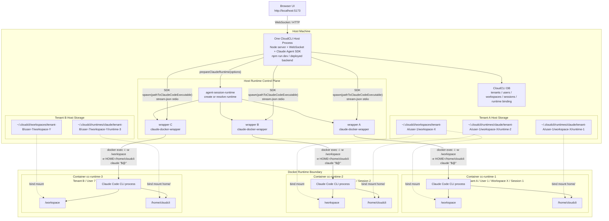
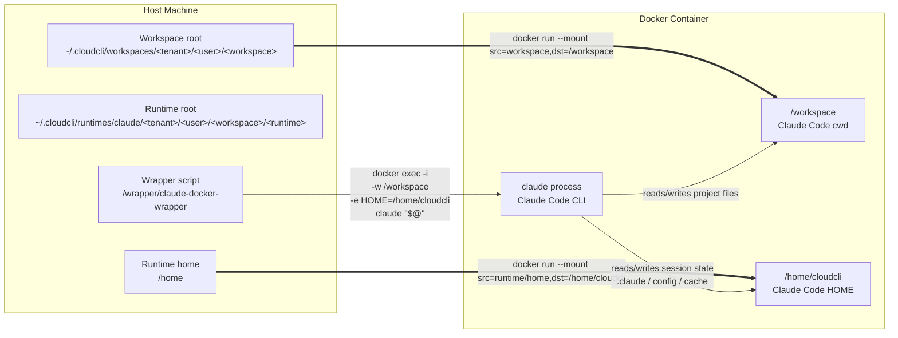

# 多租户 Docker Claude Code 进程架构图

Last updated: 2026-04-28

这份图聚焦当前设计中的三个关系：

- 宿主机上一个 CloudCLI / Claude Code UI 后端进程，与多个 Docker Claude Code runtime 的 1 对多关系。
- 多租户维度下 tenant、user、workspace、session runtime 的隔离边界。
- 宿主机目录与容器内 `/workspace`、`/home/cloudcli` 的 bind mount 映射关系。

## 进程与多租隔离架构

## 宿主机目录与容器目录映射

## 读图要点

- 宿主机只有一个 CloudCLI 后端进程作为控制平面，但它可以按 session/runtime 维度管理多个 Docker container。
- 每个 Docker container 内有自己的 Claude Code CLI 进程，容器内 cwd 固定为 `/workspace`。
- `pathToClaudeCodeExecutable` 在 Docker 模式下不是宿主机 `claude`，而是当前 runtime 的 wrapper 脚本。
- wrapper 通过 `docker exec -i ... claude "$@"` 把 Claude Agent SDK 生成的参数原样转发给容器内 Claude Code CLI。
- workspace 目录和 runtime home 目录分开挂载：`/workspace` 面向项目文件，`/home/cloudcli` 面向 Claude 会话状态和配置。
- tenant/user/workspace/runtime 维度都体现在宿主机目录层级中，避免不同租户共享宿主机 `~/.claude` 或同一份 runtime home。
- 后续追问时，后端通过 session id 找回同一个 runtime，再由 SDK 传入 `--resume <sessionId>`；容器内 Claude Code CLI 在同一个 `/home/cloudcli` 下恢复上下文。
