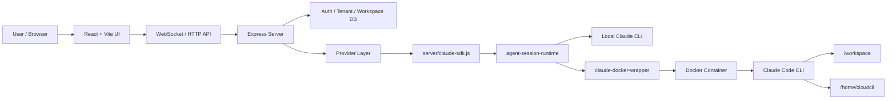
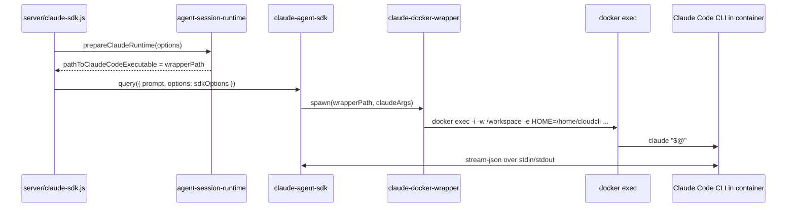
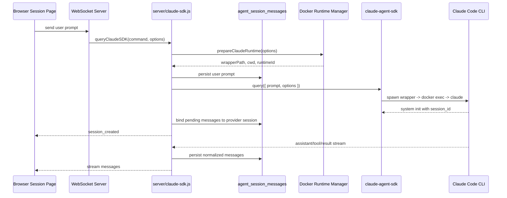

# CloudCLI / Claude Code UI 项目知识库

Last updated: 2026-04-28

这份文档用于持续沉淀对本项目的理解。它不是一次性的交付文档，而是后续调试、改架构、补 Docker runtime、多租隔离、理解 Claude Agent SDK 时的知识入口。

更新建议：

- 每次弄清一个关键链路，就追加到对应章节。
- 每个结论尽量写清楚“入口文件、关键函数、运行时行为、验证方式”。
- 涉及 `.env`、API Key、OAuth token、数据库内容时，只记录变量名和用途，不记录真实值。
- 如果代码后续调整，优先更新“当前结论”和“代码入口”两部分，避免文档和实现漂移。

## 当前关注范围

最近围绕这个项目梳理的核心问题是：

- 本地如何启动项目。
- 多租户、用户、workspace、session runtime 的边界如何划分。
- Docker 如何限制 Claude Code CLI 的访问范围。
- `claude-docker-wrapper` 的作用是什么。
- `@anthropic-ai/claude-agent-sdk` 如何连接 Docker 容器里的 Claude Code CLI 进程。
- 一个新 session 如何创建，后续追问如何带着已有 chat history 继续对话。
- `cwd`、`HOME=/home/cloudcli`、`pathToClaudeCodeExecutable`、`sdkOptions.resume=sessionId` 分别是什么意思。

## 快速入口

本地启动文档：

- `docs/local-development-startup.md`

架构材料：

- `scratch/presentations/cloudcli-multitenant-docker-architecture/output/output.pptx`
- `scratch/presentations/cloudcli-multitenant-docker-architecture/architecture-diagrams.md`
- `scratch/presentations/cloudcli-multitenant-docker-architecture/architecture-overview.mmd`
- `scratch/presentations/cloudcli-multitenant-docker-architecture/new-session-data-flow.mmd`

核心代码入口：

- `server/load-env.js`: 启动时加载项目 `.env`。
- `server/index.js`: 后端 HTTP/WebSocket 入口，接收前端会话请求。
- `server/claude-sdk.js`: 把 UI 请求转换成 Claude Agent SDK 调用。
- `server/services/agent-session-runtime.js`: 根据当前模式准备 local 或 Docker runtime。
- `server/services/session-message-history.js`: 管理 UI 侧会话消息历史。
- `server/modules/providers/list/claude/claude-auth.provider.ts`: Claude provider 安装/状态检查相关逻辑。

## 本地启动模型

当前项目本地开发一般使用：

```bash
npm install
npm run dev
```

推荐环境：

- Node.js v22+。
- macOS 上安装 Xcode Command Line Tools，方便编译原生依赖。
- 开发默认前端端口 `5173`，后端端口 `3001`。

启动后浏览器访问：

```text
http://localhost:5173
```

`.env` 是后端运行时的重要输入。`server/load-env.js` 会在启动早期把项目根目录的 `.env` 写入 `process.env`，所以一些变量即使没有在 shell 里 export，后端进程也可以看到。

常见变量：

- `SERVER_PORT`: 后端 Express/WebSocket 端口。
- `VITE_PORT`: Vite 前端端口。
- `DATABASE_PATH`: 本地认证和多租数据数据库位置。
- `CLAUDE_CLI_PATH`: local 模式下 Claude Code CLI 的可执行路径。
- `ANTHROPIC_API_KEY`、`ANTHROPIC_BASE_URL`、`ANTHROPIC_MODEL`: Provider / 模型配置。
- `CLAUDE_EXECUTION_MODE=docker`: 开启 Docker-backed Claude runtime。
- `CLOUDCLI_CLAUDE_DOCKER_IMAGE`: Docker 模式使用的镜像。
- `CLOUDCLI_RUNTIME_ROOT`: Docker runtime 的宿主机持久化根目录。

## 总体架构



理解这个项目时，可以把它分成四层：

- UI 层：展示 tenants、workspaces、sessions、chat messages，并通过 WebSocket 发起 Claude 请求。
- 后端业务层：认证、多租、workspace、provider/session 路由。
- SDK 适配层：`server/claude-sdk.js` 把 UI 的请求映射成 `@anthropic-ai/claude-agent-sdk` 的 options。
- Runtime 层：local 模式直接启动宿主机 Claude CLI；Docker 模式启动 wrapper，再由 wrapper 进入容器执行 Claude Code CLI。

## 多租与 Workspace 隔离

当前关注的隔离对象包括：

- tenant
- user
- workspace
- session runtime
- runtime HOME
- Docker container

较安全的 workspace 位置应避免放在项目仓库内部。之前观察到，如果 workspace 建在应用仓库子目录下，Claude Code CLI 可能沿着 `cwd` 向上发现父目录 `.git`，从而暴露父项目仓库信息。更合理的方向是：

```text
~/.cloudcli/workspaces/<tenant>/<user>/<workspace>
```

Docker runtime 侧的持久化目录类似：

```text
~/.cloudcli/runtimes/claude/tenant-<id>/user-<id>/workspace-<id>/runtime-<runtimeId>/
```

其中关键子目录：

- `home/`: 挂载到容器内 `/home/cloudcli`。
- `wrapper/`: 保存生成的 `claude-docker-wrapper` 脚本。

## Docker Runtime 做了什么

Docker 模式不是让 SDK 直接连接 Docker API，而是把“Claude CLI 可执行文件”替换成一个宿主机 wrapper。

`agent-session-runtime` 在 Docker 模式下会：

- 根据 tenant、user、workspace、session 创建或解析 runtime。
- 准备宿主机 workspace 路径。
- 准备宿主机 runtime home 路径。
- 确保 Docker container 存在并运行。
- 生成 wrapper 脚本。
- 返回给 `server/claude-sdk.js` 一组 runtime options。

返回的关键字段包括：

- `cwd`: 宿主机 workspace 路径。
- `containerCwd`: 容器内工作目录，当前是 `/workspace`。
- `projectPath`: 容器内项目路径，当前是 `/workspace`。
- `pathToClaudeCodeExecutable`: wrapper 脚本路径。
- `executionEnv`: 传给 wrapper / SDK 子进程的环境变量。
- `settingSources`: Docker 模式下只使用 project 级设置，减少 host 配置影响。
- `disableHostMcpConfig`: Docker 模式禁用 host MCP 配置注入。

## claude-docker-wrapper 的作用

wrapper 的核心职责是把 SDK 发起的本地子进程调用转成容器内的 Claude Code CLI 调用。

它的核心形式是：

```bash
exec docker exec -i \
  -w /workspace \
  -e HOME=/home/cloudcli \
  "${DOCKER_ENV[@]}" \
  <container_name> \
  claude "$@"
```

关键点：

- `docker exec -i`: 让 SDK 和容器内 `claude` 之间保持 stdin/stdout 通道。
- `-w /workspace`: 让容器内 Claude Code 的当前工作目录固定在 `/workspace`。
- `-e HOME=/home/cloudcli`: 让容器内 Claude Code 使用隔离 HOME。
- `"${DOCKER_ENV[@]}"`: 只透传 allowlist 中的环境变量，例如 Provider 相关变量。
- `claude "$@"`: 执行容器内 `claude`，并把 SDK 传给 wrapper 的所有 CLI 参数原样转发进去。

因此，SDK 并不知道自己真的在使用 Docker。对 SDK 来说，它只是启动了一个名为 `pathToClaudeCodeExecutable` 的可执行文件，并通过 stdio 与它通信。

## cwd 是什么意思

`cwd` 是 current working directory，即子进程的当前工作目录。

在 local 模式：

- SDK 直接启动宿主机上的 Claude Code CLI。
- `cwd` 就是 Claude Code CLI 在宿主机上的工作目录。

在 Docker 模式：

- SDK 启动的是宿主机上的 wrapper。
- wrapper 进程本身的 `cwd` 是宿主机 workspace 路径。
- wrapper 内部通过 `docker exec -w /workspace` 把容器内 Claude Code CLI 的工作目录固定为 `/workspace`。

所以 Docker 模式下要区分两个 cwd：

- SDK / wrapper 这一层看到的宿主机 `cwd`。
- 容器内 Claude Code CLI 实际运行时的 `/workspace`。

## HOME=/home/cloudcli 的含义

这句话：

```bash
-e HOME=/home/cloudcli
```

表示容器内 Claude Code CLI 进程看到的 HOME 是：

```text
/home/cloudcli
```

它对应的宿主机目录不是宿主机的 `~/.claude`，而是当前 session runtime 的 `runtimeHomePath`，通常类似：

```text
~/.cloudcli/runtimes/claude/tenant-<id>/user-<id>/workspace-<id>/runtime-<runtimeId>/home
```

指定 HOME 的目的：

- 避免容器里的 Claude Code 使用宿主机真实 `~/.claude`。
- 把会话文件、Claude 配置、凭证缓存等限制在当前 runtime home。
- 让同一个 session 后续追问可以复用同一个 HOME 里的 Claude Code 会话状态。
- 让不同 tenant、user、workspace、runtime 之间的状态更容易隔离。

## Claude Agent SDK 与 Docker 内 Claude CLI 如何连接

核心链路：



SDK 连接容器内 Claude CLI 的方式不是 HTTP，也不是 Docker SDK，而是：

1. 后端把 `pathToClaudeCodeExecutable` 设置成 wrapper 路径。
2. Claude Agent SDK 使用这个路径作为要 spawn 的命令。
3. wrapper 执行 `docker exec -i ... claude "$@"`。
4. SDK 的 stdin/stdout 通过 wrapper 和 `docker exec -i` 接到容器内 Claude Code CLI。
5. SDK 和 CLI 使用 `stream-json` 协议交换消息。

## pathToClaudeCodeExecutable 与 resume=sessionId 如何配合

项目里 `server/claude-sdk.js` 会把请求 options 映射成 SDK options：

```js
sdkOptions.pathToClaudeCodeExecutable = pathToClaudeCodeExecutable || process.env.CLAUDE_CLI_PATH || 'claude';

if (sessionId) {
  sdkOptions.resume = sessionId;
}
```

这两个参数职责不同：

- `pathToClaudeCodeExecutable`: 告诉 SDK 要启动哪个可执行入口。
- `resume`: 告诉 SDK 这次 Claude Code CLI 调用要恢复哪个已有 session。

Docker 模式下，`pathToClaudeCodeExecutable` 是 wrapper，所以 SDK 实际会启动：

```text
<runtime>/wrapper/claude-docker-wrapper
```

SDK 会把 `resume` 编成 Claude Code CLI 参数，等价于：

```text
--resume <sessionId>
```

概念上最终命令是：

```text
<runtime>/wrapper/claude-docker-wrapper --resume <sessionId> ...
```

wrapper 再把参数通过 `"$@"` 原样转发进容器：

```text
docker exec -i -w /workspace -e HOME=/home/cloudcli <container> claude --resume <sessionId> ...
```

所以 `sessionId` 的传递路径是：

```text
业务 options.sessionId
  -> sdkOptions.resume
  -> SDK 构造 CLI 参数 --resume <sessionId>
  -> wrapper "$@"
  -> docker exec
  -> 容器内 claude --resume <sessionId>
```

它不是通过环境变量传递的。

## 新 Session 创建与后续追问数据流



新 session：

- 前端发送用户 prompt。
- 后端准备 runtime。
- 后端先把用户 prompt 存入 UI 数据库。
- SDK 启动 Claude Code CLI。
- Claude Code CLI 返回 `system init` 消息，其中包含真实 provider session id。
- 后端把 runtime 和 provider session 绑定，并通知前端 `session_created`。
- 后续 assistant/tool/result 消息继续写入 UI 数据库。

后续追问：

- 前端带着已有 `sessionId` 发起请求。
- Docker runtime manager 根据 `sessionId` 找回已有 runtime。
- 后端设置 `sdkOptions.resume = sessionId`。
- SDK 把它变成 `--resume <sessionId>`。
- 容器内 Claude Code CLI 在同一个 `/home/cloudcli` 下读取已有会话状态。
- 新回复继续流式返回并写入 UI 数据库。

需要注意：

- UI 数据库里的 history 主要用于页面展示和消息列表恢复。
- 真正让 Claude Code 恢复上下文的是 `--resume <sessionId>` 加同一个 runtime HOME。
- 当前实现不是把 DB 中所有历史消息重新拼成 prompt 发给 Claude。

## UI History 与 Claude CLI History 的区别

这个项目里有两类历史：

1. UI 侧历史
2. Claude Code CLI 侧历史

UI 侧历史：

- 存在项目数据库中。
- 由 `session-message-history` 读取和写入。
- 用于页面刷新后展示已有对话。
- 用于绑定 UI session、provider session、runtime 消息。

Claude Code CLI 侧历史：

- 存在 Claude Code 自己的会话文件中。
- 在 Docker 模式下，这些状态应落在 `/home/cloudcli` 对应的 runtime home 中。
- 由 Claude Code CLI 在收到 `--resume <sessionId>` 时自行加载。

理解追问链路时，不要把这两类历史混为一谈。UI DB history 不是 Claude CLI resume 的直接来源。

## Local 模式与 Docker 模式差异

Local 模式：

- `pathToClaudeCodeExecutable` 通常是 `CLAUDE_CLI_PATH || 'claude'`。
- Claude Code CLI 在宿主机上执行。
- HOME、`.claude`、MCP、settings 等更容易受到宿主机环境影响。

Docker 模式：

- `pathToClaudeCodeExecutable` 是 wrapper。
- Claude Code CLI 在容器内执行。
- workspace 挂载到 `/workspace`。
- runtime home 挂载到 `/home/cloudcli`。
- `HOME=/home/cloudcli`。
- host MCP config 默认不注入。
- `settingSources` 更收敛，当前返回 `['project']`。

## 常见问题

### claude-docker-wrapper 起到了什么作用？

它是 SDK 和 Docker 容器之间的适配层。SDK 只会 spawn 一个本地可执行文件，wrapper 就伪装成这个本地可执行文件。真正执行时，wrapper 使用 `docker exec -i` 进入容器运行 `claude`，并透传 SDK 构造的所有 CLI 参数。

### Claude Agent SDK 是如何连接 Docker 中 Claude Code CLI 的？

通过 stdio。SDK spawn wrapper，wrapper 执行 `docker exec -i ... claude "$@"`，`-i` 保持 stdin，Claude CLI 的 stdout 又通过 docker exec 返回给 SDK。双方使用 `stream-json` 协议。

### sdk 的 cwd 是什么意思？

是 SDK 启动子进程时的当前工作目录。Docker 模式下要额外注意，wrapper 的 host cwd 和容器内 `claude` 的 `-w /workspace` 是两个层面的 cwd。

### HOME=/home/cloudcli 对应宿主机哪个目录？

对应当前 runtime 的 `runtimeHomePath`，通常在：

```text
~/.cloudcli/runtimes/claude/tenant-<id>/user-<id>/workspace-<id>/runtime-<runtimeId>/home
```

这个目录通过 Docker bind mount 映射到容器内 `/home/cloudcli`。

### 为什么要固定 HOME？

为了避免容器内 Claude Code 使用宿主机 `~/.claude`，并让 session 状态、配置、缓存落到当前 runtime 的隔离目录里。

### resume=sessionId 是如何传给容器内 Claude 的？

`server/claude-sdk.js` 把 `sessionId` 写入 `sdkOptions.resume`。Claude Agent SDK 把它转换成 `--resume <sessionId>`。wrapper 用 `"$@"` 把这个参数转发给容器内 `claude`。

### 后续追问是不是把 UI chat history 重新发给 Claude？

不是。UI history 用于展示和本地记录；Claude Code 的上下文恢复依赖 `--resume <sessionId>` 和同一个 runtime HOME 中的 Claude Code 会话文件。

## 调试建议

当遇到 Claude runtime 问题时，优先按这个顺序查：

1. `.env` 是否被 `server/load-env.js` 加载。
2. WebSocket 请求是否进入 `server/index.js`。
3. 请求是否进入 `queryClaudeSDK`。
4. `prepareClaudeRuntime` 返回的是 local 还是 docker。
5. Docker 模式下 wrapper 是否生成。
6. `pathToClaudeCodeExecutable` 是否指向 wrapper。
7. `sdkOptions.resume` 是否等于当前 session id。
8. wrapper 是否通过 `"$@"` 收到 SDK 参数。
9. 容器内 `HOME` 是否是 `/home/cloudcli`。
10. runtime home 下是否有对应 session 状态。

常用检查命令：

```bash
rg -n "pathToClaudeCodeExecutable|sdkOptions.resume|prepareClaudeRuntime|buildClaudeDockerWrapperScript" server
```

```bash
rg -n "resume|--resume|pathToClaudeCodeExecutable" node_modules/@anthropic-ai/claude-agent-sdk -g '!*.map'
```

```bash
docker ps
```

```bash
docker exec -it <container_name> sh
pwd
echo "$HOME"
ls -la /workspace
ls -la /home/cloudcli
```

## 后续更新模板

新增知识点时可以按这个模板追加：

```markdown
### 主题

日期：

问题：

结论：

代码入口：

- `path/to/file`

运行时行为：

验证方式：

待确认：
```

## 待持续补充

- Docker image 内部 Claude Code CLI 的安装来源与版本管理。
- `server/modules/providers/list/claude/claude-auth.provider.ts` 的 provider 状态检查与实际 query 路径之间的差异。
- Docker runtime 生命周期：创建、复用、停止、清理。
- 多租切换后 workspace/project/session 列表刷新策略。
- MCP config 在 local 和 Docker 模式下的边界。
- 文件权限审批流在 Docker 模式下如何与 UI permission request 对接。
