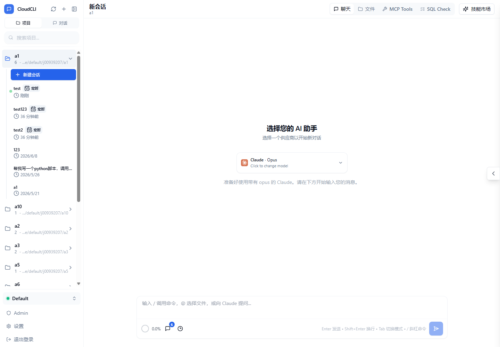
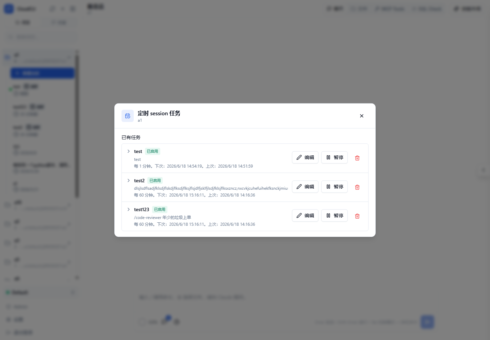
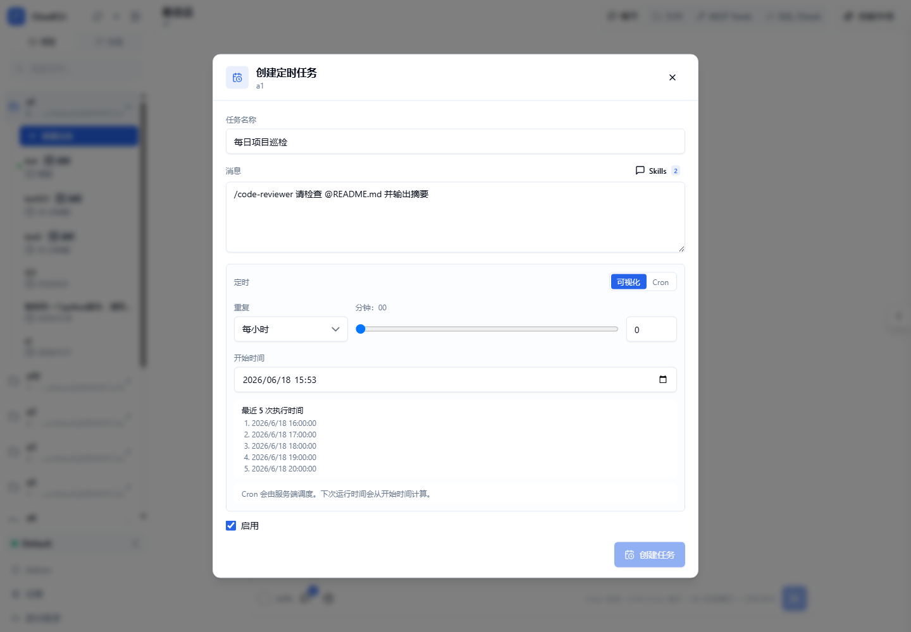
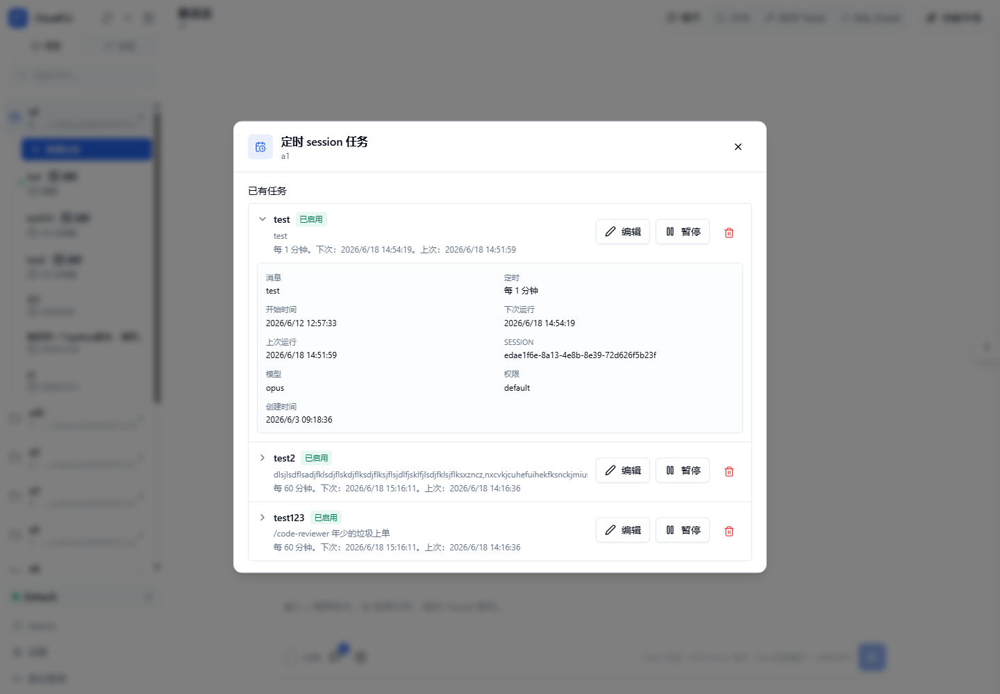
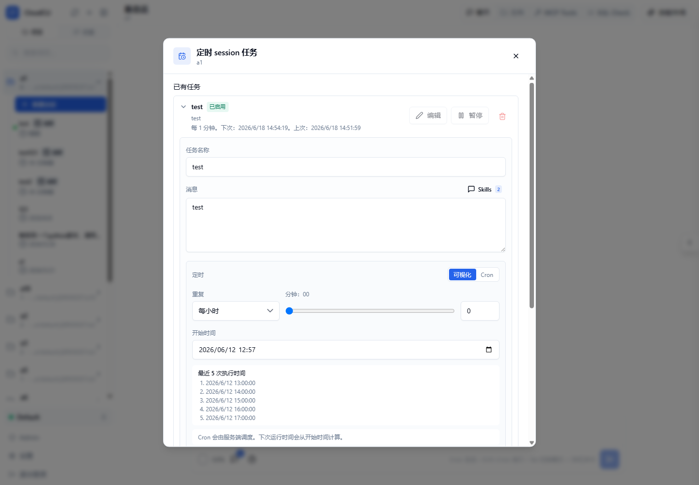

# 定时 session 任务功能介绍与使用说明

这份文档说明 CCUI 自定义定时任务的功能定位、入口和使用方式。定时任务用于在指定时间自动开启或复用一个 session，并向 agent 发送预设消息。

## 1. 功能介绍

定时 session 任务是 CCUI 提供的工作区级自动执行能力。用户可以在某个工作区中创建定时任务，配置任务名称、消息内容、执行时间和启用状态。任务到点后，系统会自动创建或复用该任务绑定的 session，并把配置好的消息发送给 agent。

核心能力：

- 支持按 session 粒度运行：每个定时任务会绑定自己的 session，后续执行会复用该 session。
- 支持可视化定时配置：可选择每小时、每日、每周、每月，并设置分钟、小时、星期或每月日期。
- 支持 Cron 表达式：适合需要更灵活调度规则的场景。
- 支持消息增强输入：定时任务消息框支持和普通对话框一致的 `/skill`、`@文件` 等便捷输入能力。
- 支持任务管理：可查看详情、编辑任务、暂停/恢复任务、删除任务。
- 支持侧边栏标识：定时任务对应的 session 会在左侧 session 列表中展示“定时”标识；暂停的任务会展示“暂停”标识。

左侧 session 列表中的定时任务标识：



## 2. 使用入口

### 2.1 新建定时任务

在新建 session 下方点击“定时任务”按钮，只用于创建新的定时任务。

适用场景：

- 想为当前工作区创建一个新的定时执行 session。
- 想配置一条定时消息，让 agent 按计划自动执行。

### 2.2 查看历史定时任务

在左侧工作区列表中，将鼠标悬浮到工作区上，点击工作区旁边的定时任务图标，可以打开该工作区的定时任务列表。

工作区定时任务列表：



适用场景：

- 查看当前工作区已有的定时任务。
- 打开某个定时任务详情。
- 编辑、暂停、恢复或删除已有定时任务。

### 2.3 从定时 session 查看任务详情

如果某个 session 是定时任务 session，左侧 session 列表中会显示“定时”标识。点击该标识可以打开对应定时任务的详情页。

说明：

- 定时任务 session 不支持修改 session 名称。
- “定时”标识在鼠标悬浮 session 时不会被隐藏。
- 暂停的定时任务 session 会额外显示“暂停”标识。

## 3. 创建定时任务

打开“创建定时任务”后，按以下步骤配置：

1. 填写“任务名称”。
2. 在“消息”中输入任务执行时要发送给 agent 的内容。
3. 在“定时”中选择“可视化”或“Cron”。
4. 设置开始时间。
5. 确认“启用”状态。
6. 点击“创建任务”。

创建定时任务页面：



创建成功后：

- 系统会为该任务创建一个定时 session。
- 该 session 会出现在左侧 session 列表中。
- 该 session 会展示“定时”标识。
- 到达执行时间后，系统会向该 session 自动发送任务消息。

## 4. 配置定时规则

### 4.1 可视化配置

可视化配置适合大多数常见定时场景。支持：

- 每小时：选择每小时的第几分钟执行。
- 每日：选择每天的小时和分钟执行。
- 每周：选择星期、小时和分钟执行。
- 每月：选择每月日期、小时和分钟执行。

可视化模式下会展示“最近 5 次执行时间”，方便确认规则是否符合预期。

### 4.2 Cron 配置

Cron 配置适合更灵活的调度需求。当前支持 5 段 Cron 表达式：

```text
分钟 小时 日期 月份 星期
```

示例：

```text
0 9 * * *
```

表示每天 09:00 执行。

```text
30 18 * * 5
```

表示每周五 18:30 执行。

Cron 任务由服务端调度，下次运行时间会从设置的开始时间计算。

## 5. 消息框能力

定时任务的消息框和普通对话输入框保持一致，支持常用快捷能力。

### 5.1 使用 `/skill`

在消息框中输入 `/` 可以打开命令或 skill 选择列表。选择 skill 后，会把对应内容插入到定时任务消息中。

适用场景：

- 让定时任务按某个 skill 的要求执行。
- 固定每天或每周触发同一类自动化流程。

### 5.2 使用 `@文件`

在消息框中输入 `@` 可以添加工作区文件引用。

适用场景：

- 定时检查某个文件。
- 定时总结某个文档。
- 定时根据项目中的配置文件生成报告。

## 6. 查看和编辑任务

打开定时任务详情页后，可以查看：

- 任务名称
- 绑定 session
- 定时规则
- 下次运行时间
- 上次运行时间
- 创建时间
- 最近错误
- 启用或暂停状态

点击“编辑”后，可以修改：

- 任务名称
- 消息内容
- 定时规则
- 开始时间
- 启用状态

任务详情展示：



编辑定时任务：



修改完成后点击“保存修改”。

## 7. 暂停、恢复和删除

### 7.1 暂停任务

在任务详情或已有任务列表中点击“暂停”。暂停后：

- 任务不会继续按计划执行。
- 左侧定时 session 会展示“暂停”标识。
- 任务记录和绑定 session 会保留。

### 7.2 恢复任务

暂停后可以点击“恢复”。恢复后任务会继续按配置的定时规则执行。

### 7.3 删除任务

点击“删除任务”后，系统会弹出二次确认。确认后任务会被删除，此操作不可撤销。

## 8. 与 session 的关系

定时任务是 session 粒度的：

- 新建定时任务时，会创建或绑定一个专属 session。
- 首次运行会创建 session，后续运行复用同一个 session。
- 已有普通 session 不支持直接增加定时任务。
- 定时任务 session 的名称由任务和系统维护，不支持在左侧直接重命名。

## 9. 注意事项

- 创建任务时必须选择工作区。
- 消息内容不能为空。
- Cron 表达式必须是 5 段。
- 开始时间必须是有效日期时间。
- 如果任务没有按预期执行，优先检查任务是否已启用、下次运行时间是否正确、服务端调度进程是否正常运行。
- 如果 CCUI 所在 Docker 服务被外部策略定时关闭，CCUI 自己的定时任务和 Claude Code 原生定时能力都可能无法在关闭期间执行。

## 10. 常见示例

### 每天上午检查项目状态

配置：

- 任务名称：每日项目检查
- 定时方式：可视化
- 重复：每日
- 时间：09:00
- 消息：

```text
请检查当前项目的 Git 状态、最近失败的任务和需要我关注的问题，并给出简短总结。
```

### 每周五生成周报

配置：

- 任务名称：每周周报
- 定时方式：Cron
- Cron 表达式：

```text
0 18 * * 5
```

- 消息：

```text
请总结本周这个工作区的主要变更、风险和下周建议。
```

### 使用 skill 执行固定流程

配置：

- 在消息中输入 `/` 选择需要的 skill。
- 补充具体目标，例如：

```text
/skill 请根据当前工作区内容执行每日巡检，并输出结果摘要。
```

### 引用文件执行检查

配置：

- 在消息中输入 `@` 选择目标文件。
- 补充执行要求，例如：

```text
请检查 @README.md 中的使用说明是否和当前项目功能一致，并列出需要更新的地方。
```
