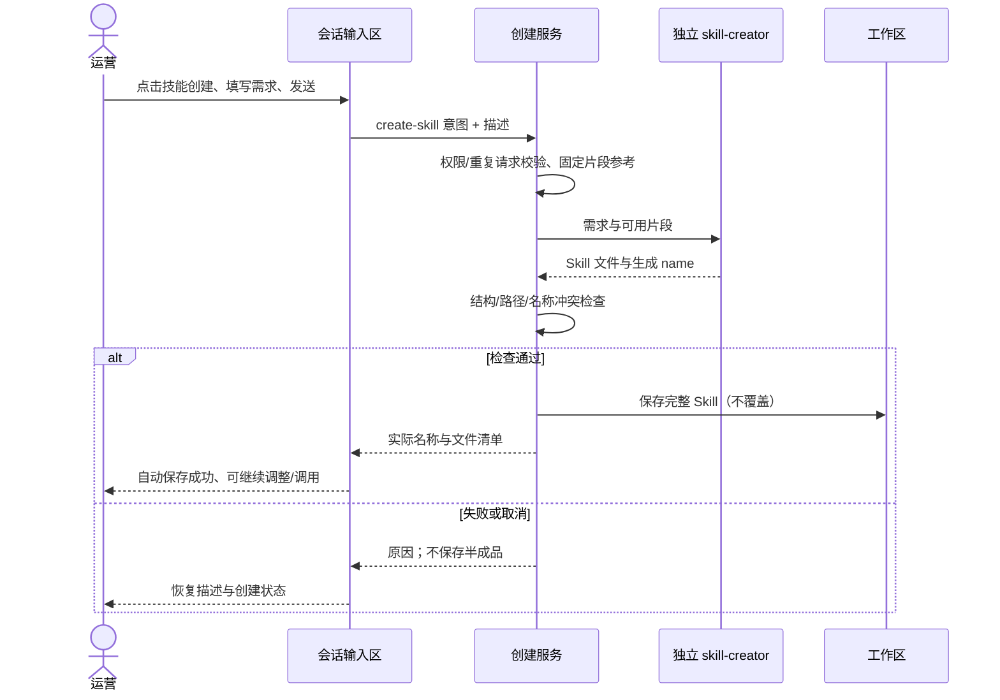
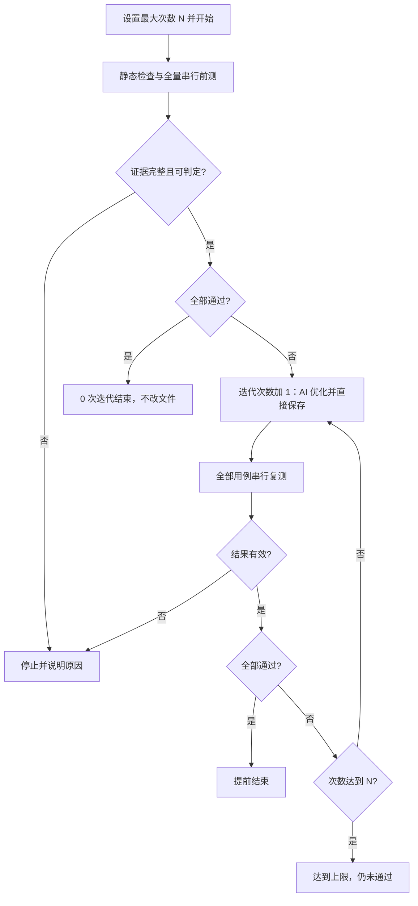
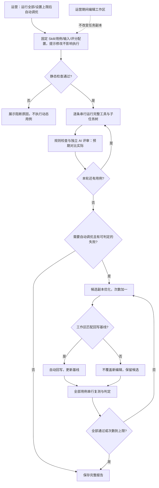
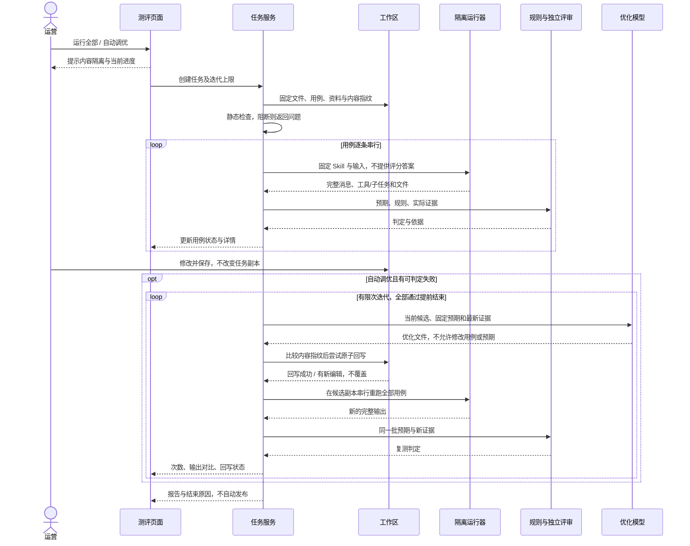
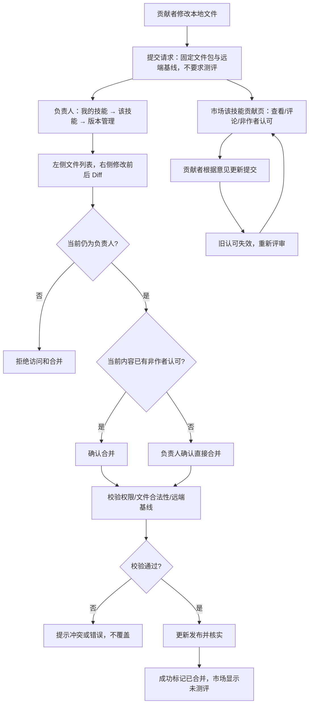
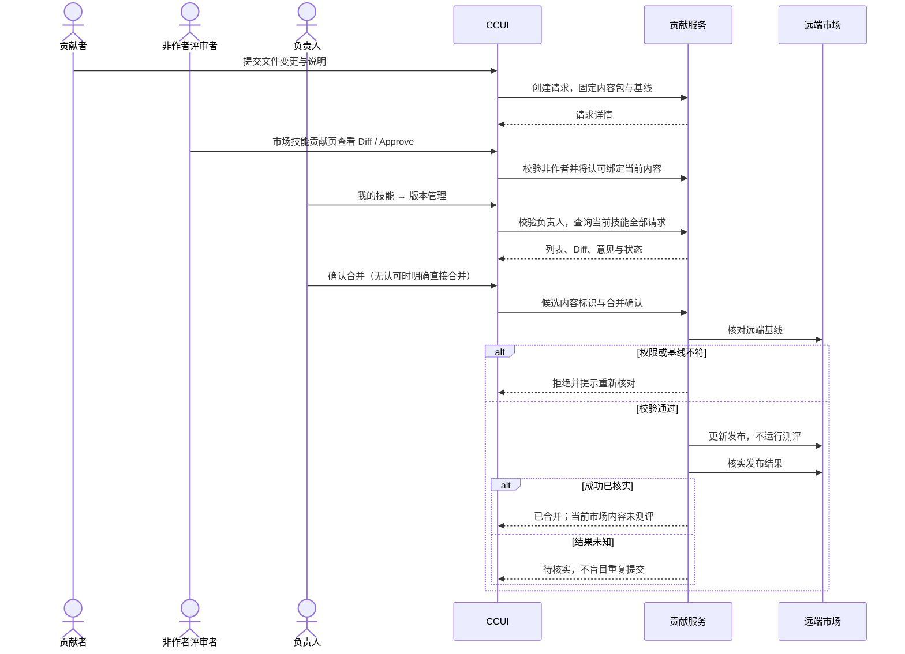

# 技能市场：功能分类与完整交互流程

日期：2026-09-16

定位：产品交互设计，按主要功能大类描述入口、参与者、用户动作、系统反馈、结果与异常分支。仅展开本次待实现/待改造功能；已有能力仅作为流程衔接。HTML 原型不代表生产功能已接入。

图示速查：[测评流程与时序](#122-技能测评流程图)｜[版本管理贡献流程与时序](#124-版本管理贡献流程图)。

配套阅读：[运营与管理员视角](skill-market-运营与管理员使用视角.md)｜[技术改造清单](skill-market-待实现功能设计.md)｜[原型](prototypes/skill-market/index.html)｜[流程与时序图集](skill-market-功能流程与时序图.md)。

## 1. 功能分类与整体链路

| 分类 | 包含功能 | 涉及页面/参与者 |
| --- | --- | --- |
| A 片段与快捷插入 | 公共片段查看、维护；片段/Skill/MCP 快捷插入 | 片段管理、文件编辑、模板；运营、系统管理员 |
| B 模板 | 模板查看、管理员配置、自定义字段、预置片段、使用模板 | 模板中心、会话；运营、授权模板管理员 |
| C Skill 创建与会话迭代 | 会话描述创建；后续三个模板入口、补充信息、自动保存、继续调整、直接调用、保存用例 | 会话、我的技能；工作区编辑者、AI |
| D 用例管理 | 手工添加、AI 添加、会话沉淀、编辑、删除保护 | 我的技能测评、文件编辑；本地编辑者、AI |
| E 测评 | 静态检查、串行运行、预期/实际判定、完整输出详情 | 我的技能测评、市场报告；编辑者、运行器、评审 AI |
| F 自动优化 | 全量前测、有限次修改与全量复测、自动保存、输出/文件对比 | 我的技能测评；编辑者、优化 AI |
| G 贡献 | 提交、多文件 Diff、公开评审、处理修改、合并即发布 | 我的技能、贡献中心、市场贡献；贡献者、评审者、负责人 |
| H 技能管理与发布 | 负责人专属版本管理、转移负责人、分类、直接发布门禁、下架记录保留 | 我的技能管理/操作区、市场；负责人 |
| I 市场与本地联动 | 新详情布局、只读报告、时间更新提示、同步冲突/失效 | 技能市场、我的技能；授权用户 |

```text
需求描述 + 片段参考（后续可用模板）→ 会话生成并自动保存 → 继续调整或直接调用
                                       ↓
                   手工 / AI / 调用保存形成用例
                                       ↓
          运行全部，或自动优化（前测 → 有限次写入与全量复测）
                                       ↓
           本地继续使用 / 负责人直接发布
                                       或
          提交贡献 → 他人评审 → 授权合并并更新发布
```

### 交付阶段（以此边界为准）

本文保留完整目标设计，但不代表全部纳入第一阶段。第一阶段仅实现会话描述创建、片段、用例与测评优化；已实现的基础能力只作为衔接，不重复建设。模板、贡献、发布及市场治理改造均为后续规划。

| 范围 | 第一阶段 | 后续阶段 |
| --- | --- | --- |
| 创建 | 会话“技能创建”切换输入意图，直接描述，无技能标识表单 | 使用模板、模板中心与模板维护 |
| 片段 | 平台共享、管理员维护、普通用户只读使用、正文快速插入与生成参考；2026-09-21 追加我的技能 / 已启用 MCP 工具名称插入 | — |
| 验证 | 手工 / AI / 会话保存用例、静态检查、后台串行测评、有限次自动优化 | 市场报告与发布门禁联动 |
| 治理 | 沿用现有工作区访问/编辑权限 | 版本管理（贡献）、发布、市场详情改造 |

第一阶段验收以[功能说明](skill-market-第一阶段-功能说明.md)、[详细设计](skill-market-第一阶段-详细设计.md)和[第一阶段原型](prototypes/skill-market/phase1.html)为准；整体原型保留后续入口作规划演示。下面 B、G、H、I 及涉及模板/发布的分支均标为后续，不作为首期依赖。

### 共用约定（涉及模板/治理时仅限后续）

- 顶层入口顺序：技能市场、我的技能、模板中心、片段管理。
- 普通用户可看模板、片段但不能维护定义；使用不受“库只读”限制。
- 本地编辑权与市场发布权分开。同一共享工作区同目录是一份共同文件，不是按用户各存一套用例。
- Skill 无业务版本/历史版本；本次测评和文件对比不提供历史恢复入口。
- 用例只写每个 Skill 的 `evals/evals.json`；没有草稿确认、验收标准确认。
- 运行与优化在测评页后台串行执行，不跳会话；没有独立“调试/试用 Skill”模式。
- Skill 负责人能发布、合并，但两者不是平台库管理员。普通直接发布要本人当前测评通过，贡献提交/合并免测评。

## 2. A：片段与快捷插入

### A1 查看公共片段

**参与者：** 所有有访问权的用户。**入口：** 技能区域 → 片段管理。

1. 打开片段管理，看到名称、说明及搜索入口；普通用户不显示新增/编辑/删除按钮。
2. 输入关键词筛选，点击某项查看完整固定 Markdown 正文。
3. 用户可返回列表，或到文件编辑“快捷插入”使用，不要求先配置分类或参数。
4. 没有片段时显示空列表说明；无搜索结果时保留关键词并允许清空；读取失败保留查询条件并提示重试。

**结果：** 浏览不会修改库或 Skill。公共片段全平台共享，不承载租户私密材料。

### A2 管理员新增、修改、删除片段

**参与者：** 系统管理员。**入口：** 片段管理 → 新增片段 / 已有片段维护。

| 步骤 | 用户动作 | 系统反馈 |
| --- | --- | --- |
| 新增 | 填名称、说明、固定 MD 正文，保存 | 校验必填及内容；成功后列表出现新片段 |
| 修改 | 打开片段，调整内容，保存 | 显示更新后的当前内容；不存在“创建新版本” |
| 删除 | 选择目标，核对删除对象后确认 | 从可用库移除；已有 Skill 和模板中的正文副本不受影响 |
| 取消 | 取消编辑或删除 | 不改变库；未保存内容按页面离开提示处理 |
| 失败 | 权限被撤销、保存冲突或服务异常 | 不显示成功，不覆盖别人已保存的内容；保留可恢复输入并提示刷新/重试 |

**注意：** 不追踪既有 Skill 引用，不批量回改已插入内容；不引入片段版本、动态参数或双重分类。SQL Check 片段仅是规范正文，不自动启用检查工具。

### A3 快捷插入片段、其他 Skill、MCP 工具

**参与者：** 本地文件编辑者。**入口：** 我的技能 → 文件编辑 → 快捷插入。

1. 用户在待编辑文件放置光标或选中文本，点击快捷插入。
2. 弹框提供“片段 / 其他 Skill / MCP 工具”三个 Tab。搜索框上不增加重复标题行。
3. 切换 Tab、搜索和选择，按下表呈现。

| Tab | 弹框展示 | 插入内容 |
| --- | --- | --- |
| 片段 | 左侧列表、右侧完整正文预览 | 所选片段正文 |
| 其他 Skill | 名称列表，无右侧正文区 | 仅 Skill 名称 |
| MCP 工具 | 名称列表，无右侧正文区 | 仅 MCP 工具名称 |

4. 用户确认插入，文本替换当前有效选区或插入光标处；返回编辑器，可按已有方式继续修改、撤销和保存。
5. 用户关闭弹框则不改变文件；无搜索结果不可插入残留选择。目标文件切换、只读或选区失效时提示重新选择位置，不能写入另一文件。

**结果：** 插入普通文本，不自动保存整份编辑缓冲、不自动发布、不安装技能或授权工具。仅列可访问、可用资源；避免插入到 frontmatter 破坏结构。

## 3. B：模板中心（后续）

### B1 运营查看与使用模板

**入口：** 技能区域 → 模板中心。**角色：** 普通用户也可见。

1. 浏览或筛选模板，查看名称、说明、适用场景、需要填写的字段及默认值。
2. 打开模板详情可看预置正文，但不能编辑库定义。
3. 点击“在会话中使用”，进入会话输入区并带入模板选择，转 C1；此时未发送任务、未创建 Skill。
4. 未选模板、取消选择或返回浏览，都不会生成任何文件。
5. 模板已删除/不可访问时说明原因并保留用户未提交的补充信息，重新选择；不能默默改用其他模板。

### B2 管理员创建/编辑模板

**角色：** 获授权的模板管理员。**入口：** 模板中心 → 新建模板 / 编辑模板。

1. 填写模板名称、描述，说明运营用它能完成什么任务。
2. 添加自定义字段：字段标识、显示名称、单行/多行/选项类型、必填、默认值及填写提示；选项型配置可选值。
3. 从片段库配置预置片段，查看将纳入模板的正文；模板保存的是正文副本，不是运行时活引用。
4. 保存前校验重复字段标识、保留字段冲突、默认值类型和必填配置；错误定位到对应字段，用户修正后再次保存。
5. 保存成功，普通用户可在模板中心/会话选择中使用。取消编辑不改变当前模板。
6. 编辑后保存影响之后发起的生成，不回改已有 Skill；在途生成按启动时固定的模板内容执行。
7. 删除模板需核对目标再确认；之后不可新选，已生成 Skill 保留。在途任务不能因定义被删而切换到其他内容。

**范围：** 模板维护沿用授权管理员及租户范围；尚未扩成全平台共享。普通运营不需要自己创建模板，也不需要配置模板结构。

## 4. C：Skill 创建与会话内迭代

### C0 第一阶段：直接描述创建（默认入口）

1. 在会话输入框底部与其他能力同行点击“技能创建”。只切换输入意图，不打开模板弹窗，不要求填写技能标识。
2. 输入框提示“请描述你想创建的技能：用于什么场景、提供哪些输入、希望得到什么结果…”。空输入、填写中、失焦时按钮均持续高亮；再次点击退出并保留文字。
3. 发送时携带明确的 create-skill 意图及需求原文。空描述/权限校验失败就地提示，保留文字与高亮状态。普通提问不得误走生成流程。
4. 在独立环境调用 skill-creator，提供授权片段库参考，由 AI 选择适用正文；不要求用户选择片段。未命中可以不插入，不把整个库强塞入产物。
5. creator 生成合法 name，服务端检查路径与格式；同名自动选择可用后缀，并保持目录、SKILL.md frontmatter 与 evals/evals.json 的 skill_name 一致。保存阶段再次检查，不覆盖既有 Skill。
6. 完整检查后自动保存到 workspace 的 .claude/skills/<name>/，刷新“我的技能”与会话命令列表。无需确认保存；当前会话展示生成结果和实际名称。
7. 成功后退出创建模式并清空已发送草稿。失败/取消不留下半成品，恢复输入供重试；生成中按钮保持选中且禁用，不能重复提交。
8. 用户继续自然语言调整或 /name 直接调用，转 C2/C3；没有专门的调试或试用页面。



### C1 后续：模板创建与三个入口

**入口补充：** 我的技能“新建技能”改为下拉，提供“直接创建”和“模板创建”。直接创建沿用原有填写弹窗；模板创建先打开与会话“使用模板（后续）”相同的模板选择弹框，选好后才跳到会话继续填写。取消选择留在我的技能，不创建文件。模板创建因此共有以下三个入口。

| 入口 | 动作 | 到达的状态 |
| --- | --- | --- |
| 聊天输入框底部 | 点击独立的“使用模板（后续）”，选模板；不改变“技能创建”的直接描述行为 | 当前会话输入区显示模板填写区域 |
| 模板中心 | 选模板 → 在会话中使用 | 跳到会话，显示同样的模板填写区域 |
| 我的技能 | 新建技能 → 模板创建 → 在弹框选择模板 | 选择后跳到会话填写；不直接生成 |

**后续完整流程：**

模板选择弹框和模板中心均支持按名称/描述搜索；片段管理支持名称/说明/正文搜索。输入即时过滤，各处关键词独立，不改变原访问权限；提供结果数量、无结果提示和清空入口。重新打开模板弹框清空上次弹框搜索，取消不影响原会话未发送内容。

1. 通用模板只填写“要解决的问题”等业务信息，不显示技能名称与标识，由 skill-creator 生成并校验，同名自动避让。其他专用模板暂保留原字段。选中模板后“使用模板”按钮持续高亮，取消或成功生成后解除；校验失败保留状态与输入。
2. 额外信息输入框提示“请输入额外补充信息…”。默认值可沿用；运营主要描述业务目标，无需手选执行架构。
3. 点击发送。缺少必填或格式错误时就地提示，不发起任务、不丢输入；取消模板恢复普通输入状态。
4. 系统固定模板、预置正文、输入及授权片段参考，在独立环境调用 skill-creator；AI 匹配适用片段并形成自包含正文。
5. 会话显示生成进度与结果，保持现有聊天消息样式，不增加专用结果卡片外壳或“模拟生成结果”生产按钮。
6. 包校验通过后自动保存到 `Workspace/.claude/skills/<name>/`，包含 `SKILL.md` 和 `evals/evals.json`；没有初始用例则数组为空。
7. 会话告知名称和保存位置；我的技能及命令列表刷新。无需“确认保存到我的技能”。创建者初始为负责人。

**异常分支：**

- 同名目录存在：不覆盖，提示换名或明确进入已有技能编辑；不悄悄修改 name。
- 生成失败、文件非法、保存前取消：不留下部分 Skill，保留可用于重试的输入。
- 已保存后用户停止：如实提示已生成的文件，不假装取消后自动消失。
- 工作区权限不足：说明需要编辑权限；选择模板不自动获取权限。
- 片段参考不足或目标模糊：必要时补充信息，不编造能力、不开生产工具。

### C2 生成后继续调整

1. 用户在当前会话继续输入，例如“把输出改为按门店分组，并补充异常订单说明”。
2. Agent 针对明确的 Skill 读取并修改授权内容，检查后直接保存；会话说明本次修改情况。
3. 用户可继续发指令，也可进入我的技能直接编辑 MD；无需每轮确认采用。
4. 多个技能目标有歧义时才请用户指出目标；权限不足或并发修改时不覆盖。
5. 正文或用例改变会使旧测评不再适用于当前内容；市场已发布内容不会随本地修改自动更新。

### C3 普通调用与保存用例

1. 用户正常调用 `/skill-name 具体任务`，不先点试用按钮、不进入调试模式。
2. 原聊天展示模型回复、工具调用、子任务及生成文件；等整次根调用结束后提供“保存为测评用例”。
3. 用户点击一次，系统关联该 Skill 与该次 query/结果/输入资料，形成合法用例并直接保存。
4. 按钮变为“已保存”，可查看用例；再次点击同次保存不重复新增。会话可以继续，不强制跳转测评。
5. 来源输出作为预期的参考，不要求后续逐字复现，也不代表结果天然正确；用户后续可以在测评页修改预期。
6. 调用未完整、无法归属 Skill、缺少重跑资料、资源不可共享时说明原因；不伪造成功用例、不保存别人的执行记录。

**结果：** 用例落在该 Skill 的 `evals/evals.json`。输入资料需可重跑并脱敏；保存用例不把私人会话全文自动公开到市场。

## 5. D：用例管理

### D1 进入与查看

**入口：** 我的技能 → 某 Skill → 测评。所有有本地编辑权限的人都可管理用例，不限负责人。

页面整体为一张测评表。“运行全部 / 自动优化 / 添加验证场景”同高，位于“技能测评”标题同一行的右侧；窄屏放不下时整体换到标题下方。“添加验证场景”下拉只有“AI准备场景”“添加场景”。每条用例末尾有查看详情、编辑及按保护规则显示的删除操作；静态检查单独占一行。

### D2 手工添加

1. 添加验证场景 → 添加场景。
2. 填写输入请求、预期结果，可选填写检查要点和输入文件。
3. 点击保存用例；系统检查格式、附件路径及并发，分配唯一 id，直接追加到 `evals/evals.json`。
4. 表格立即出现新行，标为未运行；文件编辑区可看到同一份内容，当前旧报告不再作为完整用例集的通过证明。
5. 校验失败定位字段并保留输入；取消不写文件。不存在保存后再确认生效。

### D3 AI 添加

1. 添加验证场景 → AI准备场景。
2. AI 根据当前 Skill、已有用例和授权材料生成新场景；页面显示准备中，避免重复触发同次请求。
3. 格式和资源检查通过后直接追加，显示新增结果，不进入草稿/待确认区。
4. 业务标准确实无法确定时提示补充必要信息；生成异常则报错，不编造预期、不覆盖已有用例。

### D4 编辑与删除

| 动作 | 交互结果 | 失败/边界 |
| --- | --- | --- |
| 编辑用例 | 打开已有字段，保存后更新同一 id，旧结果失效 | 运行期间暂停写入；并发变化提示重新读取 |
| 删除未发布用例 | 核对目标后删除并更新表格/JSON | 取消不变；不能把删除失败显示为成功 |
| 删除曾发布用例 | 删除不可用并说明“曾随 Skill 发布，不可删除” | 删文件、改 id、整体覆盖也不能绕过 |
| 直接编辑 JSON | 合法保存后表格重新读取同一文件 | 非法 JSON 拒绝保存或提示修复，不能生成第二套用例 |

“曾发布不可删除”不禁止用户编辑其预期，但编辑后必须重新运行；自动优化不能修改任何用例或预期。

**格式共识：** 根字段 `skill_name`、`evals`；每例有唯一整数 `id`、`prompt`、`expected_output`，可选 `files`、`expectations`。输入路径相对 Skill 根目录。运行结果和状态不写入此 JSON。同一共享目录只有一份用例文件。

## 6. E：测评与结果详情

### E1 点击运行全部

1. 用户点击运行全部；系统检查权限、用例与目录占用。没有用例时提示先添加，不产生“0/0 通过”。
2. 有未保存文件编辑时提示先保存；已有任务时显示当前任务，不重复启动。
3. 留在测评页，系统固定当前内容和全部用例，开始静态检查；运行/优化按钮暂不可重复触发，显示停止入口。
4. 静态检查覆盖结构、用例格式、路径、资源、安全边界；确定性阻断展示定位及修复提示，用例标未运行。质量建议单独展示，不冒充业务失败。
5. 无阻断则按数组顺序串行执行每个用例：运行 → 等工具/子任务结束 → 收集产物 → 判定 → 清理 → 下一例。
6. 每行实时显示状态，整体显示当前进度；不跳会话。单例业务失败继续后续，可隔离的单例异常也记录后继续；任务级异常/取消/权限撤销则停止；普通内容编辑不停止任务。
7. 完成后展示通过数/总数，各行均保留结果及查看详情。运行全部不会修改 Skill，不会发布。

### E2 系统如何给出结果

- 数值、文件存在性、结构、禁止操作等由规则判断；文字说明和业务完整性由独立 AI 评审依据固定预期与实际证据判断。
- 结果可为文字、工具、子任务或文件，不要求固定 JSON 或逐字相等；仅在用例明确要求时约束具体格式/工具。
- 独立评审不能被模型输出中的指令影响，也不能覆盖安全和必要规则失败。证据不足标为无法确定/异常，不算通过。
- 执行者不读取预期答案；评分者读取预期和证据。页面判定不是被测 Agent 对自己的表扬。

### E3 查看单次用例完整输出

1. 用户点行末查看详情，原测评页保留，不创建会话。
2. 详情顶部展示当次输入、固定预期和检查要点。
3. 下方单列按真实聊天格式展示完整可见消息：用户输入、Claude 回复、Markdown/代码、工具输入与返回、子任务、文件内容。
4. 展开工具/子任务查看详细记录，长内容可一直滚动到末尾；测评判定与依据单独放置，不混成模型回复。
5. 关闭详情回到原表格。尚未运行、当前只收到部分输出、执行中断、记录不可公开分别显示准确状态，不拿总结填充“原始输出”。

### E4 离开、停止与失效

| 情况 | 用户所见与后续 |
| --- | --- |
| 离开页面/刷新 | 后台任务继续；回来读取同一任务进度，不重新发起 |
| 点击停止 | 显示停止处理中，结束主任务和子任务；已完成结果保留，剩余未运行 |
| 修改 Skill/用例后看旧报告 | 标记旧结果，仍展示当次固定预期，不拿新标准解释旧输出 |
| 环境不可用或证据不足 | 明确异常/无法确定，不能通过发布门禁 |
| 断线 | 提示连接状态，恢复后补齐进度，不能因断线声称任务已取消 |

## 7. F：自动优化

### F1 有最大迭代次数的自动优化

**入口：** 我的技能 → 测评 → 自动优化。**角色：** 本地编辑者，无需是市场负责人。

1. 点击“自动优化”打开设置弹框，仅需填写最大迭代次数（默认 3，整数 1–10）。取消不创建任务；非法值就地提示。
2. 点击“开始优化”后留在测评页，固定文件、全部用例、输入资料及判定标准；整个任务后台串行。
3. 先静态检查并全量前测，不计入迭代次数。已全部通过则直接结束，执行 0 次迭代，不修改文件。
4. 存在业务失败时开始一次迭代：模型对照实际与预期优化 → 校验并直接保存 → 同一批用例全部串行复测。一次优化尝试即计一次，即使没有产生差异也计数。
5. 复测全通过则提前结束；否则未到上限，使用刚完成的复测作为下一轮依据继续优化，不重复执行相同内容的前测。
6. 到达上限仍有失败，显示“已达到最大迭代次数，仍有用例未通过”。任务结束不等于技能通过，不自动发布。
7. 运行异常、证据不足、权限变化、人工停止或运行预算耗尽均停止；已落盘修改保留，不自动回滚。
8. 页面显示“已执行 X / N 次迭代”、当前阶段与结束原因。每轮报告保留；默认详情比较初始前测和最新一轮复测，标明轮次，未运行不可补用旧结果。

不能跳过前测、只重跑失败用例，或改变用例、预期、输入资料、评分规则、工具权限来获取通过。最大迭代次数由后端校验和持久化，不只依赖前端计数；还需超时、成本上限和停机清理。



### F2 查看优化前后输出

1. 点任意用例查看详情，上方显示同一输入与预期。
2. 左列为初始前测完整输出，右列为最新一次复测完整输出（标注第几次迭代），顶部对齐；两边均按会话样式展示消息/工具/子任务/文件及各自判定。
3. 可向下读完整内容；窄屏保持左右列并局部横向滚动，不改成上下对比。
4. 未完成一侧显示等待、运行中或中断，不用前一次任务结果补齐。

### F3 查看 Skill 修改与异常处理

“查看 Skill 修改对比”展示本次开始前与最后已保存状态的各文件完整差异，只读；不提供确认采用、自动回滚或历史版本恢复。

| 分支 | 文件实际状态 | 页面处理 |
| --- | --- | --- |
| 写入前停止/失败 | 尚未修改 | 保留已得到前测结果，说明未保存修改 |
| 写入后停止/后测失败 | 修改已存在 | 明确已保存且复测未通过/未完成；可查看差异并继续调整 |
| 前测证据不足 | 不凭空优化 | 显示原因，补齐资料或环境后再运行 |
| 工作区文件被修改 | 任务副本继续执行，不覆盖新编辑 | 回写冲突时保留任务候选与新编辑，展示差异；报告只对应任务内容 |
| 优化请求越权 | 不执行该写入 | 说明超出自动修改范围，不私自扩权 |

自动保存不等于自动发布。优化后通过可用于有权限的发起者后续直接发布，但仍需显式发布操作。

## 8. G：贡献请求（后续）

### G1 提交与跟踪

**角色：** 对本地内容有编辑权且能访问目标市场 Skill 的用户。**入口：** 我的技能 → 提交贡献。

1. 保存需要提交的文件修改，选择/核对对应市场目标，填写标题与修改说明。
2. 系统固定本次候选内容及对应市场基线，展示全部变更文件，用户核对后提交。
3. 不要求先运行测评，贡献详情不展示测评模块；必要文件合法性、安全和已发布用例保护仍生效。
4. 提交后进入请求详情；贡献者从市场该技能的贡献页跟踪，负责人从“我的技能 → 该技能 → 版本管理”处理。移除顶部贡献 Tab，不再提供跨技能收件箱。
5. 提交前取消不创建请求；无变化、目标不可用或内容冲突时说明原因，不制造空请求。

### G2 多文件查看与评审

1. 用户打开请求，左侧列新增、修改、删除文件；点某个文件，右侧显示修改前后 Diff。
2. 可逐个查看 `SKILL.md`、用例 JSON、引用文件和附件。二进制文件显示可核对信息，不伪造文本 Diff。
3. 有该 Skill 查看权的其他用户可以评论、建议修改或 Approve，无需被指定为协助人。
4. 作者自己不能 Approve，即使也是负责人；重复认可不增加人数。
5. 普通评审者 Approve 后仍没有合并权。关闭详情回到对应列表，评论/认可不会触发发布。

### G3 收到修改意见后的更新

1. 贡献者查看意见，修改本地文件并显式更新该贡献内容；普通本地保存不能自动改变已经提交的候选包。
2. 请求展示新的文件变化，旧内容的 Approve 失效，需要其他用户重新查看和认可。
3. 远端基线变化时先核对差异；不能在用户不知情时把旧请求强行覆盖到新市场内容。
4. 更新失败保留上次有效提交，并说明未成功更新，不误显示已完成修改。

### G4 合并即发布

| 当前操作者/条件 | 可执行动作 |
| --- | --- |
| 普通用户，无论是否 Approve | 不可合并 |
| 负责人，有有效他人 Approve | 正常合并 |
| 负责人，无有效他人 Approve | 可选择直接合并，记录例外操作 |

1. 合并者核对目标、候选文件、意见及权限，明确本操作会直接更新市场内容。
2. 系统重新校验权限、有效认可、远端基线及包合法性；不执行测评门禁。
3. 更新发布并核实远端结果，成功才显示已合并；该市场 Skill 报告变为“未测评”。
4. 本地各副本不自动覆盖，后续按更新提示同步。
5. 操作前取消无影响；权限撤销、内容变化、基线冲突则停止。远端结果未知显示待核实，不显示已合并或引导反复重发。

**列表规则：** 原“管理”Tab 改名“版本管理”，仅负责人可见，按当前 skillId 展示全部贡献请求和状态筛选。普通用户仍可从市场该技能的贡献页参与评审和跟踪自己的请求，但不能合并。不增加历史版本功能。负责人可在没有他人 Approve 时直接合并；任何人都不能 Approve 自己的请求。

## 9. H：技能管理与直接发布（后续）

### H1 负责人专属管理

**入口：** 我的技能 → 当前技能 → 版本管理。取消 Skill 管理员角色和配置入口，只有负责人可以访问该模块、发布和合并；旧管理员授权不再生效。平台系统管理员的公共库维护权不变，不自动获取技能治理权。

1. 保留负责人转移、分类修改，放在本模块“技能管理信息”区；市场管理仍只读展示负责人、分类。
2. 转移后新负责人获得权限，原负责人失去权限；后端重新校验当前角色，不能仅隐藏按钮。
3. 成员失效、并发保存或权限变化时提示重新核对，不覆盖新状态；取消不改变数据。
4. 不增加版本号、历史版本列表或恢复入口。

### H2 普通直接发布

**角色：** 当前负责人，且具有该本地工作区编辑权。

1. 用户在我的技能完成当前内容的本人测评；自动优化的完整后测也可按适用规则作为本人报告。
2. 点击发布；无报告、已失效、非本人报告、空用例、失败/异常/未运行时明确说明原因，引导运行全部。
3. 条件满足时核对将发布的内容并确认；确认的是共享发布，不是本地采用修改。
4. 系统发送固定内容、核实成功，市场展示当前公开测评结果，已随包发布的用例登记不可删除。
5. 内容在确认期间变化或权限撤销则阻止发布；远端结果未知为待核实，不盲目重复提交。

此流程不同于 G4：直接发布需要本人当前测评通过；贡献合并不需要测评。

### H3 下架与记录保留

沿用负责人下架入口与核对动作，本期新增约束是：停止市场分发但保留本地文件、贡献、报告和审计；其他副本看到来源下架。仅负责人可下架。重新发布按当前授权与发布规则执行，不增加历史版本页面。

## 10. I：市场与本地联动

### I1 新详情页如何衔接

| 页面 | 用户交互 | 结果 |
| --- | --- | --- |
| 市场概览 | 默认全展开文件树，默认读 SKILL.md，选择其他文件 | 右侧只读切换内容 |
| 市场测评 | 查看当前适用公开报告与用例详情 | 无运行、优化、用例编辑控件；不能看私有未授权轨迹 |
| 市场贡献 | 查看该 Skill 请求并按角色评审/合并 | 进入 G 类流程 |
| 市场管理 | 看负责人、分类 | 始终只读 |
| 我的技能 | 文件编辑 / 测评 / 版本管理（仅负责人） | 按本地编辑和技能治理权限操作，无发布与来源 Tab |

没有适用报告、贡献合并或外部内容变化后统一显示“未测评”。不把私有旧报告套在新的市场内容上。

### I2 待更新提示与同步分支

1. 系统比较远端更新时间与本地成功导入那份内容对应的远端更新时间，不比较本地编辑时间。
2. 远端更新时显示待更新；若本地也改过，同时显示有本地修改，不互相覆盖状态。
3. 用户查看差异，选择处理更新或取消。沿用既有同步动作，不在本文重述基础导入操作。
4. 成功同步后才刷新文件和导入对照时间；取消、失败、只查看差异、测评均不推进对照。
5. 时间缺失显示更新状态未知；时间倒退显示异常；来源下架保留本地，不伪装成普通可更新状态。
6. 同步或文件变动后，本地旧报告失效；如需直接发布必须运行当前内容。

例：远端导入对照为 09:00，本地 11:00 编辑，远端 10:00 更新，仍需提示待更新。

## 11. 跨功能交互检查表

| 必须连续跑通的链路 | 不能出现的断点 |
| --- | --- |
| 模板中心 → 会话 → 生成 → 我的技能 | 再确认保存、生成成功但列表/命令不可见 |
| 调用 → 保存用例 → 文件/表格 | 验收确认、重复保存、两套用例不一致 |
| 添加用例 → 运行全部 → 详情 | 跳会话、全部并行、结果只剩摘要 |
| 自动优化 → 保存 → 后测 → 对比 | 待采用、仅跑失败例、复测失败却声称没修改 |
| 贡献 → 评审 → 合并发布 | 自我 Approve、普通用户合并、错误套用测评门禁 |
| 本人测评 → 直接发布 → 市场报告 | 他人/过期报告放行、旧报告冒充当前结果 |
| 市场变动 → 本地提示 → 同步 | 本地时间隐藏远端更新、失败也推进导入对照 |

### 当前保留的范围边界

模板全平台共享、自动修改脚本和放开生产工具均未扩大授权，继续沿用技术清单中的限定范围。其他发布渠道仍保留；无法约束远端的原子并发和外部删除行为，失败/冲突必须如实反馈。以上两类限制不通过增加运营日常确认步骤掩盖。


## 12. 本次补充：测评与版本管理流程图、顺序交互图

### 12.1 测评期间编辑不影响执行

运行区固定提示：“本次测评/自动调优使用启动时固定的 Skill、用例和输入资料副本；期间修改 Skill 不会影响本次执行。”

任务服务复制完整 Skill、evals/evals.json、输入文件及评分配置。运行器使用副本，优化器只改变候选副本；预期与用例始终冻结。后续工作区编辑可以正常保存，不混入本次结果。

无并发编辑时，优化仍自动回写，不增加确认采用步骤。每次回写须原子比较工作区与最近一次任务成功写入的内容指纹；发生冲突则不覆盖，继续在任务副本完成调优，保留双方内容与差异，明确“未回写工作区”。报告绑定执行内容，不可冒充新编辑内容已通过。权限撤销、运行异常、证据不足和用户停止仍会停止任务。临时副本不是历史版本。

### 12.2 技能测评流程图



运行或评审异常、证据不足不能当成普通业务失败进入下一次优化，须展示原因并结束相应任务；全通过可提前结束，上限耗尽不代表通过。

### 12.3 技能测评顺序交互图



### 12.4 版本管理（贡献）流程图



### 12.5 版本管理（贡献）顺序交互图


