# 技能市场：本次会话新增与调整设计的流程图、时序图

更新：2026-09-14。只聚焦本次会话设计，不展开已有搜索、上传、普通聊天与底层文件 CRUD。

依据：[主方案](skill-market-v2.0-需求设计说明书.md)、[最新文件化测评与自动落盘方案](superpowers/specs/2026-09-14-skill-eval-file-and-auto-write-design.md)、[交互原型](prototypes/skill-market/index.html)。

共 16 组、32 张图。所有角色均需实际租户/工作区授权；「公开」不代表越过访问控制。流程图展示角色/判断，时序图展示前端、服务、模型和隔离执行职责，不要求每个职责常驻一个容器。

本次明确撤回用例草稿确认与优化人工采用；普通用户可只读看模板/片段；负责人指定 Skill 管理员。Skill 无版本，本次操作快照只为结果和 Diff，不是历史版本。图示均是目标方案，离线原型只模拟。

## 目录

1. [端到端闭环](#f01)
2. [模板定义与普通用户只读浏览](#f07)
3. [会话技能生成、自动保存与继续调整](#f08)
4. [全平台片段的维护、查看与复制](#f06)
5. [快捷插入三类内容](#f05)
6. [会话调用直接保存 evals/evals.json](#f10)
7. [文件化用例的直接新增与保护](#f11)
8. [运行全部：静态检查与串行队列](#f12)
9. [动态证据与独立 AI 判断](#f13)
10. [自动优化：全量前测、自动落盘、全量后测](#f14)
11. [详情页与当前市场测评报告](#f02)
12. [负责人指定管理员与权限变更](#f18)
13. [贡献多文件 Diff 与公开评审](#f16)
14. [贡献合并：授权决策、免测评立即发布](#f17)
15. [直接发布：双角色与本人测评](#f15)
16. [无版本更新时间与本地结果失效](#f03)

## 1. 端到端闭环

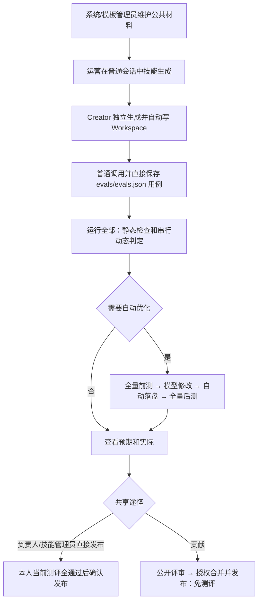
```mermaid
flowchart TD
  A[系统/模板管理员维护公共材料] --> B[运营在普通会话中技能生成]
  B --> C[Creator 独立生成并自动写 Workspace]
  C --> D[普通调用并直接保存 evals/evals.json 用例]
  D --> E[运行全部：静态检查和串行动态判定]
  E --> F{需要自动优化}
  F -->|是| G[全量前测 → 模型修改 → 自动落盘 → 全量后测]
  F -->|否| H[查看预期和实际]
  G --> H
  H --> I{共享途径}
  I -->|负责人/技能管理员直接发布| J[本人当前测评全通过后确认发布]
  I -->|贡献| K[公开评审 → 授权合并并发布：免测评]
```

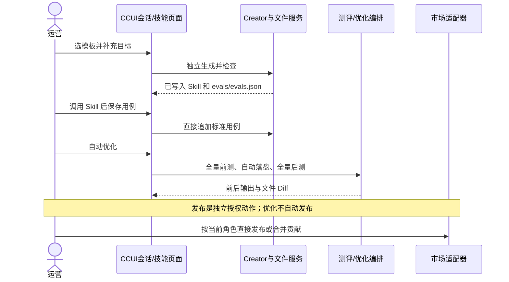
```mermaid
sequenceDiagram
  actor U as 运营
  participant UI as CCUI会话/技能页面
  participant C as Creator与文件服务
  participant E as 测评/优化编排
  participant M as 市场适配器
  U->>UI: 选模板并补充目标
  UI->>C: 独立生成并检查
  C-->>UI: 已写入 Skill 和 evals/evals.json
  U->>UI: 调用 Skill 后保存用例
  UI->>C: 直接追加标准用例
  U->>UI: 自动优化
  UI->>E: 全量前测、自动落盘、全量后测
  E-->>UI: 前后输出与文件 Diff
  Note over U,M: 发布是独立授权动作；优化不自动发布
  U->>M: 按当前角色直接发布或合并贡献
```

## 2. 模板定义与普通用户只读浏览

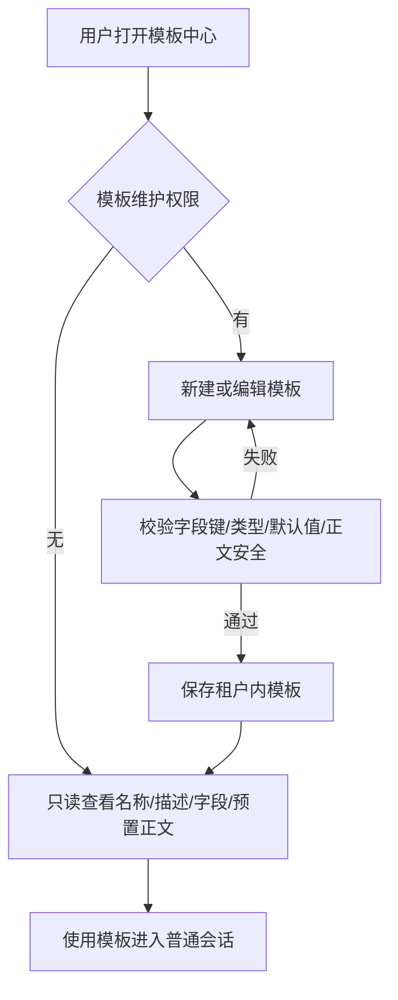
```mermaid
flowchart TD
  A[用户打开模板中心] --> B{模板维护权限}
  B -->|无| C[只读查看名称/描述/字段/预置正文]
  B -->|有| D[新建或编辑模板]
  D --> E[校验字段键/类型/默认值/正文安全]
  E -->|失败| D
  E -->|通过| F[保存租户内模板]
  F --> C
  C --> G[使用模板进入普通会话]
```

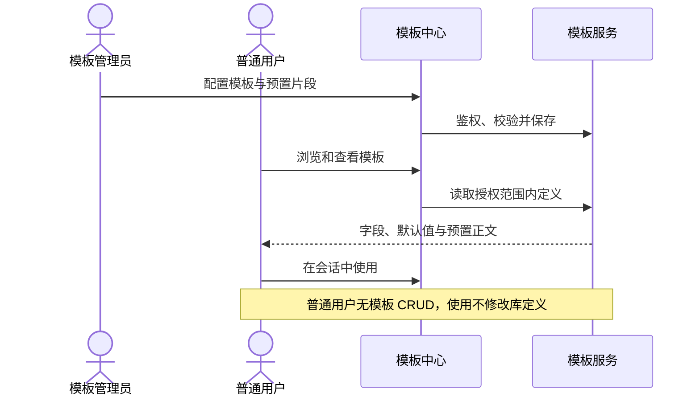
```mermaid
sequenceDiagram
  actor A as 模板管理员
  actor U as 普通用户
  participant UI as 模板中心
  participant S as 模板服务
  A->>UI: 配置模板与预置片段
  UI->>S: 鉴权、校验并保存
  U->>UI: 浏览和查看模板
  UI->>S: 读取授权范围内定义
  S-->>U: 字段、默认值与预置正文
  U->>UI: 在会话中使用
  Note over U,S: 普通用户无模板 CRUD，使用不修改库定义
```

## 3. 会话技能生成、自动保存与继续调整

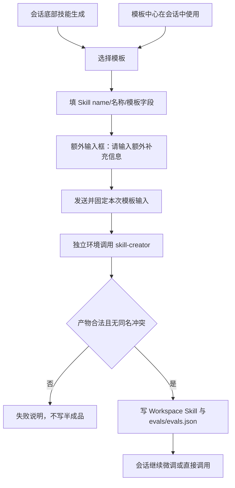
```mermaid
flowchart TD
  A[会话底部技能生成] --> C[选择模板]
  B[模板中心在会话中使用] --> C
  C --> D[填 Skill name/名称/模板字段]
  D --> E[额外输入框：请输入额外补充信息]
  E --> F[发送并固定本次模板输入]
  F --> G[独立环境调用 skill-creator]
  G --> H{产物合法且无同名冲突}
  H -->|否| I[失败说明，不写半成品]
  H -->|是| J[写 Workspace Skill 与evals/evals.json]
  J --> K[会话继续微调或直接调用]
```

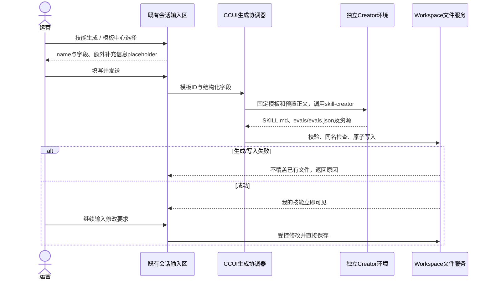
```mermaid
sequenceDiagram
  actor U as 运营
  participant UI as 既有会话输入区
  participant B as CCUI生成协调器
  participant C as 独立Creator环境
  participant FS as Workspace文件服务
  U->>UI: 技能生成 / 模板中心选择
  UI-->>U: name与字段、额外补充信息placeholder
  U->>UI: 填写并发送
  UI->>B: 模板ID与结构化字段
  B->>C: 固定模板和预置正文，调用skill-creator
  C-->>B: SKILL.md、evals/evals.json及资源
  B->>FS: 校验、同名检查、原子写入
  alt 生成/写入失败
    FS-->>UI: 不覆盖已有文件，返回原因
  else 成功
    FS-->>UI: 我的技能立即可见
    U->>UI: 继续输入修改要求
    UI->>FS: 受控修改并直接保存
  end
```

## 4. 全平台片段的维护、查看与复制

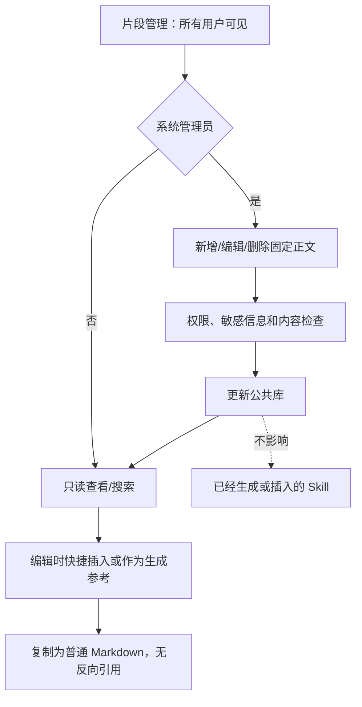
```mermaid
flowchart TD
  A[片段管理：所有用户可见] --> B{系统管理员}
  B -->|是| C[新增/编辑/删除固定正文]
  C --> D[权限、敏感信息和内容检查]
  D --> E[更新公共库]
  B -->|否| F[只读查看/搜索]
  E --> F
  F --> G[编辑时快捷插入或作为生成参考]
  G --> H[复制为普通 Markdown，无反向引用]
  E -.不影响.-> I[已经生成或插入的 Skill]
```

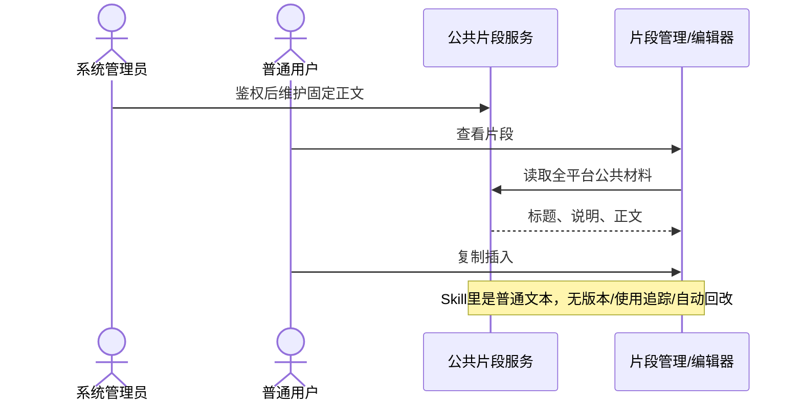
```mermaid
sequenceDiagram
  actor A as 系统管理员
  actor U as 普通用户
  participant S as 公共片段服务
  participant UI as 片段管理/编辑器
  A->>S: 鉴权后维护固定正文
  U->>UI: 查看片段
  UI->>S: 读取全平台公共材料
  S-->>UI: 标题、说明、正文
  U->>UI: 复制插入
  Note over UI,S: Skill里是普通文本，无版本/使用追踪/自动回改
```

## 5. 快捷插入三类内容

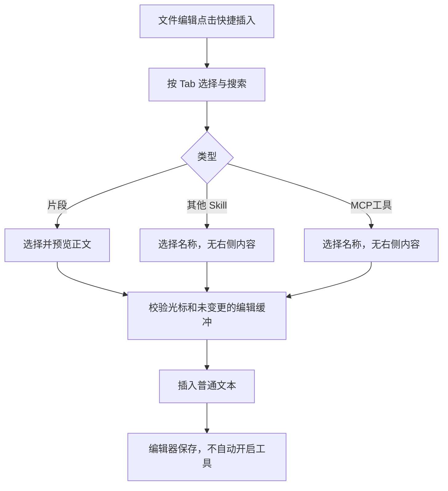
```mermaid
flowchart TD
  A[文件编辑点击快捷插入] --> B[按 Tab 选择与搜索]
  B --> C{类型}
  C -->|片段| D[选择并预览正文]
  C -->|其他 Skill| E[选择名称，无右侧内容]
  C -->|MCP工具| F[选择名称，无右侧内容]
  D --> G[校验光标和未变更的编辑缓冲]
  E --> G
  F --> G
  G --> H[插入普通文本]
  H --> I[编辑器保存，不自动开启工具]
```

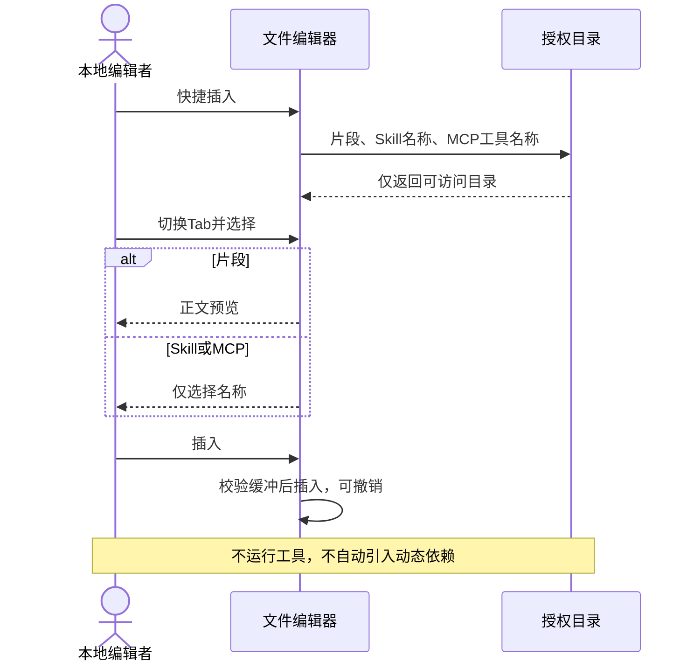
```mermaid
sequenceDiagram
  actor U as 本地编辑者
  participant UI as 文件编辑器
  participant S as 授权目录
  U->>UI: 快捷插入
  UI->>S: 片段、Skill名称、MCP工具名称
  S-->>UI: 仅返回可访问目录
  U->>UI: 切换Tab并选择
  alt 片段
    UI-->>U: 正文预览
  else Skill或MCP
    UI-->>U: 仅选择名称
  end
  U->>UI: 插入
  UI->>UI: 校验缓冲后插入，可撤销
  Note over U,S: 不运行工具，不自动引入动态依赖
```

## 6. 会话调用直接保存 evals/evals.json

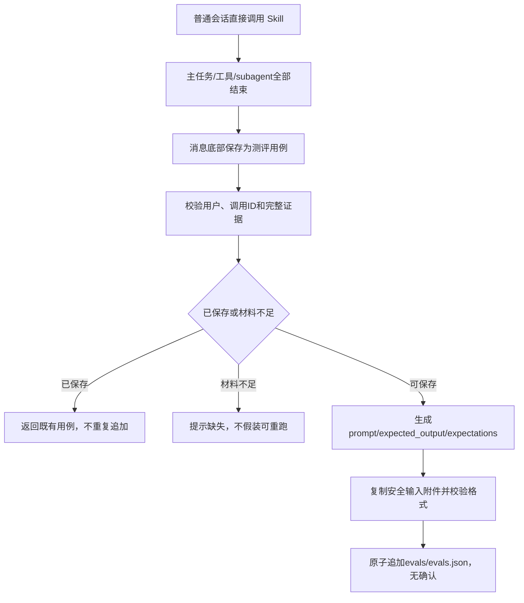
```mermaid
flowchart TD
  A[普通会话直接调用 Skill] --> B[主任务/工具/subagent全部结束]
  B --> C[消息底部保存为测评用例]
  C --> D[校验用户、调用ID和完整证据]
  D --> E{已保存或材料不足}
  E -->|已保存| F[返回既有用例，不重复追加]
  E -->|材料不足| G[提示缺失，不假装可重跑]
  E -->|可保存| H[生成prompt/expected_output/expectations]
  H --> I[复制安全输入附件并校验格式]
  I --> J[原子追加evals/evals.json，无确认]
```

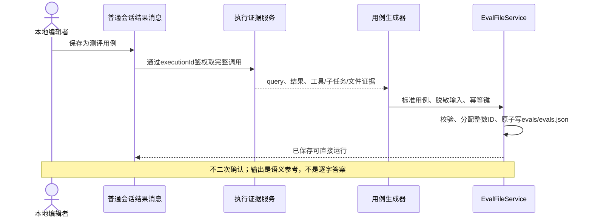
```mermaid
sequenceDiagram
  actor U as 本地编辑者
  participant UI as 普通会话结果消息
  participant R as 执行证据服务
  participant C as 用例生成器
  participant F as EvalFileService
  U->>UI: 保存为测评用例
  UI->>R: 通过executionId鉴权取完整调用
  R-->>C: query、结果、工具/子任务/文件证据
  C->>F: 标准用例、脱敏输入、幂等键
  F->>F: 校验、分配整数ID、原子写evals/evals.json
  F-->>UI: 已保存可直接运行
  Note over U,F: 不二次确认；输出是语义参考，不是逐字答案
```

## 7. 文件化用例的直接新增与保护

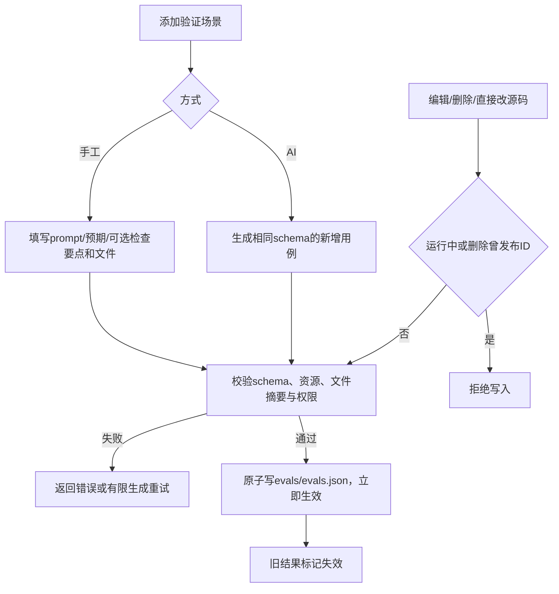
```mermaid
flowchart TD
  A[添加验证场景] --> B{方式}
  B -->|手工| C[填写prompt/预期/可选检查要点和文件]
  B -->|AI| D[生成相同schema的新增用例]
  C --> E[校验schema、资源、文件摘要与权限]
  D --> E
  E -->|失败| F[返回错误或有限生成重试]
  E -->|通过| G[原子写evals/evals.json，立即生效]
  G --> H[旧结果标记失效]
  I[编辑/删除/直接改源码] --> J{运行中或删除曾发布ID}
  J -->|是| K[拒绝写入]
  J -->|否| E
```

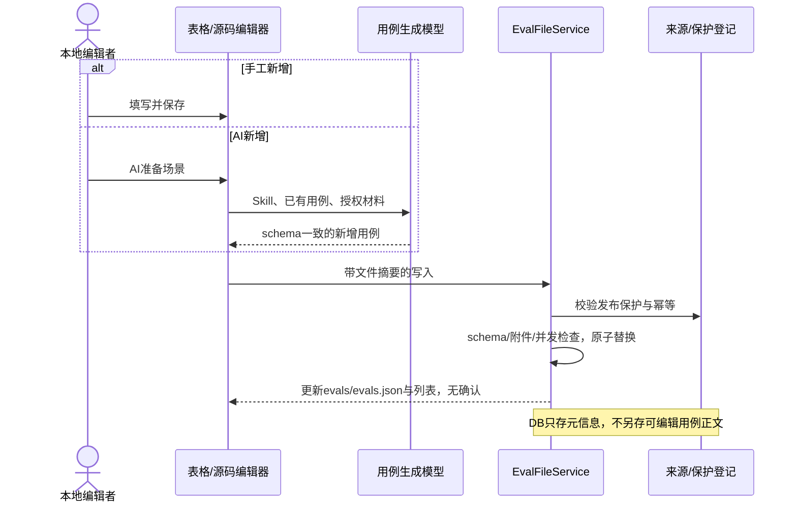
```mermaid
sequenceDiagram
  actor U as 本地编辑者
  participant UI as 表格/源码编辑器
  participant AI as 用例生成模型
  participant F as EvalFileService
  participant DB as 来源/保护登记
  alt 手工新增
    U->>UI: 填写并保存
  else AI新增
    U->>UI: AI准备场景
    UI->>AI: Skill、已有用例、授权材料
    AI-->>UI: schema一致的新增用例
  end
  UI->>F: 带文件摘要的写入
  F->>DB: 校验发布保护与幂等
  F->>F: schema/附件/并发检查，原子替换
  F-->>UI: 更新evals/evals.json与列表，无确认
  Note over F,DB: DB只存元信息，不另存可编辑用例正文
```

## 8. 运行全部：静态检查与串行队列

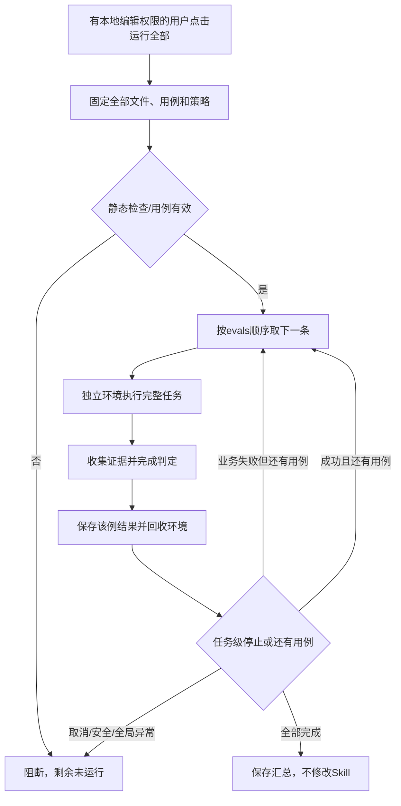
```mermaid
flowchart TD
  A[有本地编辑权限的用户点击运行全部] --> B[固定全部文件、用例和策略]
  B --> C{静态检查/用例有效}
  C -->|否| D[阻断，剩余未运行]
  C -->|是| E[按evals顺序取下一条]
  E --> F[独立环境执行完整任务]
  F --> G[收集证据并完成判定]
  G --> H[保存该例结果并回收环境]
  H --> I{任务级停止或还有用例}
  I -->|业务失败但还有用例| E
  I -->|成功且还有用例| E
  I -->|取消/安全/全局异常| D
  I -->|全部完成| J[保存汇总，不修改Skill]
```

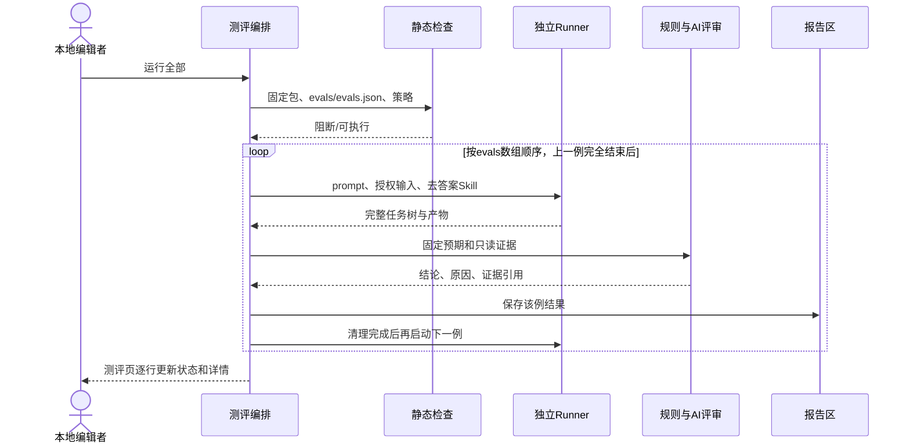
```mermaid
sequenceDiagram
  actor U as 本地编辑者
  participant Q as 测评编排
  participant S as 静态检查
  participant R as 独立Runner
  participant G as 规则与AI评审
  participant DB as 报告区
  U->>Q: 运行全部
  Q->>S: 固定包、evals/evals.json、策略
  S-->>Q: 阻断/可执行
  loop 按evals数组顺序，上一例完全结束后
    Q->>R: prompt、授权输入、去答案Skill
    R-->>Q: 完整任务树与产物
    Q->>G: 固定预期和只读证据
    G-->>Q: 结论、原因、证据引用
    Q->>DB: 保存该例结果
    Q->>R: 清理完成后再启动下一例
  end
  Q-->>U: 测评页逐行更新状态和详情
```

## 9. 动态证据与独立 AI 判断

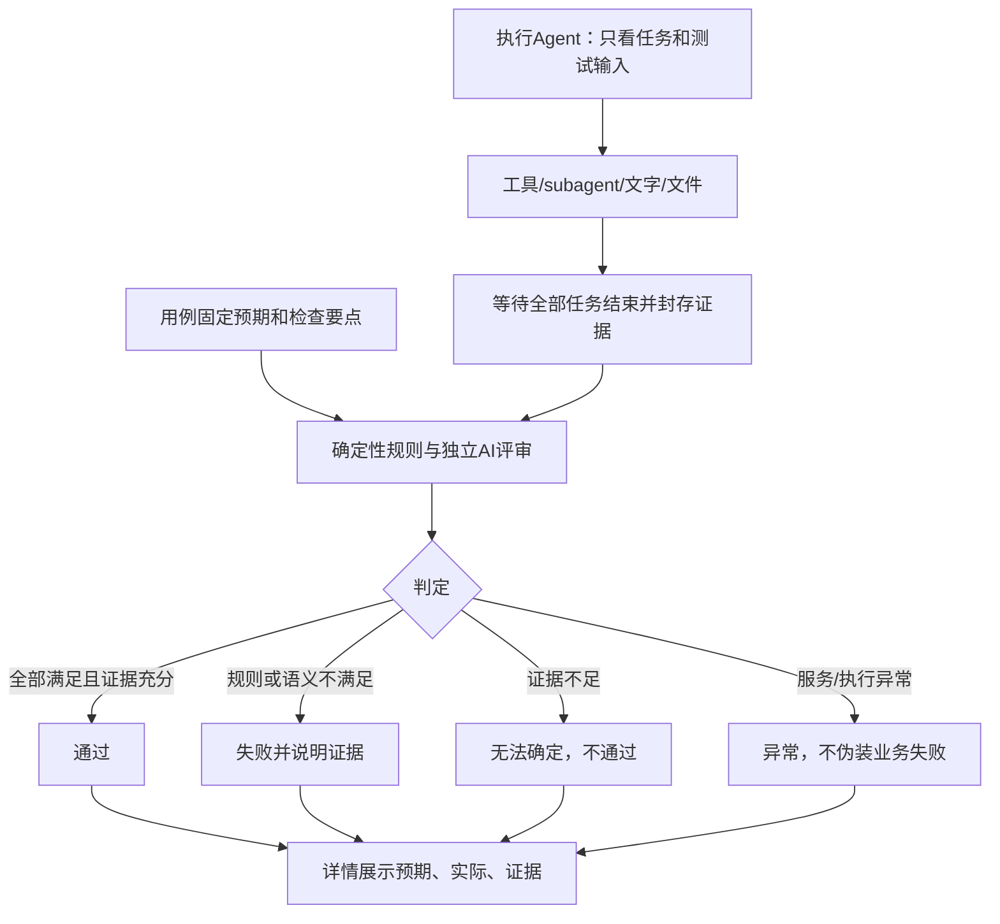
```mermaid
flowchart TD
  A[执行Agent：只看任务和测试输入] --> B[工具/subagent/文字/文件]
  B --> C[等待全部任务结束并封存证据]
  D[用例固定预期和检查要点] --> E[确定性规则与独立AI评审]
  C --> E
  E --> F{判定}
  F -->|全部满足且证据充分| G[通过]
  F -->|规则或语义不满足| H[失败并说明证据]
  F -->|证据不足| I[无法确定，不通过]
  F -->|服务/执行异常| J[异常，不伪装业务失败]
  G --> K[详情展示预期、实际、证据]
  H --> K
  I --> K
  J --> K
```

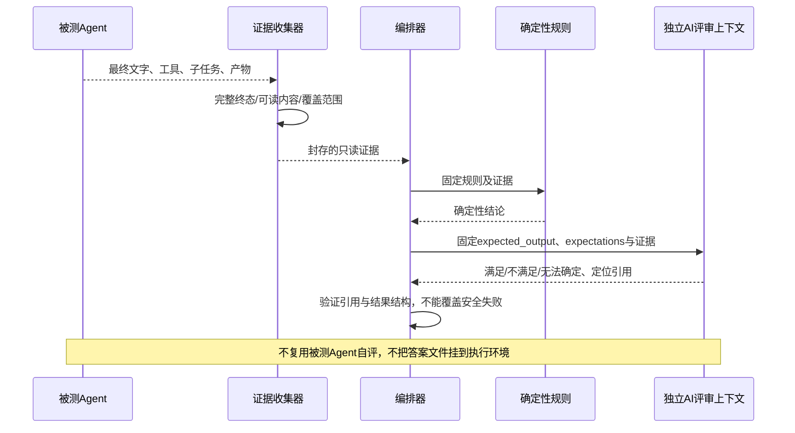
```mermaid
sequenceDiagram
  participant R as 被测Agent
  participant C as 证据收集器
  participant Q as 编排器
  participant G as 确定性规则
  participant J as 独立AI评审上下文
  R-->>C: 最终文字、工具、子任务、产物
  C->>C: 完整终态/可读内容/覆盖范围
  C-->>Q: 封存的只读证据
  Q->>G: 固定规则及证据
  G-->>Q: 确定性结论
  Q->>J: 固定expected_output、expectations与证据
  J-->>Q: 满足/不满足/无法确定、定位引用
  Q->>Q: 验证引用与结果结构，不能覆盖安全失败
  Note over R,J: 不复用被测Agent自评，不把答案文件挂到执行环境
```

## 10. 自动优化：全量前测、自动落盘、全量后测

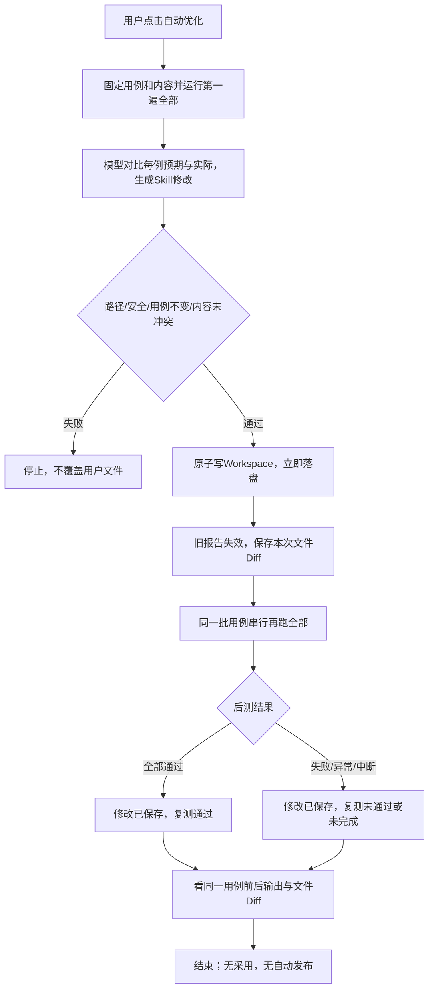
```mermaid
flowchart TD
  A[用户点击自动优化] --> B[固定用例和内容并运行第一遍全部]
  B --> C[模型对比每例预期与实际，生成Skill修改]
  C --> D{路径/安全/用例不变/内容未冲突}
  D -->|失败| E[停止，不覆盖用户文件]
  D -->|通过| F[原子写Workspace，立即落盘]
  F --> G[旧报告失效，保存本次文件Diff]
  G --> H[同一批用例串行再跑全部]
  H --> I{后测结果}
  I -->|全部通过| J[修改已保存，复测通过]
  I -->|失败/异常/中断| K[修改已保存，复测未通过或未完成]
  J --> L[看同一用例前后输出与文件Diff]
  K --> L
  L --> M[结束；无采用，无自动发布]
```

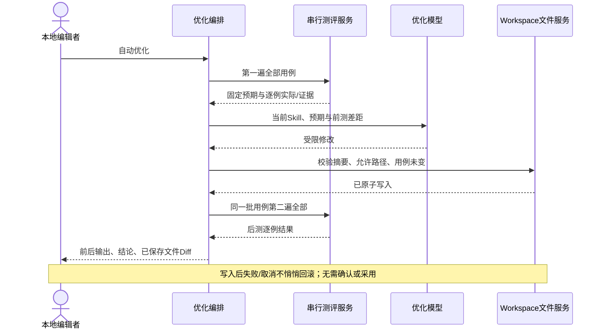
```mermaid
sequenceDiagram
  actor U as 本地编辑者
  participant O as 优化编排
  participant E as 串行测评服务
  participant AI as 优化模型
  participant FS as Workspace文件服务
  U->>O: 自动优化
  O->>E: 第一遍全部用例
  E-->>O: 固定预期与逐例实际/证据
  O->>AI: 当前Skill、预期与前测差距
  AI-->>O: 受限修改
  O->>FS: 校验摘要、允许路径、用例未变
  FS-->>O: 已原子写入
  O->>E: 同一批用例第二遍全部
  E-->>O: 后测逐例结果
  O-->>U: 前后输出、结论、已保存文件Diff
  Note over U,FS: 写入后失败/取消不悄悄回滚；无需确认或采用
```

## 11. 详情页与当前市场测评报告

```mermaid
flowchart TD
  A[打开Skill] --> B{位置}
  B -->|市场| C[概览/测评/贡献/管理]
  C --> D[概览：全展开树和只读SKILL.md]
  C --> E[管理：只读负责人/管理员/分类]
  C --> F{当前包有匹配公开报告}
  F -->|是| G[只读测评表和授权详情]
  F -->|否| H[未测评]
  B -->|我的技能| I[文件编辑/测评/管理]
  I --> J[按本地编辑及角色授权操作]
  J --> K[查看固定预期与完整会话输出：单次单列、前后左右两列]
```

```mermaid
sequenceDiagram
  actor U as 用户
  participant UI as Skill详情
  participant F as 文件/治理服务
  participant R as 报告服务
  U->>UI: 打开Skill详情
  UI->>F: 按市场或本地读取当前文件和角色
  F-->>UI: 文件树、SKILL.md、evals/evals.json、管理员
  UI->>R: 查询当前包匹配且有权查看的报告
  alt 市场无匹配报告
    R-->>UI: 未测评，不回退本地结果
  else 有报告
    R-->>UI: 公开投影或本地授权详情
  end
  U->>UI: 查看用例详情
  UI-->>U: 当次预期与实际；优化则前后两份
```

## 12. 负责人指定管理员与权限变更

```mermaid
flowchart TD
  A[我的技能管理页] --> B{当前负责人}
  B -->|否| C[只读负责人/管理员/分类]
  B -->|是| D[指定管理员/转移负责人/修改分类]
  D --> E[校验成员、授权戳与发布/测评互斥]
  E -->|失效或越权| F[拒绝并刷新]
  E -->|有效| G[原子保存并审计]
  G --> H[撤销旧授权，更新界面]
  H --> I[管理员可测评后发布及评审后合并]
```

```mermaid
sequenceDiagram
  actor O as 负责人
  actor A as Skill管理员
  participant UI as 管理页
  participant G as 治理服务
  participant P as 发布/贡献服务
  O->>UI: 选择Skill管理员
  UI->>G: 当前用户、成员列表、授权戳
  G->>G: 验证owner、成员范围和任务互斥
  G-->>UI: 保存并审计新授权
  A->>P: 发布或合并
  P->>G: 重新检查实时角色
  G-->>P: 允许或已撤销
  Note over O,P: 系统管理员不自动获得Skill管理员权；后者不能自行指派管理员
```

## 13. 贡献多文件 Diff 与公开评审

```mermaid
flowchart TD
  A[本地编辑者提交贡献：免测评] --> B[固定文件包与市场基线]
  B --> C[市场详情贡献列表/收到的或我提交的]
  C --> D[左侧变更文件列表，右侧Diff]
  D --> E{查看者是作者}
  E -->|是| F[可讨论，不可自我Approve]
  E -->|否| G[评论/建议修改/Approve]
  G --> H[认可绑定当前提交摘要]
  H --> I{提交内容再次变化}
  I -->|是| J[旧认可失效，重新评审]
  I -->|否| K[等待负责人或管理员合并]
```

```mermaid
sequenceDiagram
  actor C as 贡献者
  actor R as 其他评审者
  participant UI as 贡献页面
  participant S as 贡献服务
  C->>S: 提交固定文件和基线，无测评
  R->>UI: 打开技能所属贡献
  UI->>S: 读取授权请求与多文件差异
  S-->>UI: 新增/修改/删除文件及Diff
  R->>S: Approve当前摘要
  S->>S: 校验不是作者、提交未变化
  S-->>UI: 有效认可
  Note over C,S: 作者可回复/撤回，但任何角色都不能自我Approve
```

## 14. 贡献合并：授权决策、免测评立即发布

```mermaid
flowchart TD
  A[点击合并] --> B{负责人或指定Skill管理员}
  B -->|否| C[拒绝]
  B -->|是| D{至少一位有效非作者Approve}
  D -->|有| E[正常合并]
  D -->|无且为负责人| F[负责人直接合并，单独审计]
  D -->|无且为管理员| C
  E --> G[检查包/保护用例/远端基线/实时权限]
  F --> G
  G -->|冲突| H[重新核对，不强推]
  G -->|有效| I[调用远端更新发布：免测评]
  I --> J{回读与固定包匹配}
  J -->|是| K[已合并，市场未测评]
  J -->|不明或不匹配| L[待核实，不盲重试]
```

```mermaid
sequenceDiagram
  actor U as 负责人或Skill管理员
  participant C as 贡献服务
  participant G as 治理/文件校验
  participant M as 既有远端市场
  U->>C: 合并固定请求
  C->>G: 实时角色、非作者认可、包与保护登记
  alt 管理员无有效认可或无授权
    G-->>C: 拒绝
  else 正常认可或负责人直接合并
    G-->>C: 允许并记录路径
    C->>M: 预检后更新固定包，无测评门禁
    C->>M: 回读文件摘要和更新时间
    M-->>C: 结果
    C-->>U: 成功或待核实
    Note over C,M: 成功清空适用市场报告；不覆盖本地副本
  end
```

## 15. 直接发布：双角色与本人测评

```mermaid
flowchart TD
  A[负责人/Skill管理员直接发布] --> B{本人当前完整测评通过}
  B -->|否| C[提示运行全部，不允许跳过]
  B -->|是| D[固定包、evals/evals.json和共享检查]
  D --> E[确认发布并重新鉴权/摘要/远端检查]
  E -->|失效| F[拒绝或重新核对]
  E -->|有效| G[发布并回读]
  G --> H{结果匹配}
  H -->|是| I[关联当前公开报告并登记用例永久保护]
  H -->|否| J[失败或待核实]
  I --> K[市场显示当前结果；本地优化不自动发布]
```

```mermaid
sequenceDiagram
  actor U as 负责人或Skill管理员
  participant P as 发布服务
  participant R as 测评/文件服务
  participant M as 既有远端市场
  U->>P: 直接发布当前内容
  P->>R: 检查本人报告、当前内容、用例、授权戳
  R-->>P: 全部通过且适用或拒绝原因
  P-->>U: 固定包预览与发布确认
  U->>P: 确认发布
  P->>P: 再次鉴权与冲突检查
  P->>M: 发布固定包
  P->>M: 回读
  M-->>P: 内容与时间
  P-->>U: 核实成功/失败/待核实
  Note over R,M: 贡献合并走独立免测评通路，不套用此门禁
```

## 16. 无版本更新时间与本地结果失效

```mermaid
flowchart TD
  A[取得当前远端更新时间] --> B{和导入时对应远端时间比较}
  B -->|相同| C[已同步，本地编辑时间不参与]
  B -->|更晚| D[提示可更新]
  B -->|缺失/倒退| E[未知或异常，不伪称同步]
  D --> F{本地有修改}
  F -->|有| G[先看差异并确认覆盖]
  F -->|无| H[下载当前包]
  G --> H
  H --> I[成功原子替换文件及evals/evals.json]
  I --> J[同时更新导入对照时间，使旧本地测评失效]
  J --> K[无历史版本或回滚入口]
```

```mermaid
sequenceDiagram
  actor U as 本地用户
  participant UI as 我的技能
  participant S as 同步服务
  participant M as 远端市场
  participant F as 本地文件与导入绑定
  UI->>M: 查询远端当前更新时间
  M-->>S: remoteUpdatedAt
  S->>F: 读importedRemoteUpdatedAt
  S-->>UI: 已同步/可更新/未知
  U->>UI: 查看差异并确认更新
  UI->>S: 更新
  S->>M: 下载当前包
  S->>F: 校验后原子替换文件与导入对照时间
  F-->>UI: 更新成功，旧报告不适用
  Note over M,F: 保留外部发布渠道，无CAS时不能保证跨客户端原子一致性
```

## 附录A：实现依赖

evals/evals.json 为用例唯一可编辑来源；报告/证据/保护登记单独存储。队列串行并持久化游标；每例独立清洁环境，去掉答案投影。运行与自动写入均校验文件摘要、授权戳和任务锁。仅改 CCUI，远端认证及回读语义必须联调确认。

## 附录B：状态边界

- 自动优化写入之前失败不覆盖文件；写入后失败/取消保留已落盘修改，不自动回滚。
- 修改用例、文件或权限后旧结果失效；详情仍使用当次固定预期，不混入新预期。
- 普通用户能维护自己的本地用例，但不因此获得发布权；管理员权限不等于系统管理权。
- 贡献合并免测评；直接发布必须由当前发布角色本人运行完整测评并通过。
- evals/evals.json 随包分发，不能含私密输入/预期；原始报告不默认发布。
- 任一未运行/异常/无法确定不得作为通过。失败用例不能从分母中剔除。
- 曾发布用例永久不可删除；表单、源码、文件操作和贡献都校验保护登记。
