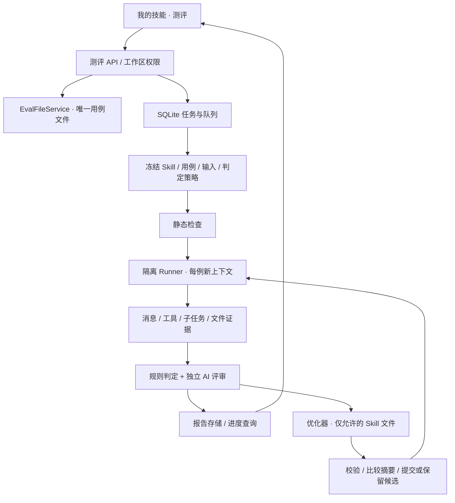

# 技能市场测评功能实施方案

日期：2026-09-18。状态：首版代码已实现；真实模型与 Docker 联调待部署环境验证。具体实现边界、部署条件与验证方式见 [运行与验收](skill-evaluations-运行与验收.md)。下文保留设计目标，实际落地差异以运行与验收文档为准。

产品依据：[第一阶段功能说明](skill-market-第一阶段-功能说明.md)、[第一阶段详细设计](skill-market-第一阶段-详细设计.md)、[第一阶段原型](prototypes/skill-market/phase1.html)。旧专项方案中涉及负责人确认、发布门禁、独立调试和私有测试格式的内容不作为本次要求。

本方案按用户确认覆盖用例管理、运行测评、报告和有限次自动优化，分批开发；会话保存用例作为接入步骤。技能创建、公共片段、模板、贡献和发布治理不作为测评上线依赖。下文 P3 是测评链路的中间验收点，完整范围仍包含 P4 自动优化与 P5 会话保存用例。

## 1. 核心决策

1. 测评回答“这个 Skill 能否完成给定任务”，结果为逐例通过、未通过、异常、无法判定；不以文档结构总分替代业务结果。
2. 用例唯一事实源为 Skill 内的 `evals/evals.json`；数据库保存任务、保护登记和报告索引，不另建一份可编辑用例库。
3. 复用当前 Claude Agent SDK 作为首个执行适配器，新增测评专用隔离运行环境。模型、执行器、工具策略、评分器及其版本随任务冻结。
4. 每个任务严格串行执行用例；一条用例的主任务、工具、子任务、证据采集、评审和清理全部结束后才开始下一条。
5. 规则检查负责可计算事实，独立 AI 评审负责语义验收。执行器看不到预期答案，评审器不能执行被测输出中的指令。
6. 自动优化沿用已有产品规则：全量前测 → 受限修改 → 自动保存 → 全量后测；默认 3 轮、可设 1–10 轮；不新增采用按钮、自动回滚或发布。
7. 遵循 **2026-09-16 补充规则**：运行期间允许工作区编辑；本次始终测试固定副本，回写冲突后继续测试候选副本，不覆盖新编辑。该规则覆盖早期“运行时禁止编辑”“普通内容冲突终止循环”的描述。
8. 借鉴达尔文的独立诊断、失败驱动修改和成对比较；不原样安装其指令驱动后台任务，不引入 Python 优化框架作为首期必需依赖。
9. **执行记录仅保留最新一次**：同一工作区同一 Skill 的 run-all 与 optimize 共用一个最新任务位置；再次运行替换前一次报告，不建设历史测评列表。用例定义与输入附件继续保留，可反复执行。

## 2. 当前代码事实与改动位置

| 现有位置 | 已有能力 | 实施方式 |
| --- | --- | --- |
| [SkillsWorkspacePanel.tsx](../src/components/skills-market/SkillsWorkspacePanel.tsx) | 我的技能/市场详情、文件树、编辑器、发布入口 | 仅在本地详情新增“文件 / 测评”内容切换，测评拆为独立组件 |
| [api.js](../src/utils/api.js) | 工作区请求和 tenant 参数封装 | 增加 `skillEvaluations` API 分组，沿用鉴权请求 |
| [workspace-skills.js 路由](../server/routes/workspace-skills.js) | 详情、文件、目录操作，按工作区校验权限 | 新路由独立挂载；现有写入口接入用例校验和文件事务 |
| [workspace-skills.js 服务](../server/services/workspace-skills.js) | manifest 校验、路径拒绝符号链接、文件 revision、目录 hash、受管理源与运行目录同步 | 抽出内部共享路径/事务能力；新增 evals 校验，不能只在新 API 中校验 |
| [workspace-access.js](../server/services/workspace-access.js) | tenant/workspace 的 owner/edit/view 权限 | 任务启动、查询、事件、取消、附件下载均复用；执行期间复核权限 |
| [top-skill-jobs.js](../server/services/top-skill-jobs.js) | 异步任务入口模式，内存 Map 与 TTL | 不复用其存储；新任务使用 SQLite 持久队列和租约 |
| [agent-graphs.js](../server/services/agent-graphs.js) | SDK 创建/优化调用 | 现有路径 `tools=[]`、单轮、鉴权失败模板 fallback，不适用于真实测评，不直接调用 |
| [agent-session-runtime.js](../server/services/agent-session-runtime.js) | Docker/本地运行、资源限制、用户运行环境 | 可抽取容器生命周期公共函数；不能直接挂载真实工作区、用户 HOME 和共享可写缓存 |
| [claude-sdk.js](../server/claude-sdk.js) | 主任务与后台子任务生命周期、工具消息处理 | 提取纯消息归一化和生命周期跟踪逻辑，保留普通聊天行为；禁止把聊天启动函数整个搬入测评 |
| [MessageComponent.tsx](../src/components/chat/view/subcomponents/MessageComponent.tsx)、[buildSubagentTraces.ts](../src/components/chat/subagent/buildSubagentTraces.ts) | 文本、工具、子任务展示 | 提取或包装只读呈现层，去掉授权、重试和真实会话副作用 |
| [db.js](../server/database/db.js)、[index.js](../server/index.js) | 数据库初始化与路由/服务启动 | 挂载幂等迁移、测评路由、队列 worker、重启恢复及清理 |

已经核对本地 SDK 类型中存在 `maxBudgetUsd`、`canUseTool`、`settingSources`、任务事件等能力；这只证明接口存在，具体子任务终止、权限继承和费用归集仍须通过 P0 真实验证。

## 3. 用户操作与交付范围

入口：**我的技能 → 某个本地 Skill → 测评**。市场导入的本地可编辑副本同样支持；远端市场页不新增运行或写操作。

顶部三个操作：添加验证场景（手工 / AI 准备场景）、运行全部、自动优化。用例表为“验证场景、预期结果、运行结果、操作”。

- 无用例：显示引导，禁止启动运行和优化；不显示通过。
- 首次添加：创建 `evals/evals.json`。读取旧 Skill 不偷偷写文件。
- 手工保存和 AI 添加：合法内容直接生效，不增加草稿确认。
- 运行中：显示阶段、已完成例数、正在执行的用例、停止按钮；离开页面不会停止任务，再进入恢复。
- 工作区文件和用例可继续编辑，但明显提示“本次使用启动时的副本”；同一 Skill 的第二个测评/优化请求返回忙碌。
- 查看详情：顶部为当次冻结输入和预期，下方显示逐项判定、完整可见过程和产物；普通测评单列，优化默认初始前测/最新后测双列。
- 对比另有“Skill 文件修改”，显示本次任务初始与最终候选，以及候选是否已写入工作区。
- 只展示最新一次任务。尚未再次运行时，因编辑而失效的最新报告仍可查看，并标明“不对应当前文件”；再次运行被服务端接受后清空旧结果，显示本次进度或未执行，不回填上次结果。
- owner/edit 可维护用例、运行、优化、取消；view 仅查看有权限的用例与报告。工作区 owner/edit 可停止本工作区任务，记录操作者。

首期支持文本、Markdown、JSON、CSV 产物内容判定及工具/子任务轨迹。XLSX、DOCX、PDF 的深度内容抽取及图片视觉判定在能力清单中明确标为未支持；若某例必须依赖这些证据则返回无法判定，不能只检查文件存在便通过。之后以受控解析器扩展，不改变任务协议。

## 4. 服务结构



建议新增模块（均为待实现文件，不表示当前已有）：

| 模块 | 职责 |
| --- | --- |
| `server/services/skill-evals/files.js` | schema、增删改、附件、ID、保护登记与事务 |
| `server/services/skill-evals/snapshots.js` | 固定清单、分类投影、内容摘要和候选副本 |
| `server/services/skill-evals/jobs.js`、`worker.js` | 持久任务、幂等、锁租约、调度、取消与恢复 |
| `server/services/skill-evals/runtime.js`、`runner.js` | 专用沙箱、SDK 调用、能力白名单、生命周期 |
| `server/services/skill-evals/evidence.js` | 归一化事件、完整性检查、产物安全收集 |
| `server/services/skill-evals/static-checks.js` | 确定性静态规则及提示 |
| `server/services/skill-evals/grading.js` | 冻结判定计划、规则检查、独立 AI 评审、结论聚合 |
| `server/services/skill-evals/optimizer.js`、`commit.js` | 失败诊断、受限文件变更、回写日志与并发保护 |
| `server/services/skill-evals/reports.js` | 最新报告、分页证据、差异、授权下载和被替换记录清理 |
| `server/services/skill-evals/case-generation.js`、`invocations.js` | AI 追加用例、真实调用转用例 |
| `server/database/skill-evaluation-schema.js`、`skill-evaluation-db.js` | 迁移及数据访问，复用现有 SQLite 连接 |
| `server/routes/skill-evaluations.js` | 所有新接口，支持依赖注入测试 |
| `shared/skillEvaluation.ts` | 请求/响应、状态和证据结构的共享类型 |

内部接口以数据和能力对象传递，避免服务互相访问真实工作区路径。测试注入 runner、reviewer、时钟和存储，不在生产模块内添加“固定成功结果”分支。

## 5. 用例、快照和持久化

### 5.1 用例格式保持不变

```json
{
  "skill_name": "store-weekly-report",
  "evals": [
    {
      "id": 1,
      "prompt": "根据活动记录生成周报，没有客流数据时不要计算增长率。",
      "expected_output": "说明活动进展、数据缺口和下周计划，不编造增长率。",
      "files": ["evals/files/activity.txt"],
      "expectations": ["包含下周计划", "不编造增长率"]
    }
  ]
}
```

`id` 为稳定正整数；`files` 相对于 Skill 根目录；预期和场景非空；数组顺序就是执行顺序。缺少 `expectations` 时仍按完整 `expected_output` 进行语义验收。

所有表单、AI 追加、会话保存和 JSON 编辑共用相同校验。未知字段首期返回明确的 schema 错误，不静默丢弃。ID 分配在锁内完成，不复用已删除或保护登记中的 ID；新增保护登记不允许用改 ID 绕过。

新写接口必须提交 `expectedRevision`；服务端在锁内读取、核对、校验、暂存、提交，冲突返回 409。AI 生成期间若用例变化，不覆盖整份文件；安全追加也必须重新核验输入与分配 ID，无法确认时返回冲突。

已发布保护沿用第一阶段要求：可信远端包或现有发布成功记录登记 case ID，来源不明不伪造历史。保护检查覆盖 evals 文件重写、删除、父目录删除、重命名、市场更新/覆盖导入及其他平台文件写入口；不新增发布门禁。直接终端或外部磁盘修改无法靠 UI 拦住，后续读取时与登记核对，发现受保护用例缺失即提示修复并阻止开始测评。

### 5.2 任务快照

任务启动时生成并保存：

- `skillContentHash`：运行文件清单、路径、字节内容；不混入报告。
- `evalsHash`：规范化用例内容与顺序。
- `inputsHash`：本次所有输入附件的内容摘要。
- `policyHash`：模型标识、执行器/镜像版本、工具配置、判定计划、提示词及解析器版本。
- `workspaceFingerprint`：回写前对整个目标 Skill 及受管理源/运行副本的比对依据，包含用例与输入，防止意外回写旧资料。

加平台协作锁后构建快照；复制前后复核清单和内容，不稳定时重试一次，仍变化则 409。保存后的任务只读自身快照，不再从当前用例文件取预期。报告当前有效性按这些摘要重新比对，不以“最新完成的一次”推断有效。

### 5.3 SQLite 与文件存储

| 表（建议） | 关键字段 / 约束 |
| --- | --- |
| `skill_eval_latest` | tenant/workspace/skillKey 唯一，latestJobId、generation；run-all 与 optimize 共用，不含 AI 生成用例任务 |
| `skill_eval_jobs` | jobId、tenant/workspace/user、skillKey、kind、requestId、requestHash、status、phase、outcome、hashes、cursor、maxIterations、iteration、stopReason、cancelRequested、leaseOwner/expiry/fence、budget、timestamps |
| `skill_eval_rounds` | jobId + round 唯一，前后内容摘要、候选/写入状态、文件变更清单、比较结果、提交日志指针 |
| `skill_eval_case_runs` | jobId + round + caseId 唯一，执行/判定状态、checks、证据索引、资源用量、错误原因 |
| `skill_eval_events` | jobId + seq 唯一，持久化进度事件，支持断线后续读 |
| `skill_eval_protection` | tenant/workspace/skillKey/caseId 唯一，保护来源、登记时间 |
| `skill_eval_case_sources` | 用例来源、调用幂等记录、ID 分配元数据；与 evals 文件通过写入日志一致提交，不作为用例正文副本 |
| `skill_eval_locks` | tenant/workspace/skillKey 唯一；active job、租约与单调 fencing token |

任务创建唯一键包含 tenant、workspace、actor、requestId；同 requestId 同请求返回原任务，不同请求体返回 409。并发启动同一 Skill 由数据库事务抢锁，不能靠进程内 Map 判重。

区分两种锁：job 租约只禁止同一 Skill 重叠运行/优化；文件协调锁只在快照、保存或提交期间短暂持有。不能用整个 job 生命周期占住文件写锁，否则会违反运行中允许编辑的要求。

报告根目录使用服务端配置 `SKILL_EVAL_STORAGE_ROOT`，必须位于用户工作区之外，推荐与数据库位于同一持久卷。服务端生成 tenant/workspace/job 路径，客户端只传 jobId/artifactId。快照、JSONL 证据、产物和写入日志均存于该根目录；Runner 无法挂载其父目录。

数据库和文件不是一个事务：先暂存、校验并写 manifest，再通过数据库标记引用为可见；孤立文件定期回收，缺失文件明确报错。报告不再采用“保留 30 天”的历史归档策略，按下面的最新一次替换规则管理。

### 5.4 最新一次替换与清理

替换单位为同一 tenant/workspace/skill 的**一次用户启动任务**。普通测评、自动优化互相替换；不同 Skill 或工作区互不影响。自动优化任务内部的前测与各轮后测仍属于同一次任务，保留其优化依据与前后对比，不能每跑一条用例或一轮就清空本任务基线。

1. 新请求先通过权限、基本参数、非空用例、revision 和忙碌检查；在数据库同一事务内创建新 job、切换 latestJobId、递增 generation，并登记旧任务清理标记。请求未被接受不删除旧结果；幂等重试同一请求不触发替换。
2. 服务端成功接受新任务即替换旧记录，不等待新任务成功。新任务排队、静态检查失败、运行失败或取消时都只展示本次状态，不恢复旧报告，也不将旧通过状态填入尚未运行的用例。
3. 旧报告、各轮判定、消息、工具与子任务轨迹、事件、产物、快照、候选与文件差异立即停止对外提供，随后由可重试清理任务物理删除。旧链接在鉴权后返回 410；前端关闭旧详情、取消旧请求，丢弃旧 jobId/generation 的迟到响应。
4. 清理只删除旧任务专属目录和记录，不删除 `evals/evals.json`、`evals/files` 原始输入、保护登记、会话原始记录，或已经写入工作区的优化结果。保留新任务引用的数据；采用共享存储时须先做引用检查。
5. 旧任务仅可短期保留 requestId/requestHash/jobId/已替换标记等最小幂等墓碑，不保留报告正文或历史入口；墓碑按有限重试窗口过期。窗口内重试旧请求返回已替换，不能把旧任务重新设为最新或重复执行。
6. 文件清理中断后在启动扫描时继续，不能只隐藏 UI 而让旧证据永久堆积。未完成文件提交恢复或未清理运行进程时仍占用锁，先恢复一致性再允许新任务替换，避免删除恢复所需日志。
7. 当前最新任务仍持久化以支持刷新与重启恢复；“一次性记录”不等于只放内存。没有再次运行时继续展示最新结果；Skill/工作区删除时随其生命周期清理。

## 6. 测评执行与隔离

### 6.1 执行环境

首期生产只启用专用容器执行路径；没有经过验证的隔离能力时返回 `EVAL_RUNTIME_UNAVAILABLE`，不降级到宿主机执行。平台自身的模型调用与控制面可以复用已有凭据服务，但不把生产业务密钥注入任务进程。

每条用例新建容器、HOME、SDK 上下文和临时目录。先追求隔离可验证，后续再优化容器复用。目录投影为：

```text
控制面私有：evals.json / expected / grading plan / before report / snapshots

用例容器：
  /workspace/.claude/skills/<name>/   # 只读运行文件，排除 evals 和答案材料
  /workspace/.claude/skills/<name>/evals/files/... # 仅当前用例显式授权的输入
  /workspace/output/                # 可写产物
  /workspace/work/                  # 可写临时工作目录
  /home/eval/                       # 本例独立、任务后删除
```

仅投影当前用例的 `files`，保留其约定相对路径。普通 references 需要做运行资料与答案资料分类，不能把仅仅“不在 evals 目录”当作无答案证明；无法分离则阻断并说明。测试 prompt 可包含用户原本知道的输出要求，但不会额外注入 `expected_output`、expectations 和评分规则。

不用现有 `expandLeadingSkillCommand` 的全局技能扫描路径；复用纯展开逻辑，显式绑定当前快照，避免加载用户全局技能、插件或同名 Skill。仅加载平台生成的运行配置；不继承真实工作区 CLAUDE.md、用户 settings、Hooks 或自动发现的 MCP。

容器无宿主工作区、用户 HOME、Docker socket 和共享可写 Python 缓存；只读基础镜像、非 root、资源限制、进程数限制和受控出站。需要 Bash/子任务的例子必须由容器策略限制实际文件与网络访问，不能只靠工具名白名单。

模型网络通过受控代理放行，任务进程最多得到短期、任务范围的代理凭据，不能拿到上游长期模型密钥；测试 MCP 由服务端网关代理并限制工具、参数、测试账号、调用量与期限。容器网络只允许这些网关，网关不得成为任意转发代理。鉴权、权限继承、SDK 子任务流和代理兼容性列为 P0 验证项；未验证前不能宣称生产隔离已完成。

### 6.2 Runner 契约

```ts
runCase({
  jobId, round, caseId, skillProjection, prompt, inputFiles,
  runtimeProfile, toolPolicy, deadline, budget, abortSignal, onEvent
}): Promise<{
  executionStatus: 'completed' | 'error' | 'cancelled';
  evidenceManifestRef: string;
  evidenceComplete: boolean;
  usage: { tokens: number | null; costUsd: number | null };
  errorCode?: string;
}>
```

这里没有 expected/expectations 参数。被测 Skill 不强制输出 JSON；JSON 仅用于平台内部记录与评审响应。

完成条件：主 Agent 终态 + 全部工具/子任务终态 + 停止所有写入者并冻结产物 + 证据收集完整。主任务 `result` 或短暂无消息均不是完成依据。子任务清理失败时停止整个 job 并保留隔离资源待清理，不能释放锁后立刻启动新任务。

证据保存 seq、可见消息、tool call/result、parentToolUseId、taskId、状态和时间。文件登记 artifactId、内容 hash、相对路径、类型、大小、提取内容与覆盖范围。拒绝符号链接、设备文件、路径逃逸和超额压缩包；输出与下载均经过授权和脱敏，HTML 默认下载或隔离预览，不在应用主域执行。

不存隐藏思维链。若脱敏、截断或解析失败影响必需证据，报告标记覆盖缺口并判为无法判定，不使用一句最终总结代替完整证据。

## 7. 静态规则与结果判定

### 7.1 静态规则

首批规则：SKILL.md 存在、frontmatter 合法且 name/description 满足现有约束；用例 schema/ID/附件合法；安全路径、大小与文件数量；保护登记完整；运行所需工具/测试账号/解析器可用。规则返回 `ruleId/severity/file/location/reason`。

凭据或危险声明扫描只能作为确定性模式匹配与策略判断，不能声称覆盖所有风险。歧义、冗余、缺少错误分支等 AI 文档质量建议单独展示，不加入业务通过率。静态阻断保存报告，动态用例为 `not_run`。

### 7.2 冻结判定计划

保持现有用例格式，不让用户填写第二套 assertion JSON：

1. `expected_output` 作为完整语义标准，`expectations[]` 作为附加必需项；保留原文、来源位置及稳定 checkId。
2. 平台基础规则检查执行完整性、工具策略、实际产物可读取等事实。
3. 精确数值、列名和格式断言仅在平台已有受信解析/业务规则能够无歧义确定时启用，记录规则实现和参数摘要。不能让 AI 临时编一段脚本，直接作为确定性规则执行。
4. 一般自然语言约束由 AIReviewer 验收。要求相互冲突、缺少判断依据或证据格式未支持时返回 `uncertain`，提示改进用例；不猜测正确答案。
5. 计划在执行前固定，并在同一任务各轮复用；优化器不能改计划。

### 7.3 独立评审

AIReviewer 使用独立、无工具的模型请求，输入固定要求、原始 prompt、授权输入及完整可见证据。必需输入也交给评审器用于核对事实，但不直接挂载工作区。前后轮不复用评审对话上下文，固定模型/参数/模板标识。

每条结论必须返回 checkId、passed/failed/uncertain、reason 和 evidenceRefs；校验结构、必需项齐全以及引用真实存在。缺项、非法 JSON 或虚构引用允许同一证据下一次格式修复；仍失败为 `error`，不循环刷到通过。超过上下文预算时按照冻结策略分段覆盖并记录完整性；未能覆盖必要内容则无法判定。

预期可被优化器读取，被测 Runner 不可读。报告显示“参考结果来自用户 / AI / 历史调用”，不将 AI 生成预期或用户保存动作当成事实正确性证明。

### 7.4 状态聚合

| 结果 | 条件 |
| --- | --- |
| `passed` | 执行完整，所有必需规则及语义项通过，无策略阻断 |
| `failed` | 已有充分证据表明至少一个必需业务要求不满足；保留其他项的不确定性 |
| `error` | 模型、工具、评审器、环境或资源限制导致无法完成正常测评 |
| `inconclusive` | 执行完成但必要证据不足、标准冲突、格式未覆盖或评审无法确定 |
| `not_run` / `cancelled` | 尚未开始 / 执行被取消，分别显示 |

规则失败不被 AI“总体不错”覆盖。出现技术错误时仍保留已识别失败项，但用例终态为 error。动态过程中发现隔离破坏或越权执行，立即终止 job 为 error，并记录独立安全事件。

任务 `status` 与 `outcome` 分开：`completed` 只表示流程结束；outcome 使用 `passed/failed/error/inconclusive/not_evaluated`。全部非空用例通过才为 passed；任何 error 优先标记 error，其次明确业务失败，其次 inconclusive；取消保留局部结果但不能显示整批通过。

展示“通过 6 / 8，未通过 1，异常 1”，不把异常从分母去掉。优化终止判断额外检查是否存在 error/inconclusive，即使另有业务失败也不能继续用异常证据自动改写。

普通运行全部遇到业务 failed 或单例 inconclusive 时继续；局部工具错误只有在该例已彻底清理且后续环境仍有效时才允许继续。鉴权失败、权限撤销、隔离破坏、总预算耗尽和清理失败立即停止整批。优化模式出现 error/inconclusive 时终止自动循环，保留已有结果，未执行项明确标记。

例如周报用例：有授权活动记录、没有客流明细。输出包含下周计划且说明缺失数据，可以通过相应语义项；编造“客流增长 20%”为业务 failed；测试工具离线为 error；必须验收的扫描 PDF 内容当前无法解析则为 inconclusive。这三类问题分别需要修改 Skill、修复环境、补足证据能力，不能都交给优化器反复改文案。

## 8. 达尔文能力的接入方式

参考 [darwin-skill 核心指令](https://github.com/alchaincyf/darwin-skill/blob/master/SKILL.md)（2026-09-18 查阅，文件自标 v2.1）。采用方法思想，不执行其中的整套 Git、人工暂停、模拟实测或个人风格评分流程。实施时若复用原文/代码，应固定 commit 并按仓库许可保留归属。

首期启用：优化器与评审器隔离；根据失败证据生成有范围的修改；每轮保存修改目标、理由和结果。

成对比较做成可选评审器，默认关闭以控制首期成本：把**同一用例前后的实际输出和产物证据**匿名标记为 A/B，固定要求、随机展示顺序，独立判断 better/worse/tie/uncertain。它不单凭 SKILL.md 文案评分，不替代用例通过条件，也不控制自动回滚。开启后冻结配置并独立记录费用；不可用时显示“对比意见不可用”，不篡改已完成的主测评结论。

多评委多数决、无 Skill 基线、留出集和演化候选池不纳入首期。报告明确：同一组用例上的改善不保证未见场景的泛化提升。

## 9. 自动优化与写入

```text
冻结快照/计划 → 静态检查 → 全量前测（round=0）
  ├─ 全通过：结束，iteration=0
  ├─ 异常/无法判定：结束并解释原因
  └─ 有业务失败：
       原子增加 iteration（不超过 maxIterations）
       → 读取上一轮完整证据 → 生成候选修改 → 校验
       → 无冲突则提交；有冲突则保留候选，后续轮禁止自动回写
       → 候选全量后测 → 全通过 / 达上限 / 异常则结束，否则下一轮
```

优化器仅能提出 SKILL.md 和必要运行资源变更，输出结构化变更清单，由服务端写文件；不授予其真实工作区写权限。禁止改 name、evals、输入、判定规则、权限、用户配置，禁止按具体 case ID/测试答案写分支。后者需静态与独立诊断协同检查，不能承诺自动识别全部投机行为。

每轮在暂存区应用全部变更并重跑适用的完整静态检查，再进入提交和动态后测；无改动仍消耗一轮并做全量后测。格式失败的有限修复仍属于本轮预算，不增加隐形迭代。达到上限、全部通过、取消、权限撤销、总预算耗尽、执行/评分异常均保存明确 stopReason。

写入日志记录 `prepared → committing → committed`、原内容/候选清单、备份和摘要，覆盖受管理源与运行副本；所有平台文件操作、Skill 同步与普通运行准备共享同一协调锁。在锁内核对最新 workspaceFingerprint 和 fencing token，再提交，提交后立即通知前端刷新。

跨文件、源目录/运行目录不能声称单个 rename 天然原子。实施应使用同文件系统的暂存/备份及可恢复日志，并在转换期间阻止平台读者读到半份目录；崩溃恢复先完成或修复到完整状态再开放读取，不能重新调用模型重复生成。提交故障的技术恢复与“后测退化自动回滚”是两回事，后者不做。

外部进程不会遵守平台锁，因此必须二次校验、保留备份并测试写入竞争；发现无法确认的磁盘状态立即停止回写，保留双方文件。不能承诺普通摘要比较对任意外部并发写入提供绝对互斥。若上线要求该保证，需要将所有工作区写入纳入受控存储/文件系统锁协议，列为额外基础设施工作。

发生一次回写冲突后，该 job 置 `writebackStatus=conflict`，剩余轮只改候选副本，即使后来摘要偶然相同也不恢复回写。工作区仍可继续编辑，报告明确“候选已通过，当前工作区未应用”，不出现“当前技能已通过”。

取消提交前丢弃未提交修改；提交是有界临界区，进入提交后先完成/恢复文件一致性再响应取消，保留已提交修改。后测失败或取消不自动回滚。对比页面明确区分“已写入部分/最终候选/当前工作区”。

## 10. 持久任务、停止与资源预算

任务状态：`queued → running → completed/failed/cancelled/interrupted`；阶段独立为 snapshot、static-check、before-running、optimizing、writing、after-running、finalizing。内容失效使用最新报告属性，不改写其执行结论；下一次任务被接受后，旧任务按第 5.4 节清理。

首期 worker 与 Node 服务同部署，不新增 Redis。DB 是任务事实源；进程 Map 只保存活跃 AbortController/容器句柄。每个 Skill 同时一个运行或优化任务，跨 Skill 受部署和租户并发配额约束，初始部署可从全局 1 个 job 起步。

worker 领取任务时获取租约及 fencing token，续租失败立即停止执行与写入。租约过期后先确认/清理旧容器，禁止旧 worker 凭陈旧 token 提交。

停止接口只设置持久 cancelRequested，worker 发 SDK 停止信号，终止全部子任务/工具并清理容器，最终写 cancelled。前端显示“正在停止”，不能刚点按钮就假装已结束。

重启后：queued 可继续；证据不完整的活动用例标记 interrupted，不自动重复真实工具操作；已提交且可确认的优化轮可从同一快照恢复后测，不重复计轮/写文件；日志有歧义先修复文件一致性再终止并解释。用户重试创建新 job，旧记录不被覆写。

建议初始限额（服务端配置，P0 实测后校准）：每例运行 5 分钟、每 job 60 分钟、每例 24 个 Agent turn、32 次工具调用、用例最多 50 条、单例证据 10 MiB、产物总计 50 MiB。超限明确 error，不悄悄截断为成功；上传还遵循既有更严格限制。

模型费用上限由部署配置及租户策略设定，在任务启动前展示有效预算；网关、执行器和评审共享 job 预算。SDK 单 query 限额只是补充，不代替包含所有子任务、优化和评审的总账。未知费用记 null，不当作零；无法计费时仍强制执行时间、调用和输出额度。

N 条用例、K 次优化，最多执行 `(K+1)×N` 次用例，另有最多 K 次优化调用和对应评审；这是调用规模上界说明，不是固定价格承诺。费用与 token 统计避免重复累加 SDK 已包含的子任务用量。

## 11. API 契约

全部位于 `/api/workspaces/:workspaceId`，复用 authenticateToken 和 tenantContext。`:name` 在服务端解析为受控 Skill 身份，绝不接受请求中的任意磁盘路径。

| 方法与后缀 | 用途 |
| --- | --- |
| `GET /skills/:name/eval-cases` | 返回用例、revision、保护状态、支持能力与当前任务摘要 |
| `POST /skills/:name/eval-cases` | 手工追加；带 expectedRevision |
| `PATCH /skills/:name/eval-cases/:caseId` | 编辑指定稳定 ID；保留未编辑附件 |
| `DELETE /skills/:name/eval-cases/:caseId` | 删除并校验保护登记 |
| `POST /skills/:name/eval-inputs` | 受控上传到 evals/files，校验大小/路径/媒体类型；服务端分配文件名 |
| `POST /skills/:name/eval-case-jobs` | AI 生成追加任务，202，沿用 job 幂等和权限 |
| `POST /skills/:name/eval-cases/from-invocation` | 真实调用转用例；invocationId + expectedRevision，服务端取证 |
| `POST /skills/:name/evaluations` | 启动 run-all 或 optimize，202 |
| `GET /skills/:name/evaluations/latest` | 仅返回最新任务及 generation；尚未运行时返回空，不提供历史列表 |
| `GET /skill-jobs/:jobId` | 状态、outcome、计数、停止原因、快照有效性、报告指针 |
| `GET /skill-jobs/:jobId/events?after=...` | 持久进度增量；首版 JSON 轮询，返回 nextCursor |
| `POST /skill-jobs/:jobId/cancel` | 幂等停止 |
| `GET /skill-jobs/:jobId/cases/:caseId?round=...` | 本轮固定输入/预期/判定与证据索引 |
| `GET /skill-jobs/:jobId/cases/:caseId/messages?round=...&cursor=...` | 分页完整可见证据 |
| `GET /skill-jobs/:jobId/diff?round=...` | 文件变更和是否回写 |
| `GET /skill-jobs/:jobId/artifacts/:artifactId` | 授权下载，不接受裸路径 |

请求示例：

```json
{
  "mode": "optimize",
  "requestId": "client-generated-uuid",
  "expectedContentHash": "sha256:...",
  "expectedEvalsRevision": "sha256:...",
  "maxIterations": 3
}
```

优化省略 maxIterations 时默认 3；显式 null、字符串、非整数、越界均 400。run-all 不接收优化次数。请求不接受客户端提供的 model prompt、任意工具名、评分脚本或运行目录；运行配置由服务器的授权 profile 决定并冻结。

错误码统一：`EVAL_SCHEMA_INVALID`(400)、`EVAL_EMPTY_CASES`(400)、`EVAL_REVISION_CONFLICT`(409)、`EVAL_PROTECTED_CASE`(409)、`SKILL_JOB_BUSY`(409)、`EVAL_RUNTIME_UNAVAILABLE`(503)、`EVAL_LIMIT_EXCEEDED`(对应限额)。异步任务启动后的失败存 job，不用轮询接口 500 表示业务未通过。

首版采用已有 authenticatedFetch 的 2 秒增量轮询，页面隐藏后降低频率，切换 tenant/workspace 时 abort 旧请求并隔离缓存；终态停止任务进度轮询，重连及重新进入页面从 latest 接口恢复。另一标签页或用户启动新任务后，通过技能变更通知或页面重新聚焦刷新 latest；发现 generation 改变立即清理旧缓存，所有详情/下载仍由服务端检查是否属于最新任务。后续 SSE 可复用同一 seq 协议，用可携带授权头的流式 fetch，凭据不放 URL。此选择细化原设计的“事件流/轮询回退”，不改变用户体验要求。

## 12. 前端拆分与会话接入

新增 `src/components/skills-market/evaluation/`：

- `SkillEvaluationPanel.tsx`：标题操作、用例列表和报告状态。
- `EvalCaseEditor.tsx`：输入、预期、可选要点、附件；校验失败保留表单。
- `EvaluationJobProgress.tsx`：阶段、串行进度、停止、预算与迭代。
- `EvaluationCaseDetail.tsx`：固定预期、checks、单列/双列输出和产物。
- `EvaluationTranscript.tsx`：现有消息组件的只读适配，不暴露工具授权或发送操作。
- `EvaluationFileDiff.tsx`：复用已安装 CodeMirror merge，限定本次任务文件。
- `hooks/useSkillEvaluations.ts`：按 tenant/workspace/skill/job 缓存、轮询、请求取消和失效刷新。

用户文案进入 `src/i18n/locales/zh-CN/common.json` 与英文对应文件。报告分页应允许浏览全部输出，不能只拿最新几十条当完整过程；子任务面板从报告存储读取，不依赖普通 session ID。

会话保存用例需要补充真实 invocation 身份：在显式 `/skill` 展开时记录 invocationId、绑定本地 Skill 及内容摘要、用户原始输入、附件、消息区间和终态。不能使用展开后的整份 Skill 文本作为测试 prompt。多 Skill 或依赖历史上下文且无法完整重建时，不显示直接保存按钮或明确说明无法保存。

只有完整、成功且归属清楚的 Skill 调用显示“保存为测评用例”；服务器核验会话权限并读取执行记录，复制授权输入、最终参考输出；必要资料不可复现、无权限或无法脱敏则拒绝，不静默丢失。相同 invocation 重复点击只保存一次；成功后刷新用例列表。对历史缺少 invocation 元数据的消息不做名称猜测迁移。

## 13. 开发顺序与验收出口

| 步骤 | 主要工作 | 必须交付的验证 |
| --- | --- | --- |
| P0 运行可行性 | 专用容器/代理、冻结 Skill 注入、清洁上下文、任务事件和资源统计 | 真实文本、测试工具、subagent、CSV 产物各一例；读取答案/宿主路径/其他用例/任意出站均失败；取消后无残留写入者 |
| P1 用例与存储 | schema、保护、修订号、附件、快照、迁移、任务库、文件协调锁 | 并发保存不丢内容，路径逃逸拒绝，直接 JSON/目录操作不能绕过保护，旧无用例 Skill 正常浏览 |
| P2 后台测评 | 静态规则、串行 Runner、证据、AIReviewer、最新报告替换清理、取消/恢复/预算 | 与主任务/子任务生命周期一致；无答案泄漏；失败/异常/无法判定准确分开；重启不重复执行副作用 |
| P3 测评页面 | 详情 Tab、手工及 AI 用例、运行、进度、完整详情、报告失效 | 真实浏览器走通从添加到结果；刷新/切租户/只读权限/窄屏/取消正确；可作为测评首批上线点 |
| P4 自动优化 | 受限修改、事务日志、迭代、后测、文件/输出对比、冲突候选 | 初始通过 0 轮；1/3/10 上限；无改动计次；退化保留；外部编辑不覆盖；提交阶段崩溃和取消可恢复 |
| P5 会话沉淀 | invocation 元数据、完整调用筛选、输入复制及保存幂等 | 非完整调用不显示入口；同次只保存一次；附件/历史上下文不可复现时明确拒绝 |

P0 是生产接入前置验证，不用演示预设输出替代。P1 可在明确接口后推进，但 P2 的真实验收必须以 P0 通过为前提。P4 不依赖公共片段或技能创建，P5 也不要求新增创建模式。

测试采用仓库现有 Node test runner / tsx。建议增加聚合命令 `test:skill-evals`，覆盖 files/jobs/grading/commit、路由权限与前端状态逻辑；真实模型和容器测试单列 opt-in 集成套件，记录镜像/模型/配置摘要，不作为每次单测的付费调用。

实现后执行相关定向测试、`npm run typecheck`、生产 build 和真实浏览器流程；变更普通聊天生命周期提取逻辑时，必须回归现有 Claude 子任务、停止和消息展示测试。原型模型测试仅验证交互契约，不计入生产执行验收。

最新记录专项验收：连续两次运行后第一次证据不可访问且可物理清理；第二次失败/取消不恢复旧结果；非法请求不清空旧结果；重复提交不重复替换；run-all 与 optimize 相互替换；跨用户同一工作区共享最新结果；不同 Skill 互不影响；旧响应不污染新结果；清理中断可重试；用例定义、原始附件、工作区优化成果和本任务内前后对比不被误删。

## 14. 实施前已选默认值与剩余技术验证

不再要求运营配置完整评估框架。默认：Claude 首个 provider、隔离用例环境、单评审语义验收、真实全量串行执行、轮询进度、可选成对比较关闭、有限次直接落盘优化。

以下由开发在 P0 验证，失败时调整具体适配方式并记录，不静默降级：模型代理与 SDK 子任务兼容；容器网络约束；测试 MCP 获取与授权；子任务证据是否足够完整；预算是否覆盖所有调用；真实工作区文件写入口的锁协调覆盖；受管理源/运行双目录的故障恢复。

本次设计不承诺测评通过即适合生产发布，不新增发布门禁；交付标准是“真实执行、可定位证据、结果不误报、有限次优化与文件一致性可验证”。
