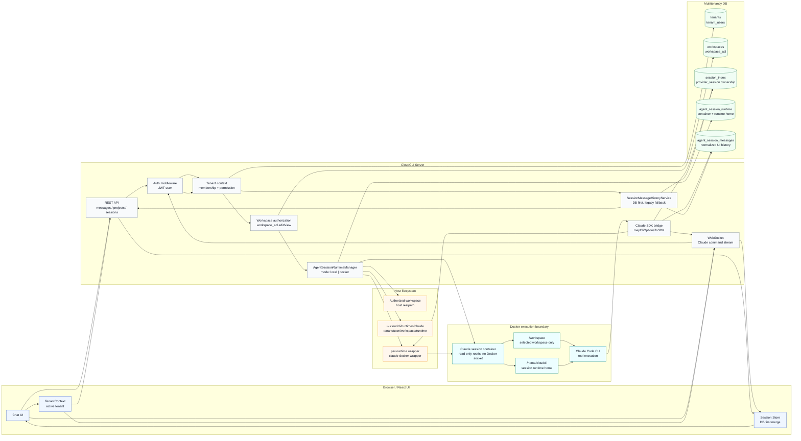
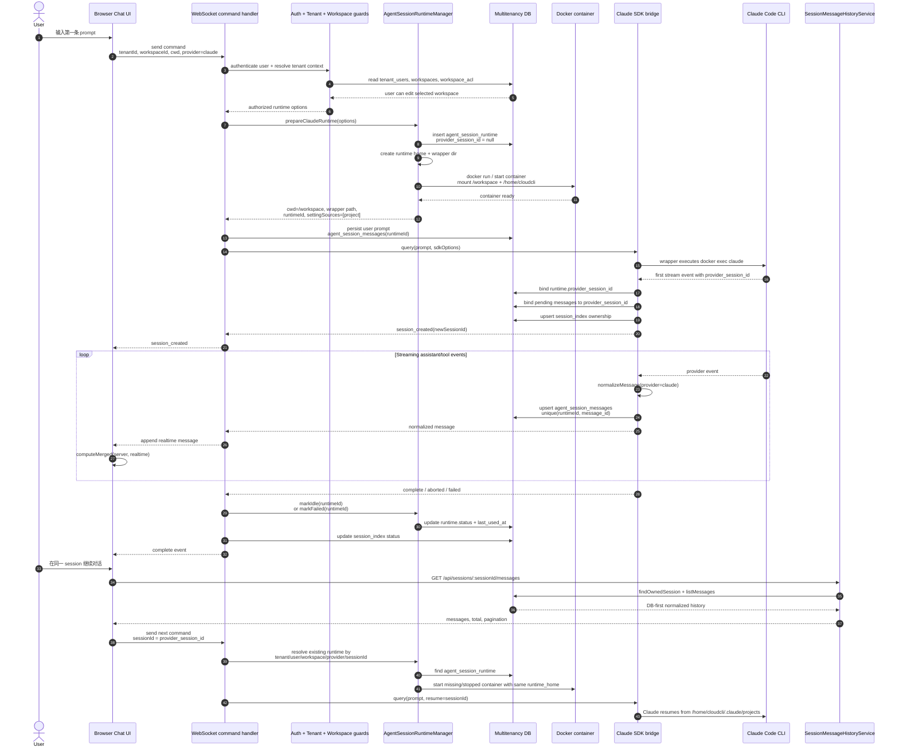

# CloudCLI Multitenant Docker Runtime Diagrams

## 1. Overall Architecture

```mermaid
flowchart LR
  %% CloudCLI multitenant Docker runtime architecture

  subgraph Browser["Browser / React UI"]
    UI["Chat UI"]
    TenantCtx["TenantContext<br/>active tenant"]
    SessionStore["Session Store<br/>DB-first merge"]
  end

  subgraph Server["CloudCLI Server"]
    HTTP["REST API<br/>messages / projects / sessions"]
    WS["WebSocket<br/>Claude command stream"]
    Auth["Auth middleware<br/>JWT user"]
    TenantGuard["Tenant context<br/>membership + permission"]
    WorkspaceGuard["Workspace authorization<br/>workspace_acl edit/view"]
    RuntimeMgr["AgentSessionRuntimeManager<br/>mode: local | docker"]
    ClaudeSDK["Claude SDK bridge<br/>mapCliOptionsToSDK"]
    HistorySvc["SessionMessageHistoryService<br/>DB first, legacy fallback"]
  end

  subgraph DB["Multitenancy DB"]
    Tenants[("tenants<br/>tenant_users")]
    Workspaces[("workspaces<br/>workspace_acl")]
    SessionIndex[("session_index<br/>provider_session ownership")]
    RuntimeTable[("agent_session_runtime<br/>container + runtime home")]
    MessageTable[("agent_session_messages<br/>normalized UI history")]
  end

  subgraph HostFS["Host filesystem"]
    WorkspaceRoot["Authorized workspace<br/>host realpath"]
    RuntimeRoot["~/.cloudcli/runtimes/claude<br/>tenant/user/workspace/runtime"]
    Wrapper["per-runtime wrapper<br/>claude-docker-wrapper"]
  end

  subgraph Docker["Docker execution boundary"]
    Container["Claude session container<br/>read-only rootfs, no Docker socket"]
    MountWorkspace["/workspace<br/>selected workspace only"]
    MountHome["/home/cloudcli<br/>session runtime home"]
    ClaudeCLI["Claude Code CLI<br/>tool execution"]
  end

  UI --> TenantCtx
  UI --> WS
  UI --> HTTP
  TenantCtx --> HTTP
  TenantCtx --> WS
  SessionStore --> UI

  HTTP --> Auth --> TenantGuard --> HistorySvc
  WS --> Auth
  Auth --> TenantGuard --> WorkspaceGuard --> RuntimeMgr
  WorkspaceGuard --> Workspaces
  TenantGuard --> Tenants

  RuntimeMgr --> RuntimeTable
  RuntimeMgr --> WorkspaceRoot
  RuntimeMgr --> RuntimeRoot
  RuntimeMgr --> Wrapper
  RuntimeMgr --> Container

  ClaudeSDK --> Wrapper
  Wrapper --> Container
  Container --> MountWorkspace
  Container --> MountHome
  MountWorkspace --> ClaudeCLI
  MountHome --> ClaudeCLI

  ClaudeCLI --> ClaudeSDK
  ClaudeSDK --> MessageTable
  ClaudeSDK --> SessionIndex
  ClaudeSDK --> WS
  WS --> SessionStore

  HistorySvc --> SessionIndex
  HistorySvc --> MessageTable
  HistorySvc --> HTTP
  HTTP --> SessionStore

  classDef ui fill:#EFF6FF,stroke:#3057C8,color:#111827
  classDef server fill:#F8FAFC,stroke:#64748B,color:#111827
  classDef db fill:#F0FDF4,stroke:#2F7D54,color:#111827
  classDef fs fill:#FFF7ED,stroke:#F2A541,color:#111827
  classDef docker fill:#ECFEFF,stroke:#0E8A86,color:#111827
  class UI,TenantCtx,SessionStore ui
  class HTTP,WS,Auth,TenantGuard,WorkspaceGuard,RuntimeMgr,ClaudeSDK,HistorySvc server
  class Tenants,Workspaces,SessionIndex,RuntimeTable,MessageTable db
  class WorkspaceRoot,RuntimeRoot,Wrapper fs
  class Container,MountWorkspace,MountHome,ClaudeCLI docker
```

## 2. New Session And Conversation Data Flow

```mermaid
sequenceDiagram
  autonumber
  actor User as User
  participant UI as Browser Chat UI
  participant WS as WebSocket command handler
  participant Auth as Auth + Tenant + Workspace guards
  participant Runtime as AgentSessionRuntimeManager
  participant DB as Multitenancy DB
  participant Docker as Docker container
  participant SDK as Claude SDK bridge
  participant CLI as Claude Code CLI
  participant History as SessionMessageHistoryService

  User->>UI: 输入第一条 prompt
  UI->>WS: send command<br/>tenantId, workspaceId, cwd, provider=claude
  WS->>Auth: authenticate user + resolve tenant context
  Auth->>DB: read tenant_users, workspaces, workspace_acl
  DB-->>Auth: user can edit selected workspace
  Auth-->>WS: authorized runtime options

  WS->>Runtime: prepareClaudeRuntime(options)
  Runtime->>DB: insert agent_session_runtime<br/>provider_session_id = null
  Runtime->>Runtime: create runtime home + wrapper dir
  Runtime->>Docker: docker run / start container<br/>mount /workspace + /home/cloudcli
  Docker-->>Runtime: container ready
  Runtime-->>WS: cwd=/workspace, wrapper path,<br/>runtimeId, settingSources=[project]

  WS->>DB: persist user prompt<br/>agent_session_messages(runtimeId)
  WS->>SDK: query(prompt, sdkOptions)
  SDK->>CLI: wrapper executes docker exec claude
  CLI-->>SDK: first stream event with provider_session_id
  SDK->>DB: bind runtime.provider_session_id
  SDK->>DB: bind pending messages to provider_session_id
  SDK->>DB: upsert session_index ownership
  SDK-->>WS: session_created(newSessionId)
  WS-->>UI: session_created

  loop Streaming assistant/tool events
    CLI-->>SDK: provider event
    SDK->>SDK: normalizeMessage(provider=claude)
    SDK->>DB: upsert agent_session_messages<br/>unique(runtimeId, message_id)
    SDK-->>WS: normalized message
    WS-->>UI: append realtime message
    UI->>UI: computeMerged(server, realtime)
  end

  SDK-->>WS: complete / aborted / failed
  WS->>Runtime: markIdle(runtimeId)<br/>or markFailed(runtimeId)
  Runtime->>DB: update runtime.status + last_used_at
  WS->>DB: update session_index status
  WS-->>UI: complete event

  User->>UI: 在同一 session 继续对话
  UI->>History: GET /api/sessions/:sessionId/messages
  History->>DB: findOwnedSession + listMessages
  DB-->>History: DB-first normalized history
  History-->>UI: messages, total, pagination
  UI->>WS: send next command<br/>sessionId = provider_session_id
  WS->>Runtime: resolve existing runtime by<br/>tenant/user/workspace/provider/sessionId
  Runtime->>DB: find agent_session_runtime
  Runtime->>Docker: start missing/stopped container with same runtime_home
  WS->>SDK: query(prompt, resume=sessionId)
  SDK->>CLI: Claude resumes from /home/cloudcli/.claude/projects
```
